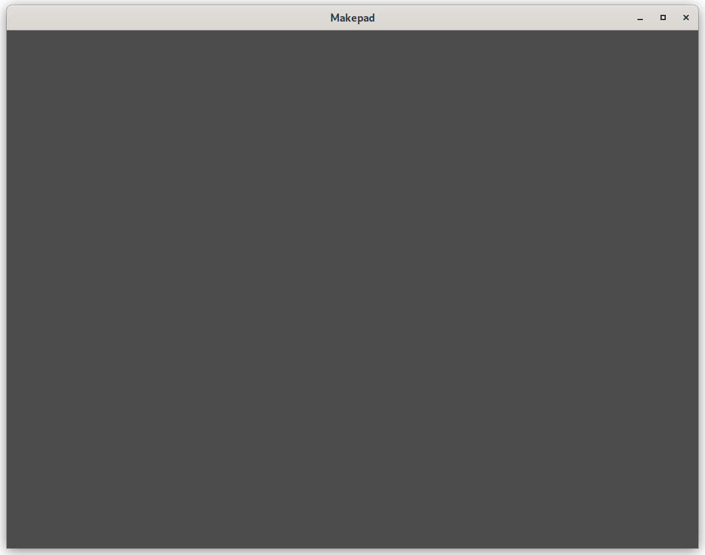
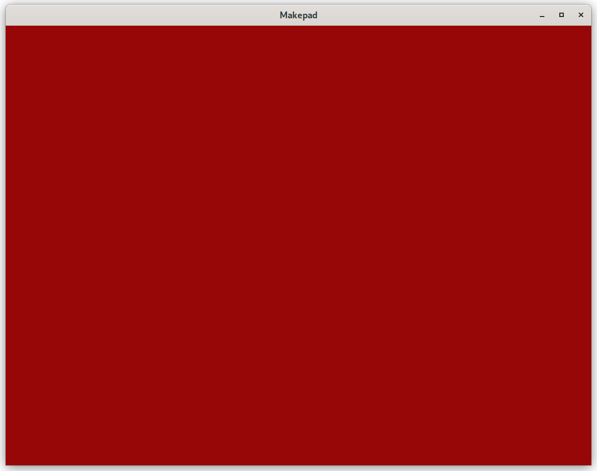

# Tutorial: UI Zoo

**You will need to build an modified version of UI zoo example from makepad. This tutorial will lead you get deep into makepad step by step. You could find the code [here](https://github.com/acyanbird/makepad-start). The code for each section in a separate git branch. This makes it possible to see the intermediate state after each section.**  

## Set up your project

To build the Makepad crates you first need to install Rust. https://www.rust-lang.org/tools/install  
We recommend that you build Makepad using the nightly Rust toolchain.

```bash
rustup install nightly
rustup default nightly
```

Use `cargo new makepad_book_ui_zoo` to create a crate.

```bash
cargo new makepad_book_ui_zoo
```

Add the `makepad-widgets` library dependency in `Cargo.toml`. Makepad is using 2021 version right now, so please change `edition = "2021"`.


```toml
[package]
name = "makepad_book_ui_zoo"
version = "0.1.0"
edition = "2021"

[dependencies]
# use rik branch，because it is the active development branch
makepad-widgets = { git = "https://github.com/makepad/makepad", branch = "rik" }
```

Then create `lib.rs` and `app.rs` files under src.

Your directory structure should look like this:

```plaintext
simple/
├── Cargo.lock
├── Cargo.toml
├── src
│   ├── app.rs
│   ├── lib.rs
│   └── main.rs

```

## Create basic window

Then let's complete our code in the `app.rs` module. 

Let's start by defining the overall component structure:

```rust
use makepad_widgets::*; // Import Makepad Widgets package

// Define live_design macro for declaring UI components and layout
live_design! {
    // import Makepad theme and shaders, and widgets
    use link::theme::*;
    use link::shaders::*;
    use link::widgets::*;
    App = {{App}} {
        ui: <Window> { }
        }
    }


// Define App struct containing UI and counter
#[derive(Live, LiveHook)]
pub struct App {
    #[live]
    ui: WidgetRef // UI component reference
}

// Implement LiveRegister trait for registering live design
impl LiveRegister for App {
    fn live_register(cx: &mut Cx) {
        // Register Makepad Widgets' live design
        makepad_widgets::live_design(cx);
    }
}

// Implement AppMain trait for handling events
impl AppMain for App {
    fn handle_event(&mut self, cx: &mut Cx, event: &Event) {
        // Handle UI events
        self.ui.handle_event(cx, event, &mut Scope::empty());
    }
}

// Define application entry point
app_main!(App);
```

Add the following code to `lib.rs`:

```rust
pub mod app;
```

Add the following code to call app_main() in main file:

```rust
fn main() {
    makepad_start::app::app_main();
}
```  
Run this project by
`cargo run`

You could see the output:

  

And the code is available [here](https://github.com/acyanbird/makepad-start/tree/01-basic-window):

Let's explain the code structure, you don't need to understand them right now:

1. `live_design!`,The live_design! macro is used to declare UI components and layout. It's part of the Live system we discussed earlier, implementing Live DSL using Rust macros to enable runtime UI modifications.
2. `app_main!(App)`defines the application entry point. Since Makepad needs to support cross-platform applications (including Web/iOS/Android/MacOS/Windows/Linux), the `app_main!` macro internally includes entry point code for various platforms, hence using a macro rather than a simple `main` function.
3. The Rust struct `App` uses the `derive(Live, LiveHook)` derive macro, automatically implementing two Live system-related traits for `App`: `Live` and `LiveHook`.
    - The `ui` field of type `WidgetRef` can be thought of as `dyn Widget`, representing UI controls that implement the `Widget` trait. These controls can be updated at runtime, marked with the #[live] attribute, which automatically implements certain derive macros, like creating `LiveId` for the field and calling `LiveHook` methods.
    - The `counter` field belongs to business logic, used for counting, so it's marked with the `#[rust]` attribute, telling the Live system it belongs to Rust's domain rather than UI controls and doesn't participate in runtime updates.
    - The `Live` and `LiveHook` traits are related to Makepad controls' Live lifecycle, which we'll discuss in detail later.
4. The `LiveRegister` trait is used to register `App` with the Live system.
5. The `AppMain` trait defines the `handle_event` method for passing various events to the UI tree, including mouse, timer, or scroll events.
    - This trait object is actually called in `app_main!`, making it part of the program entry point.
    - Internally, `ui`'s `handle_event` takes parameters `cx`/`event` for context information and events, while `Scope` is used for component state sharing, with `Scope::empty()` currently representing no shared state.

## Change background color and title

We can change the background color to the window by simply define color inside draw_bg field.  

### Background Color
There are several way to present color. For color using `vec3()`, the range is 0 and 1 instead of 0 to 255. For example, you can convert the color #970707 to vec3 form. #970707 is a dark red, and its RGB values are (151, 7, 7). By converting these values to floating-point numbers between 0 and 1, you can get vec3(0.592, 0.027, 0.027).

```rust
live_design! {
    // import Makepad theme and shaders, and widgets
    use link::theme::*;
    use link::shaders::*;
    use link::widgets::*;
    App = {{App}} {
        ui: <Window> {
            show_bg: true,
            draw_bg: {
                color: #970707    // dark red
                // color: vec3(0.592, 0.027, 0.027) // dark red as above
                // color: vec3(1, 1, 0) // yellow
                // color: #000 // black
                }
...
        }
    }
}
```
  
Try to change whatever color you want by yourself!  

### Title 

The window section sets the window's title to "Makepad UI zoo".   
Following that is the caption_bar section, which defines a caption bar. visible: true indicates that the caption bar is visible, and margin: {left: -500} sets the left margin of the caption bar. You can change the value to move the position of the caption bar label.
Finally, caption_label defines the label within the caption bar, with its text content set to "Makepad book UI Zoo caption bar".

```rust
ui: <Window> {
            show_bg: true,
            draw_bg: {
                // color: #970707    // dark red
                // color: vec3(0.592, 0.027, 0.027) // dark red as above
                // color: vec3(1, 1, 0) // yellow
                color: #000 // black
                }
            window: {
                title: "Makepad UI zoo"
            },
            caption_bar = {
                visible: true,
                margin: {left: -500},
                caption_label = { label = {text: "Makepad book UI Zoo caption bar"} },
            },
        }
```
