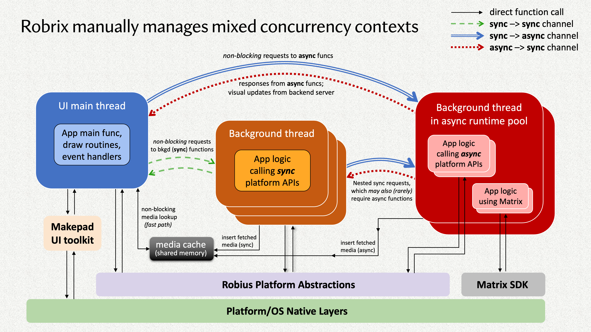
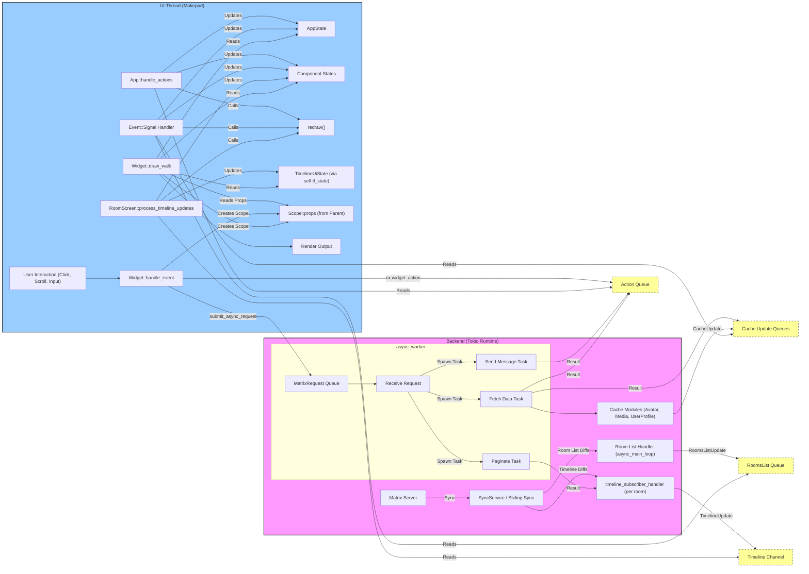

# Robrix Code Review Checklist

**Objective:** Ensure Robrix code maintains clarity, efficiency, and maintainability at the architectural level, following best practices for Makepad and Rust.

**This checklist focuses on architectural decisions rather than general coding standards**, aiming to be concise to help developers grasp basic principles rather than constraining them with excessive rules.

**Core principles summary:**

- **UI/Background Separation:** UI main thread (Makepad) vs background async thread (Tokio).
- **Communication:** Action system (`Cx::post_action`, `cx.widget_action`), thread-safe queues (`SegQueue`), specific channels (`mpsc`, `watch`, `crossbeam_channel`).
- **State Management:** Global `AppState`, per-room `TimelineUiState`, various caches.

---

## **I. Separation of Concerns**

- **[ ] Backend Logic Purity:**
    - Do background modules (such as async tasks in `sliding_sync.rs`) contain or directly manage states that are _only for UI display_ (e.g., "loading", "failed", "selected" flags, UI element visibility flags)?
    - Do background tasks directly parse or interpret user input raw text (such as checking if it contains `@room` string) to determine business logic (such as whether to set `mentions.room`)?
    - **Goal:** Backend should focus on data retrieval, processing, and core business logic, sending results through Actions or update notifications to the UI. UI components should manage their own display states. Backend should rely on data structures with clear intent passed from the UI layer.
- **[ ] UI Responsibility Clarity:**
    - Do UI components (such as `RoomsList`, `RoomScreen`, `RoomPreview`) clearly handle their own display logic, such as filtering, sorting, and formatting based on received data?
    - Are data storage/caches (such as `AppState`, `RoomsList::all_rooms`, various `*_cache.rs`) separated from data _display_ logic?
    - Do components responsible for handling user input (such as `MentionableTextInput`) fully encapsulate the intent parsing logic related to that input (e.g., distinguishing whether a user typed normal "@room" text or selected `@room` mention from a suggestion list)?
    - **Goal:** Avoid processing display logic related to specific views in the data layer or backend. Input components should be responsible for converting raw user input into structured intent data.
- **[ ] State Ownership and Passing:**
    - Is state update granularity reasonable (too large causes unnecessary redrawing, too small causes incomplete updates)?
    - Is state initialization and reset logic robust?
    - Is the boundary between global and local state clear?
    - For context-specific data (such as current room), is its ownership held by the primary manager of that context (such as `RoomScreen`)?
    - Is this context data passed down as read-only references to child components that need to access it (such as `MentionableTextInput`, `EditingPane`) through the `Scope::props` mechanism?
    - **Goal:** Avoid child components holding unnecessary, persistent copies of context data that could lead to memory leaks or inconsistent states. States should be managed by appropriate parents and shared via props.
- **[ ] Operation Atomicity and Separation:**
    - Does a function or `MatrixRequest` variant take on too many different responsibilities? (For example, a function that both queries login types and performs login operations).
    - **Goal:** Maintain single responsibility for functions and requests, making them easier to understand, test, and reuse. Pre-operations (such as queries) should be separated from core operations (such as execution).
- **[ ] Rendering and Logic Separation (`draw_walk`):**
    - Does the `draw_walk` method contain non-drawing logic, such as permission checks, complex calculations, state updates, or triggering Actions?
    - **Goal:** `draw_walk` should be as lightweight as possible, only drawing based on _currently determined_ state. State updates should be done in `handle_event` or `handle_actions`.

---

## **II. Performance Awareness**

- **[ ] UI Thread Efficiency:**
    - Do `draw_walk`, `handle_event`, `handle_actions` avoid operations that might block the main thread? (For example, direct file I/O, network requests, long-running loops, frequent or long lock waits).
    - Do event handlers avoid unnecessary or inefficient iteration over large global collections (such as all rooms, all users)? Do they only process the minimum work set relevant to the current event/Action?
    - **Goal:** Ensure smooth UI thread response.
- **[ ] Background Task Delegation:**
    - Are all potentially blocking or time-consuming operations (network, file, image decoding, complex data transformations) delegated to background Tokio threads through `submit_async_request`?
    - **Goal:** Move time-consuming work out of the UI thread.
- **[ ] Data Structure and Algorithm Efficiency:**
    - Are operations on `HashMap`/`BTreeMap` efficient? (For example, is the `entry` API used to avoid duplicate lookups when insertion or update is needed?)
    - Do collection operations (filtering, finding, removing, etc.) preferentially use Rust's iterator methods rather than manual loops?
    - **Goal:** Use appropriate data structures and algorithms for optimal performance.
- **[ ] Memory Usage and Cloning:**
    - Are there unnecessary `.clone()` calls, especially in loops or frequently called code paths? Could references (`&` or `&mut`) be passed instead?
    - Is collection into temporary `Vec`s followed by immediate iteration avoided?
    - **Goal:** Reduce unnecessary memory allocation and copy overhead.
- **[ ] Cache Utilization:**
    - Is there effective use of existing cache mechanisms (avatars, media, user profiles, room members) to avoid repeated network requests or computations?
    - Is cache update and invalidation logic reasonable?
    - **Goal:** Improve performance and reduce resource consumption through caching.
- **[ ] List Performance:**
    - When users input and trigger suggestions or search lists, are filtering and rendering operations for large member or message lists efficient enough?
    - Is fetching the complete result list from global cache or parent component on every keystroke avoided?
    - **Goal:** Ensure result list popup and filtering process is smooth.

---

## **III. Clear API Design and Encapsulation**

- **[ ] Component Interface Clarity:**
    - Are Widget public APIs (exposed through `WidgetRef` extension methods) clear in intent, easy to understand and use?
    - Do APIs well encapsulate internal implementation details, preventing callers from needing to know too much internal state or perform unsafe operations? (For example, improvements to `AvatarRow` API).
- **[ ] Input Component API:**
    - Do input components (such as `MentionableTextInput`) provide clear APIs to get the final parsed result information (for example, a method that returns a `Mentions` struct)?
    - **Goal:** Input components should provide a concise interface that returns structured results, rather than requiring callers (such as `RoomScreen`) to re-parse text or query internal state.
- **[ ] Interface Consistency:**
    - Do the visibility of `WidgetRef` extension functions and their internally called `Widget` methods (`pub` vs private) match and make sense?
- **[ ] Internal Logic Encapsulation:**
    - Is complex internal logic well organized through private helper functions?
- **[ ] Return Value/Data Structure Clarity:**
    - When functions need to return multiple related values, are structs or tuples used to encapsulate them?
    - Are specialized data structures (such as `matrix_sdk::ruma::events::room::message::Mentions`) used to precisely represent intent (including user IDs and whether `@room` is mentioned), rather than relying on boolean flags or string checks?
    - **Goal:** Use the type system to clearly express data meaning, reducing ambiguity and potential errors.

---

## **IV. Following Makepad Paradigms (Actions, Draw Loop)**

- **[ ] State Communication Methods:**
    - Are cross-thread or cross-component state changes primarily driven by the **Action** mechanism?
        - Backend -> UI: `Cx::post_action` + `SignalToUI`.
        - UI internal: `cx.widget_action`.
    - Is over-reliance on shared mutable state (such as `Arc<Mutex<T>>` or `RwLock`) for direct data modification between different components to drive UI updates avoided?
    - **Goal:** Use the framework-recommended, message-passing based patterns for state synchronization and communication.
- **[ ] State-Driven Rendering:**
    - Is the core principle of "state-driven rendering" followed? Specifically:
        1. `handle_event` / `handle_actions` are responsible for responding to events/actions and **updating state**.
        2. After state update, call `redraw()` to request redrawing.
        3. `draw_walk` draws **only based on current state**, should not contain state modification or complex logic.
    - **Goal:** Maintain purity and predictability of rendering logic.
- **[ ] Dynamic Style Application:**
    - When needing to dynamically change a Widget's style or layout in Rust code based on state, are the `live!{}` macro and `apply_over` method used?
    - **Goal:** Use mechanisms provided by Makepad for dynamic UI adjustments.
- **[ ] Action Enum Standards:**
    - Do custom Action enums derive `#[derive(Clone, DefaultNone, Debug)]` and include a `None` variant?
    - **Goal:** Comply with basic requirements for Makepad Actions.

## V. Other Functionality, Security, and User Experience Checks

- **[ ] Cross-Platform Compatibility Check:** Robrix supports different layouts for desktop and mobile, requiring specific checks for cross-platform adaptation:
    
    - Do UI components correctly respond to different screen sizes and orientations
    - Do platform-specific features have appropriate abstractions and alternatives
    - Are resource files (such as icons and fonts) correctly optimized for each platform
- **[ ] Enhanced Error Handling and User Experience Checks:**
    
    - Do network errors have appropriate user feedback and retry mechanisms
    - Are clear error messages provided when user operations fail
    - Do long operations have loading indicators
- **[ ] Security Checks**
    
    - Is sensitive data (such as login credentials) securely stored
    - Is user data displayed in the UI properly sanitized to prevent injection attacks

## VI. Future Considerations for Robrix's Vision

- **Modularity and Extensibility:**
    - **[ ] Service Pluginization:** Is the integration of new services (LLM, ActivityPub, etc.) designed as relatively independent modules/plugins, easy to add, remove, or replace? Are there clearly defined interfaces?
    - **Goal:** Ensure minimal invasiveness to existing code when adding new services, with easily extensible architecture.
- **Data Model and Aggregation:**
    - **[ ] Unified Data Model:** For information that needs aggregated display (such as unified activity stream), is there a well-designed data model to represent data from different services?
    - **[ ] Efficient Aggregation:** When aggregating data from multiple services in the backend or UI layer, is performance efficient enough?
    - **Goal:** Effectively manage and display cross-service data.
- **Error Handling and Resilience:**
    - **[ ] Service Isolation:** Does the failure or blocking of a single background service (such as ActivityPub synchronization) affect the stability of other services (such as Matrix synchronization) or the entire application?
    - **Goal:** Improve system fault tolerance.

# Appendix

The appendix section can be continuously updated and enriched to better consolidate project knowledge.

## Appendix A: Core Principles Detailed Explanation

This section aims to detail the core architectural principles involved in the Robrix Code Review Checklist, combined with Robrix's specific practices. By understanding and following these architectural principles integrated with Robrix's concrete practices, the team can more effectively develop code and conduct reviews, building more robust, efficient, and maintainable applications.



- **Diagram Description:**
    
    - Shows the separation between the **UI Main Thread** (blue) and the **Background Async Runtime Thread Pool** (red).
    - Depicts the main communication methods between them:
        - UI -> Backend (async requests): Blue solid line (sync -> async channel), corresponding to MatrixRequest queue.
        - Backend -> UI (responses/updates): Red dashed line (async -> sync channel), corresponding to Cx::post_action / SignalToUI or other notification mechanisms.
    - Shows potential synchronous calls within the background thread (orange box, calling platform APIs) and asynchronous calls (pink box, calling async platform APIs or Matrix SDK).
    - Mentions that background tasks may have nested calls (arrows within the red box).
    - Correctly places Makepad UI Toolkit, Matrix SDK, Robius platform abstraction layer, and underlying OS/platform layer in appropriate positions.
    - Specially points out the media cache as a shared memory area that both UI and backend may access (although arrow direction is slightly ambiguous in the diagram, the concept is correct).
    - The title and notes of the diagram also highlight the complexity of manually managing mixed concurrency contexts.

### **I. Separation of Concerns**

- **Principle Explanation:** This is a basic software engineering principle requiring that a complex system be divided into different parts, each handling a specific concern or responsibility. In Robrix, the main manifestation is separating UI logic, backend business logic (Matrix interaction), and data management (state, cache, persistence).
- **Importance:**
    - **Maintainability:** Modifying one part's logic (such as UI layout) should not accidentally break other parts (such as network requests).
    - **Testability:** Backend logic can be tested independently, without depending on UI.
    - **Reusability:** Generic backend logic or data management modules can be reused by different UI components.
    - **Parallel Development:** Different developers can focus on different layers.
- **Robrix Manifestation and Practice:**
    - **UI vs Backend:** `app.rs`, `home/`, `shared/` etc. are mainly responsible for UI display and interaction, running on the main thread. `sliding_sync.rs`'s `async_worker`, `async_main_loop`, `timeline_subscriber_handler`, etc. run on the background Tokio thread, handling network, SDK interaction, etc. This is the most core separation.
    - **UI Internal Responsibilities:**
        - `App` is responsible for top-level navigation and global modal dialogs.
        - `HomeScreen` is responsible for overall layout (desktop/mobile).
        - `RoomScreen` is responsible for the display and interaction logic of a single room.
        - `RoomsList` is responsible for the display and filtering of the room list.
        - (TODO: add more component descriptions)
    - **Data and Display Separation:**
        - `RoomsList` holds `all_rooms` (data storage) and `displayed_rooms` (display state), with filtering logic in `RoomsList`, rather than having the backend return filtered data.
        - Backend tasks (like `timeline_subscriber_handler`) send raw or near-raw data updates (`TimelineUpdate`), while `RoomScreen` is responsible for interpreting these updates and modifying its `TimelineUiState`, ultimately affecting rendering.
    - **Avoiding Logic in the "Wrong Place":**
        - **Anti-pattern (to avoid):** Directly managing UI element "loading" states in `sliding_sync.rs`.
        - **Good pattern:** Backend sends `TimelineUpdate::PaginationRunning`, `RoomScreen` receives it and sets the visibility of `TopSpace`.
        - **Anti-pattern (to avoid):** Performing permission checks in `draw_walk`.
        - **Good pattern:** Checking permissions in `handle_event` or `handle_actions`, and storing the result (such as whether a button is enabled) in Widget state, `draw_walk` only reads that state.
        - **Anti-pattern (to avoid):** `MentionableTextInput` directly parsing raw text to judge `@room`.
        - **Good pattern:** `MentionableTextInput` parsing user intent, generating a `Mentions` object, `RoomScreen` using that object.

### **II. Performance Awareness**

**Principle Explanation:** Written code should not only be functionally correct but also perform well in terms of resource consumption (CPU, memory) and response time, especially on the UI thread which directly affects user experience.

**Importance:**

- **Smoothness:** Avoiding UI stuttering and dropped frames, providing a smooth user experience.
- **Responsiveness:** Applications can quickly respond to user operations.
- **Resource Efficiency:** Reducing battery consumption and memory usage.

**Robrix Manifestation and Practice:**

- **UI Thread Protection:**
    - **No Blocking:** Strictly prohibit executing any operations in `draw_walk`, `handle_event`, `handle_actions` that might take more than a few milliseconds (network, file I/O, complex calculations, long-duration locks).
    - **Async Delegation:** All these time-consuming operations are sent to the background Tokio thread via `submit_async_request`.
- **Efficient Data Processing:**
    - **Avoid Redundant Iteration:** Don't iterate over large collections (such as `RoomsList::all_rooms`) for every event or Action. Updates should be as precise as possible, only processing affected parts.
    - **Utilize Iterators and APIs:** Use efficient methods like `retain`, `filter`, `map`, `entry` API to handle collections and Maps.
    - **Reduce Cloning:** Prefer passing references (`&`, `&mut`, `&Arc`), especially in loops and frequently called functions. `Arc` cloning itself is cheap, but cloning its internal data (such as `Vec`) is expensive.
- **Caching Strategy:**
    - Actively use `avatar_cache`, `media_cache`, `user_profile_cache`, `room_member_manager` to store already fetched data, avoiding repeated requests.
    - Cache retrieval logic (`get_or_fetch_*`) should check if the cache exists, and if not present and not requested, initiate a background request and mark as `Requested`, avoiding duplicate requests.
- **`draw_walk` Lightweight:**
    - `draw_walk` should only do drawing-related things, relying on _already prepared_ state. All calculations, formatting (such as timestamps), data conversion should be done during state updates (`handle_event`/`actions`).

### **III. Clear API Design and Encapsulation**

**Principle Explanation:** When designing components and modules, provide clear, concise, easy-to-understand and use public interfaces (APIs), while hiding complex internal implementation details. Good encapsulation reduces coupling, improves code maintainability and reusability.

**Importance:**

- **Usability:** Callers can easily understand how to use components.
- **Robustness:** Reduces the possibility of misuse.
- **Maintainability:** Internal implementation can be modified without affecting external callers (as long as the API doesn't change).
- **Modularity:** Components can be combined like building blocks.

**Robrix Manifestation and Practice:**

- **`WidgetRef` Extension:** Providing type-safe, object-oriented APIs by implementing extension Traits for `WidgetRef` (such as `AvatarWidgetRefExt`).
- **Single Entry Point:** Methods like `AvatarRow::set_avatar_row` encapsulate the logic of setting data and updating internal state, better than exposing multiple methods that need to be called in a specific order (such as `set_range` + `iter_mut`).
- **Hide Internal State:** Child components should not directly access the internal `#[rust]` state fields of parent components. They should interact through `props` (read-only) or Actions (requesting modification).
- **Clear Return Values:** Use structs (such as `UserProfilePaneInfo`, `CalloutTooltipOptions`) or meaningful tuples to encapsulate multiple return values. Use specialized types (such as `Mentions`) to pass data with specific semantics.
- **Privatization:** Mark helper functions that are only for internal use as private (`fn` rather than `pub fn`).

### **IV. Following Makepad Paradigms (Actions, Draw Loop)**

**Principle Explanation:** Effectively utilize the core mechanisms provided by the Makepad framework (event handling, Action system, draw loop, Live Design) to build applications, rather than trying to bypass or reinvent wheels.

**Importance:**

- **Consistency:** Code style remains consistent with the framework and other parts, facilitating team collaboration.
- **Efficiency:** Utilize optimized mechanisms of the framework (such as Action dispatch, drawing system).
- **Maintainability:** Easier to leverage future updates and improvements of the framework.

**Robrix Manifestation and Practice:**

- **Action-Driven State:**
    - **Cross-Thread Communication:** Background task completion -> `Cx::post_action` -> `SignalToUI` -> UI `handle_actions` -> update state -> `redraw()`. This is the standard process.
    - **UI Internal Communication:** Child Widget -> `cx.widget_action` -> Parent Widget `handle_actions` -> update state -> `redraw()`.
    - **Avoid Shared Locks:** Try not to use `Arc<Mutex<T>>` or `RwLock` to directly share and modify state between UI components to drive updates, which is error-prone and may block UI. Actions are preferred.
    - **State-Driven Rendering:**
        - Strictly adhere to: event/Action handlers are responsible for **updating state**, then calling `redraw()`. `draw_walk` function is only responsible for **reading current state** and rendering.
        - **Anti-pattern (to avoid):** Calculating layout, filtering data, sending Actions, or modifying `#[rust]` state in `draw_walk`.
    - **Live Design Integration:**
        - Use `live!{}` and `apply_over` to dynamically modify attributes defined by Live Design (colors, margins, visibility, etc.) in Rust code.
    - **Action Enums:**
        - Follow the standard, using `#[derive(Clone, DefaultNone, Debug)]` and including a `None` variant.

---

## Appendix B: Makepad Programming Paradigm

The Makepad framework adopts a unique hybrid paradigm, aimed at combining the speed and flexibility of declarative UI definition with the performance and type safety of the Rust language. Its core idea can be summarized as: **Live Design DSL defines structure and style, Rust handles logic and state, communication through the Action mechanism, and follows state-driven rendering loop.**

**1. Core Philosophy: Live Design DSL + Rust Logic Separation**

- **Live Design (`live_design!`)**:
    - **Purpose**: Define UI structure, layout (`Walk`, `Layout`), visual style (`Draw*` shaders), animation (`animator`), and component default/configurable properties (`#[live]`).
    - **Syntax**: CSS/JSON-like declarative syntax, easy to read and modify.
    - **Advantage**: Supports live coding, modifications to DSL can be seen in UI updates without recompiling Rust code, greatly improving UI iteration speed, facilitating collaboration between designers and developers.
- **Rust Code**:
    - **Purpose**: Implement application core logic, state management, event handling, network requests, data processing, etc.
    - **Connection**: Through `#[derive(Live, LiveHook)]` macro to associate Rust structs (usually `App` or custom Widget) with definitions in DSL. `#[live]` attributes mark fields that can be set or overridden in DSL. `LiveHook` trait (such as `after_apply`, `after_new_from_doc`) allows initialization or response logic to be executed after DSL updates are applied to Rust struct.
    - **Advantage**: Leverages Rust's performance, memory safety, and powerful type system.

**2. State Management: Centralized, Action-Driven**

- **State Storage**:
    - Application or component state is primarily stored in fields of Rust structs.
    - Fields marked with `#[live]` can be initialized or modified in DSL, suitable for configuration items and default values.
    - Fields marked with `#[rust]` are pure Rust state, not directly controlled by DSL, used to store runtime data, caches, etc.
- **State Updates**:
    - **Core Principle**: State modification **must** be done in event handling functions (such as `handle_event`, `handle_actions`, `handle_signal`), and **never** in `draw_walk`.
    - **Trigger Redraw**: After state update, must explicitly call `widget_ref.redraw(cx)` or `area.redraw(cx)` to notify the framework that this part of UI needs to be redrawn.
- **Avoid Shared Mutable State**:
    - **Not Recommended**: Try to avoid using `Arc<Mutex<T>>` or `RwLock` to directly pass and modify data between different components to drive UI updates. This approach can introduce complexity, race conditions, and debugging difficulties.
    - **Recommended**: Use the Action mechanism described below for state synchronization and communication.

**3. Event Handling and Communication: Action-Based Message Passing**

- **Event Flow**: Events (such as user input, network response, timer) are received by `AppMain::handle_event`, and passed through Widget tree via `widget_ref.handle_event(cx, event, scope)` (usually up or down, depending on `event_order`).
- **WidgetAction**: This is the core mechanism for component communication in Makepad.
    - **Send**: Child Widget or any code needing to notify externally sends an Action through `cx.widget_action(widget_uid, path, YourActionEnum::Variant)`. `widget_uid` identifies the sender, `path` provides hierarchical information, `YourActionEnum` is a custom enum containing specific information.
    - **Handle**: Parent Widget or App typically listens for Actions in the `MatchEvent::handle_actions` method. Helper methods like `widget_ref.action_name(&actions)` or `actions.find_widget_action(uid).cast()` are used to check and handle specific Actions sent by specific Widgets.
    - **Advantage**: Achieves decoupling, components don't need to directly know each other's internal implementation, only need to define clear Action interfaces. Communication paths are clear and easy to track.
- **Backend to UI**:
    - For background thread (such as network request, file IO) completion results, use `Cx::post_action(YourSignalEnum::Variant)` to send a `SignalToUI` type Action.
    - UI thread receives and processes these signals in `MatchEvent::handle_signal`, then updates state and requests redraw.
- **Action Enum Standard**: Custom Action enums need `#[derive(Clone, DefaultNone, Debug)]` and include a `None` variant to meet framework requirements.

**4. Rendering Paradigm: State-Driven, Declarative Drawing**

- **Core Principle**: Drawing logic should be a pure function mapping of current state. `draw_walk` method only reads current state and generates drawing instructions, should not have side effects or modify state.
- **Rendering Loop**:
    1. Event occurs, `handle_event`/`handle_actions` update state.
    2. After state update, call `redraw()` to mark the `Area` that needs redrawing.
    3. `Cx` collects all redraw requests at the appropriate time in the event loop.
    4. Triggers `Event::Draw` event.
    5. `draw_walk` is called, it reads the **current** state, and uses `Cx2d` API to generate drawing instructions (usually filling uniforms and instances of `Draw*` structs).
- **Drawing Primitives**: `DrawQuad`, `DrawText`, `DrawIcon`, `DrawColor` and other structs encapsulate Shader and related uniforms. Their `fn pixel` and `fn vertex` define visual appearance.
- **Performance Optimization**:
    - `DrawList2d`: Internal optimization mechanism for batching draw calls.
    - `ViewOptimize::DrawList` / `Texture`: Allow caching static or infrequently changing UI parts to draw list or texture, avoiding recalculating layout and drawing every frame. `CachedView` is a convenient wrapper.

**5. Widget Architecture: Composition and Derive Macros**

- **Definition**: Use `#[derive(Live, LiveHook, Widget)]` to define Widgets.
- **Composition**: Build complex UIs by nesting `View` or other Widgets in `live_design!`. Use `#[deref]` to delegate core `Widget` functionality (such as `draw_walk`, `handle_event`) to internal `View` or other base Widgets.
- **Interaction**: In Rust code, use `WidgetRef` and `WidgetSet` (often type aliases like `ButtonRef`, `ButtonSet`) to find, access, and manipulate Widget instances.

**6. Asynchronous Operations**

- **Background Tasks**: Use `Cx::spawn_thread` to start background threads for time-consuming operations.
- **Result Passing**: Use `mpsc` channel or custom `ToUIReceiver`/`Sender` pattern, after completion in background thread, send `SignalToUI` Action back to UI thread through `Cx::post_action`.
- **UI Update**: Process background task results in `handle_signal`, update state and request redraw.

**7. Dynamic UI Updates (Rust -> DSL)**

- When needing to dynamically change Widget style or layout based on state in Rust code (not just redraw), use `widget_ref.apply_over(cx, live!{...})`. This allows applying local DSL fragments to existing Widget instances.

**8. Summary: Advantages of Makepad Paradigm**

- **Rapid Iteration**: Live Design DSL allows quick UI modifications without compilation.
- **Performance**: Shader-based rendering and optimized drawing system provide high performance. Rust itself also provides good performance foundation.
- **Maintainability**: Separation of DSL and Rust, and Action-based communication, make code structure clearer, easier to maintain and extend.
- **Type Safety**: Rust's strong type system reduces runtime errors.
- **Cross-Platform**: One codebase can compile to desktop, web, and mobile.
- **Combination of Declarative and Imperative**: Combines the conciseness of declarative UI definition with the flexibility and control of imperative code.

Following these paradigms helps write efficient, maintainable applications that conform to Makepad's design philosophy.

---

## Appendix C: **Understanding Makepad's Redraw Mechanism**

Identifying and avoiding unnecessary redraws is key to optimizing Makepad application performance. Here are some methods and perspectives to judge and handle unnecessary redraws:

**1. Understanding Makepad's Redraw Mechanism**

- **Area-Based**: Makepad's redraw is area-based. When you call `widget_ref.redraw(cx)` or `area.redraw(cx)`, you're actually marking that `Area` as "dirty".
- **DrawList Collection**: In the drawing phase of the event loop, `Cx` collects all areas marked as dirty.
- **Pass Rendering**: `Cx` determines which `Pass`es (render passes, usually corresponding to a window or a cached View) need redrawing because they contain dirty areas.
- **Draw Call Execution**: Only `DrawCall`s (drawing instructions) that intersect with dirty areas will be resent to the GPU.

**2. Signs of Unnecessary Redraws**

- **High CPU/GPU Usage**: CPU or GPU usage remains high even when UI has no obvious changes or interactions. This may mean some parts are constantly redrawing.
- **Flickering or Visual Artifacts**: May occasionally appear, especially under complex redraw logic.
- **Animation Stuttering**: If redraw scope is too large or too frequent, it may affect animation smoothness.
- **Debug Logs/Tools**:
    - **Makepad Studio (if available)**: Studio might provide visualization tools to show which areas are being redrawn.
    - **Logs**: Add `log!()` statements in key places of `handle_event` or `draw_walk`, observe their calling frequency and timing. Pay special attention to whether `draw_walk` is frequently called without state changes.
    - **Performance Profilers**: Use system-level performance analysis tools (such as Instruments on macOS, Perf on Linux, VTune on Windows/Linux) to identify CPU/GPU hotspots.

**3. Common Causes and Methods for Identifying Unnecessary Redraws**

- **Modifying State in `draw_walk`**:
    
    - **Problem**: This is the most common mistake. `draw_walk` should only read state and draw. If state is modified in `draw_walk` (even minor state), and that modification triggers `redraw()`, it will cause an infinite redraw loop.
    - **Identification**: Carefully check all `draw_walk` implementations, ensure they don't modify any `#[live]` or `#[rust]` state fields, and don't call any methods that might indirectly trigger state changes or redraw.
    - **Solution**: Move state modification logic to `handle_event` or `handle_actions`.
- **Calling `redraw()` Too Frequently**:
    
    - **Problem**: Calling `redraw()` in event handling even when state hasn't actually changed. Or unconditionally calling `redraw()` in every `NextFrame` event.
    - **Identification**: Before calling `redraw()`, check if state has actually changed enough to require redrawing.
    - **Solution**:
        
        ```rust
        fn handle_actions(&mut self, cx: &mut Cx, actions: &Actions) {    let mut needs_redraw = false;    if self.ui.button(id!(some_button)).clicked(actions) {        if self.some_state != new_value { // Check if state actually changed            self.some_state = new_value;            needs_redraw = true; // Mark as needing redraw        }    }    // ... other state updates ...    if needs_redraw {        self.ui.redraw(cx); // Only redraw when needed    }}fn handle_event(&mut self, cx: &mut Cx, event: &Event, scope: &mut Scope) {    if let Some(ne) = self.next_frame.is_event(event) {        if self.animator.is_animating() { // Only redraw when animation is ongoing             self.update_animation_state(ne.time);             self.ui.redraw(cx);             self.next_frame = cx.new_next_frame();        }    }    // ...}
        ```
        
- **Redraw Scope Too Large**:
    
    - **Problem**: Called redraw on parent Widget or even entire window, when only a small child Widget needs updating.
    - **Identification**: Observe which unrelated parts also flash or show redraw signs during UI updates. Use `cx.debug.area(area, color)` in `draw_walk` to visualize which `Area`s are marked as dirty.
    - **Solution**: Call more precise `redraw()`. For example, only call `widget_ref.redraw(cx)` of child Widget that needs updating, or directly use child Widget's `area.redraw(cx)`.
- **Unnecessary Animation Triggers**:
    
    - **Problem**: `Animator` state transitions are unnecessarily triggered, even when there's no visual change, but `redraw: true` in the `apply` block still causes redraw. Or `animator_handle_event` returns `must_redraw()` but there's no visual change.
    - **Identification**: Check if animation state transition triggers (`animator_play`, `animator_toggle`) are too frequent or called unnecessarily.
    - **Solution**: Precisely control animation state trigger timing. If animation itself has no visual effect, consider removing `redraw: true` from the `apply` block (though this is rare).
- **Live Design Updates Triggering Excessive Redraws**:
    
    - **Problem**: During Live Coding, small changes to DSL may cause larger redraw scope than expected.
    - **Identification**: This is usually internal framework behavior, difficult to directly control, but can be observed through Studio or logs.
    - **Solution**: Usually doesn't require user intervention, but if a component responds particularly slowly to Live Update, its `after_apply` logic or child component's drawing might need optimization.
- **Calling `redraw()` on `Area::Empty` or Invalid `Area`**:
    
    - **Problem**: Though it usually won't cause errors, calling `redraw` on invalid areas is a meaningless operation.
    - **Identification**: Check if `Area` is valid before calling `redraw` (for example, whether Widget has been drawn at least once).
    - **Solution**: Add check `if area.is_valid(cx) { area.redraw(cx); }` or `if !widget_ref.is_empty() { widget_ref.redraw(cx); }`.
- **Overusing `redraw_all()`**:
    
    - **Problem**: `cx.redraw_all()` will redraw all content of all windows, should only be used for global state changes (like theme switching) or debugging.
    - **Identification**: Search for `cx.redraw_all()` calls in the codebase.
    - **Solution**: Replace with more precise `redraw()` calls.

**Debug Techniques**

1. **Comment Out `redraw()` Calls**: Temporarily comment out suspicious `redraw(cx)` calls, observe if UI still updates as expected (possibly through other `redraw`s). If UI stops updating, that `redraw` is necessary; if UI still updates or some unrelated part stops updating, there may be a problem.
2. **Color Debugging**: Add a random or changing color to Widget's background at the beginning of `draw_walk`, if this color changes when it shouldn't, it's being unnecessarily redrawn.
    
    ```rust
    fn draw_walk(&mut self, cx: &mut Cx2d, scope: &mut Scope, walk: Walk) -> DrawStep {    // Debug: Change color every time drawn    // self.draw_bg.color = Vec4::random(); // Need to import rand crate or other random number generation method    // Or change based on time    // self.draw_bg.color = Pal::iq1(cx.time() as f32);    self.draw_bg.begin(cx, walk, self.layout);    // ... rest of draw_walk ...    self.draw_bg.end(cx);    DrawStep::done()}
    ```
    
3. **Log Recording**: Add `log!()` in key functions like `handle_event`, `handle_actions`, `draw_walk`, record calling timing and related state, analyze calling frequency.

By combining understanding of Makepad's redraw mechanism with the judgment methods and debug techniques above, you can effectively locate and eliminate unnecessary redraws, thus optimizing application performance.

---

## Appendix D: Matrix Async Interaction Pattern Detailed

Robrix's core functionality depends on continuous communication with Matrix Homeserver, which is a **typical I/O intensive operation**. To maintain UI smoothness and responsiveness, Robrix adopts a clear synchronous (UI main thread) and asynchronous (background Tokio thread) separation architecture. Interaction between these two worlds is through a carefully designed message passing system.

**1. Async Request and Response Model**

Robrix's async interaction follows a standard "request-response/notification" model:

- **UI Initiates Request:** When user performs an operation requiring background processing (like sending a message, loading history), the UI thread constructs a request object (usually a variant of `MatrixRequest` enum) and sends it to the background async task. UI thread doesn't wait for operation completion, but immediately returns to process other events.
- **Backend Processes Request:** The backend Tokio runtime receives the request and starts one or more async tasks to perform actual operations (like network calls, data processing).
- **Backend Sends Response/Notification:** When background task completes or receives new data from server, it packages the result or update information into an `Action` (or other form of message) and sends it back to UI main thread.
- **UI Processes Response/Notification:** UI main thread is awakened, receives and processes messages from background, updates UI state and redraws interface.

**2. Request Processing Flow Detailed**

From user triggering an action on UI, to backend completing processing, to UI updating, the flow is as follows:

- **a. UI Event Trigger:** User interaction (such as button click, list scroll) is captured in UI main thread's `handle_event`.
- **b. Build `MatrixRequest`:** UI component creates a specific `MatrixRequest` enum instance based on event type and current state. For example:
    - Click send button -> `MatrixRequest::SendMessage { ... }`
    - Scroll to timeline top -> `MatrixRequest::PaginateRoomTimeline { direction: Backwards, ... }`
    - Click user avatar -> `MatrixRequest::GetUserProfile { ... }`
- **c. Submit Request (`submit_async_request`):** UI code calls `submit_async_request(request)`.
- **d. Send to MPSC Channel (`REQUEST_SENDER`):** `submit_async_request` internally gets global `tokio::sync::mpsc::UnboundedSender<MatrixRequest>` (`REQUEST_SENDER`), and sends `request` to channel. This is a **non-blocking** operation (because channel is unbounded).
- **e. `async_worker` Receives:** Background Tokio runtime's `async_worker` task holds an `UnboundedReceiver<MatrixRequest>`. It waits for new requests in a loop with `recv().await`.
- **f. Task Dispatch (`tokio::spawn`):** Upon receiving a request, `async_worker` typically uses `tokio::spawn` to start a new, specific async task to handle that request based on `MatrixRequest` type (e.g., a dedicated task for sending messages, a dedicated task for pagination, etc.). This allows `async_worker` itself to quickly return and receive the next request, achieving concurrent processing.
- **g. Execute Async Operations:** The newly spawned task performs actual time-consuming operations, such as calling `matrix-sdk`'s async methods to interact with Homeserver.

**Why Choose Specific Async Patterns?**

- **`tokio::sync::mpsc::unbounded_channel` (for `MatrixRequest`)**:
    - **Pros:**
        - **Non-blocking Send:** UI thread will never block when sending requests because channel is full, ensuring UI responsiveness.
        - **Generality:** Suitable for sending various types of requests.
        - **Multi-producer:** Multiple UI components can safely send requests to the same backend worker.
    - **Cons:** Unbounded may lead to unlimited memory growth (if backend processing can't keep up with UI sending pace, but risk is low in typical client scenarios).
- **`crossbeam_channel::unbounded` (for `TimelineUpdate`)**:
    - **Pros:**
        - **Synchronous Receiver:** `Receiver` can use `try_recv` in non-`async` contexts (like Makepad's `handle_event`) for non-blocking reception, very suitable for UI thread.
        - **High Performance:** `crossbeam` is generally considered higher performance than `tokio::mpsc` in some scenarios (though difference may not be significant in this application).
        - **Targeted:** Each room's `Sender` directly sends updates to corresponding `RoomScreen`'s `Receiver`.
    - **Cons:** Need to create and manage channel pairs separately for each room.
- **`tokio::sync::watch::channel` (for `TimelineRequestSender`)**:
    - **Pros:**
        - **State Broadcasting:** Very suitable for broadcasting "latest state" scenarios. Receivers only care about the latest value, old values are automatically overwritten.
        - **Efficient Notification:** `changed().await` only awakens waiters after value has _actually changed_.
    - **Cons:** Not suitable for queue scenarios requiring processing each message. Only keeps latest value.
- **`crossbeam_queue::SegQueue` (for `PENDING_*_UPDATES`)**:
    - **Pros:**
        - **Thread-safe:** Can `push` in background thread, `pop` in UI thread.
        - **Buffering/Batching:** Allows backend to quickly push many updates, UI thread can process a batch in one `Event::Signal`, avoiding too frequent UI updates.
    - **Cons:** UI thread needs to actively pull data.

**3. Response Handling Strategy Detailed**

After background task completion, results or state updates need to be notified back to UI thread.

- **Main Strategy: `Cx::post_action` + `SignalToUI`**
    1. Background task completes (e.g. `client.login(...)` returns `Ok` or `Err`).
    2. Construct a corresponding `Action` enum value based on result (e.g. `LoginAction::LoginSuccess` or `LoginAction::LoginFailure(error_string)`).
    3. Call `Cx::post_action(action)` to put Action into Makepad event queue.
    4. Call `SignalToUI::set_ui_signal()` to wake up UI thread.
    5. UI thread's `App::handle_actions` (or other Widget's `handle_actions`) matches the Action.
    6. Action handling code updates `AppState` or related Widget's `#[rust]` state.
    7. Call `self.ui.redraw(cx)` or specific Widget's `redraw()` to trigger interface redraw.
- **Buffer Queue Strategy (`SegQueue` + `SignalToUI`)**
    1. Background task produces update (e.g. receives new room list item `RoomsListUpdate::AddRoom(...)`).
    2. `push` update to corresponding global `SegQueue` (e.g. `PENDING_ROOM_UPDATES`).
    3. Call `SignalToUI::set_ui_signal()`.
    4. UI thread matches `Event::Signal` in `handle_event`.
    5. In signal handling logic, loop `pop` queue, get all pending updates.
    6. Apply these updates (e.g. modify `RoomsList`'s `all_rooms` and `displayed_rooms`).
    7. Call `redraw()`.
- **Timeline Direct Channel Strategy (`crossbeam_channel`)**
    1. Background `timeline_subscriber_handler` receives SDK's `VectorDiff`.
    2. Process Diff, build `TimelineUpdate` (e.g. `TimelineUpdate::NewItems{...}`).
    3. Send `TimelineUpdate` through `timeline_update_sender`.
    4. Call `SignalToUI::set_ui_signal()`.
    5. UI thread `RoomScreen` calls `process_timeline_updates` in `handle_event(Event::Signal)`.
    6. `process_timeline_updates` `try_recv`s updates from its `update_receiver`.
    7. Update `TimelineUiState` (such as `items` vector) and call `redraw()`.

**How to Synchronize UI State?**

Core is Action/update message-driven state change:

- Action/update messages sent from backend carry operation results or new data.
- UI thread's Action/signal handlers are responsible for parsing these messages.
- Handlers modify corresponding UI states based on message content (`AppState` fields, or `RoomScreen`'s `TimelineUiState`, or data in cache).
- After state modification, must call `redraw()` to notify Makepad that Widget or entire UI needs redrawing to reflect new state.

**Recommended Patterns for Handling Network Failures and Delays:**

1. **Clear Loading States:**
    - Immediately update UI state to show loading indicator when initiating async request (e.g., open `LoginStatusModal` and show "Logging in..." in `LoginScreen`, show `LoadingPane` or `TopSpace` in `RoomScreen`).
    - Send corresponding success or failure Action after background task completion.
2. **User-Friendly Error Handling:**
    - Background task should convert `Err` returned by `matrix-sdk` or other libraries into user-understandable error message strings when caught.
    - Include error message in failure Action (like `LoginAction::LoginFailure(String)`).
    - UI displays error message to user when handling failure Action (e.g., update `LoginStatusModal` text, or use `enqueue_popup_notification` to show temporary notification).
3. **Timeout Handling:**
    - Set reasonable network request timeout through `RequestConfig` when building `Client`. SDK will return error after timeout.
4. **Retry Mechanism (Optional):**
    - For some recoverable network errors, background task can implement automatic retry logic with limited number of attempts.
    - UI can also provide manual retry buttons.
5. **Offline Support (Advanced):**
    - Utilize `matrix-sdk`'s local cache. Can still display cached data even when network is disconnected.
    - UI needs to reflect current connection state (e.g., by monitoring `SyncService` state).
    - For send operations, can implement a send queue, automatically retrying sends when network recovers.

**4. Common Anti-patterns and Avoidance Methods**

1. **Directly Waiting for Async Response in UI Thread:**
    - **Anti-pattern:** Calling a function that returns `Future` in `handle_event` or `draw_walk` and using `.await` or synchronous blocking methods (like `block_on`, `recv().unwrap()`) to wait for result.
    - **Consequence:** UI thread blocked, interface freezes, terrible user experience.
    - **Avoidance:** Always use "request-response/notification" model. UI sends request and immediately returns, getting results through handling Actions sent back from backend.
2. **Cyclic Dependency of Async Callbacks/Actions:**
    - **Anti-pattern:** Background task A completes, sends Action X -> UI handles Action X and immediately sends request B -> Background task B completes, sends Action Y -> UI handles Action Y and immediately sends request A...
    - **Consequence:** May lead to infinite loops or hard-to-track state update logic.
    - **Avoidance:** Keep Action handling logic unidirectional. When UI handles an Action, it should only update state and request redraw, avoiding immediately triggering new backend requests that depend on just updated state in the same handler. If chain operations are really needed, consider letting background tasks orchestrate themselves, or design a more explicit state machine.
3. **State Inconsistency Issues:**
    - **Anti-pattern:**
        - Update information sent from backend is incomplete, causing UI to only update part of the state.
        - UI fails to properly update all related states when handling Action.
        - Improper error handling, causing UI to remain in loading state or display outdated error message.
        - Multiple places can modify the same state, but not through unified Action flow.
    - **Consequence:** UI displays data inconsistent with actual backend or cache data, user sees confusing or incorrect information.
    - **Avoidance:**
        - Ensure Actions/updates sent from backend contain sufficient information to fully update UI state.
        - Carefully design Action handling logic, ensuring all related UI states are updated.
        - Clearly handle both success and failure cases for each async operation.
        - Centralize state management (such as putting room state in `TimelineUiState`), and modify state through single entry point (Action handling).
        - Use Makepad's data binding or more advanced state management libraries (if applicable) to simplify state synchronization.

---

## Appendix E: State Management and Data Flow Topology

In complex applications like Robrix that continuously interact with external services (Matrix Homeserver), clear and efficient state management is crucial. Robrix adopts layered state management and clear data flow patterns.

**1. State Layering**

Robrix's state management can be roughly divided into three layers:

- **a. Global Application State (`AppState` in `app.rs`)**
    
    - **Responsibility:** Store shared state throughout the application lifecycle, unrelated to specific rooms or component instances.
    - **Content Examples:**
        - `logged_in: bool`: Whether user is logged in.
        - `window_geom: Option<WindowGeom>`: Current window size and position information.
        - `rooms_panel: RoomsPanelState`: Desktop version Dock layout state, including currently selected room (`selected_room`), Dock layout itself (`dock_state`), all open Tabs and their order (`open_rooms`, `room_order`).
    - **Access:** In UI main thread, through `Scope::data.get::<AppState>()` or `Scope::data.get_mut::<AppState>()()` for read/write access.
    - **Modification:** Usually modified by top-level `App` component's `handle_actions` or its direct child components (such as `MainDesktopUI` through `RoomsPanelAction`).
- **b. Room-Level State (`TimelineUiState` in `room_screen.rs`, stored in global `TIMELINE_STATES` Mutex)**
    
    - **Responsibility:** Store state related to a **single Matrix room** that needs to be displayed or interacted with on UI, and needs to be **persistent** (in memory, not disk) when user switches rooms or closes/reopens room Tab (desktop version).
    - **Content Examples:**
        - `room_id`: Room identifier.
        - `user_power`: Current user's permission level in the room.
        - `fully_paginated`: Whether timeline has been loaded to the very beginning.
        - `items: Vector<Arc<TimelineItem>>`: List of currently loaded timeline events.
        - `content_drawn_since_last_update`, `profile_drawn_since_last_update`: Cache markers for optimizing `PortalList` drawing.
        - `media_cache`: Cache for media files in this room.
        - `replying_to`, `editing_event`: Currently replying to or editing message state.
        - `saved_state`: Saves scroll position, input box content, etc., to restore when switching back to room.
        - `latest_own_user_receipt`: Latest read receipt from self.
    - **Access/Modification:**
        - **Ownership:** Held by global static `TIMELINE_STATES: Mutex<BTreeMap<OwnedRoomId, TimelineUiState>>`.
        - **Temporary Borrowing:** When `RoomScreen` displays a room (`show_timeline`), it `remove`s that room's `TimelineUiState` from `TIMELINE_STATES` and stores it in `RoomScreen`'s `self.tl_state` field (type is `Option<TimelineUiState>`).
        - **Return:** When `RoomScreen` hides a room (`hide_timeline`, usually called in `set_displayed_room` or `Drop`), it `insert`s the `TimelineUiState` from `self.tl_state` (including updated `saved_state`) back into global `TIMELINE_STATES`.
        - **Modification:** Mainly modified by `RoomScreen` instance holding `self.tl_state` when processing `TimelineUpdate` or user interaction.
    - **Interaction Protocol:**
        - Background `timeline_subscriber_handler` sends `TimelineUpdate` to corresponding `RoomScreen` through `crossbeam_channel`.
        - `RoomScreen` processes `TimelineUpdate` and modifies `self.tl_state`.
- **c. Component-Level State (`#[rust]` fields in Widgets)**
    
    - **Responsibility:** Store specific Widget instance's own, temporary state directly related to UI interaction or rendering. These states usually don't need to be persisted when component is hidden or destroyed (unless passed to upper layer through `saved_state` mechanism).
    - **Content Examples:**
        - `AvatarRow::buttons`: Cached avatar Widget references and drawing state.
        - `EditingPane::info`: Current editing message information.
        - `LoadingPane::state`: Loading panel's current task state.
        - `MentionableTextInput::current_mention_start_index`, `is_searching`, `possible_mentions`: Temporary states related to `@mention`.
        - `NewMessageContextMenu::details`: Message details associated with current context menu.
        - `UserProfileSlidingPane::info`: Profile information of currently displayed user.
        - Various `visible: bool`, `is_animating_out: bool` controlling visibility and animation.
    - **Access/Modification:** Directly accessed and modified by Widget itself in its `handle_event`, `handle_actions`, `draw_walk`, or custom methods.
    - **Interaction Protocol:**
        - Through calling methods on `WidgetRef` (such as `show()`, `hide()`, `set_text()`).
        - Through sending Actions to parent or other components via `cx.widget_action`.
        - Through receiving read-only context data from parent component via `Scope::props`.

**Best Practices for State Change Propagation:**

1. **Unidirectional Data Flow:** Follow top-down (or backend to UI) data flow when possible. Backend update -> Action/update -> `AppState`/`TimelineUiState` update -> `redraw()` -> `draw_walk` reads state and renders.
2. **Action-Driven:** Use Actions as the main trigger mechanism for cross-component or cross-thread state changes. Avoid directly modifying other components' states.
3. **Minimize Mutable State:** Reduce the scope of mutable state. Use `Scope::props` to pass read-only data.
4. **Clear Ownership:** Clearly define which level or component owns specific state. Avoid multiple places having mutable access simultaneously (unless protected by `Mutex` or other synchronization primitives, but these should be used minimally in UI thread).
5. **State Restoration:** For states that need to be maintained after hide/show or destroy/rebuild (such as scroll position, input box content), use explicit save/restore mechanisms (such as `saved_state` in `TimelineUiState`).

**2. Data Flow Diagram**

This is a simplified data flow diagram showing key paths from Matrix server to UI components:



![[Screenshot 2025-04-21 at 17.09.47.png]]

**Key Points and Bottleneck Analysis:**

- **Synchronization Points:** Mainly occur when background tasks complete and send Actions/updates back to UI thread. UI thread processing these messages is synchronous.
- **Cache Locations:** `avatar_cache`, `media_cache`, `user_profile_cache`, `room_member_manager`, `TimelineUiState` (holding `media_cache`).
- **Transformation Operations:**
    - Backend: Processing `VectorDiff` into `TimelineUpdate`.
    - UI: `RoomScreen` processing `TimelineUpdate` to update `items` vector. `RoomsList` processing `RoomsListUpdate` to update `all_rooms` and `displayed_rooms`. Formatting and rendering based on state in `draw_walk`.
- **Potential Bottlenecks:**
    - **Many Backend Updates:** If there are many room or timeline updates in a short time, backend sending many Actions/messages might overwhelm UI thread (though queues and `Event::Signal` help mitigate).
    - **Large Room Member Lists:** Filtering and rendering very large member lists in `@mention` suggestion list might affect UI responsiveness (though optimization through passing references via props has improved).
    - **`draw_walk` Complexity:** If `draw_walk` contains too many conditional checks or complex drawing logic, rendering might slow down.
    - **Global State Lock Contention (Theoretical):** Though Robrix seems to avoid frequent `Mutex` use in UI thread, if global state (like `TIMELINE_STATES`) lock contention is fierce (unlikely in current design), it might become a bottleneck.
- **Optimization Opportunities:**
    - **Incremental Updates:** Ensure backend only sends necessary incremental updates, not entire state.
    - **UI Batching:** Leverage `Event::Signal` and queue mechanisms to process multiple backend messages in one UI update.
    - **Virtual List (`PortalList`):** Already in use, ensure its configuration is reasonable, only rendering visible items.
    - **Caching Strategy:** Optimize cache hit rate and invalidation logic.
    - **`draw_walk` Simplification:** Keep `draw_walk` as simple as possible, move calculations to state update phase.

**3. State Management Rules**

1. **Idempotent Design:**
    - **Principle:** Applying the same Action or update multiple times should produce the same result. For example, backend might send duplicate "message sent" confirmations due to retry or other reasons, UI handling logic should gracefully handle this situation, avoiding adding duplicate messages or producing side effects.
    - **Practice:** When processing updates, check if state is already in target state. Use unique IDs (such as Event ID) to identify and deduplicate.
2. **Avoid State "Jumps" and Flickering:**
    - **Principle:** UI state transitions should be smooth and predictable, avoiding interface elements suddenly appearing, disappearing, or quickly switching between different states.
    - **Practice:**
        - Use clear loading states, rather than directly switching between "no data" and "has data".
        - For operations requiring time (such as image loading), first show placeholder or blurred preview, then smoothly replace after loading completes.
        - Use Makepad's animation system (`Animator`) to implement smooth transition effects (such as `EditingPane`'s slide in/out).
        - Ensure updates sent from backend are final states, not intermediate states, unless UI needs to explicitly show intermediate process.
3. **Reduce Unnecessary Data Copying and Transformation:**
    - **Principle:** Try to pass references rather than deep copying during data flow. Only transform data when necessary.
    - **Practice:**
        - Extensively use `Arc` to share immutable data (such as `TimelineItem`, `Vec<RoomMember>`).
        - Pass references (`&T` or `&Arc<T>`) through `Scope::props` rather than cloning data.
        - Avoid expensive data formatting or conversion in `draw_walk`, preferably preprocess during state update.
        - Lazy computation: Only calculate or format data when needed for display or use.

---

## Appendix F: Component Design Pattern Library

Robrix's UI consists of a series of reusable Makepad Widget components. By analyzing the design of these components, we can extract design patterns commonly used in Robrix (and other Makepad-based applications).

**1. Basic UI Component Patterns**

These patterns focus on building the basic elements that make up the interface.

- **a. Reusable Form Components (`RobrixTextInput`, `RobrixIconButton`)**
    
    - **Pattern:** Style encapsulation and customization.
    - **Description:** Based on basic components provided by Makepad (such as `TextInput`, `Button`), define a set of visual styles (colors, borders, fonts, padding, etc.) through `live_design!` that conform to Robrix's visual style. These customized components (`RobrixTextInput`, `RobrixIconButton`) are widely reused throughout the application to ensure UI consistency.
    - **Implementation:**
        - Define `live_design!` block in `shared/styles.rs` or component's own file.
        - Use `<BaseWidget>` syntax to inherit from base component.
        - Override shader code or instance variables in `draw_bg`, `draw_text`, `draw_icon` and other `draw` blocks to apply custom styles.
        - Adjust `walk`, `layout`, `padding`, `margin` and other attributes.
    - **Advantages:** Unified style, easy to maintain (modify one place, global effect).
    - **Example:** `RobrixTextInput` unifies input box appearance; `RobrixIconButton` provides buttons with icons and specific background/border styles.
- **b. Image and Media Components (`Avatar`, `TextOrImage`, `HtmlOrPlaintext`)**
    
    - **Pattern:** State-driven content switching and async loading placeholders.
    - **Description:** These components need to dynamically switch displayed content based on data availability (e.g., whether image has loaded) or content type (HTML vs plain text). They typically contain multiple internal views (e.g., one for text, one for image), and control which view is visible based on internal state. While waiting for async data (like images) to load, they display placeholders (like text or default images).
    - **Implementation:**
        - Use `flow: Overlay` to make internal views overlap.
        - Track what content type or loading state should currently be displayed in `#[rust]` state (like `Avatar::info`, `TextOrImage::status`).
        - In `draw_walk`, set internal views' `visible` property based on state.
        - Provide public methods (like `Avatar::show_text`, `Avatar::show_image`, `HtmlOrPlaintext::show_html`) to update state and trigger redraw.
        - Interact with cache modules (`avatar_cache`, `media_cache`), update component state through Action after data loads.
    - **Advantages:** Elegantly handle async loading and content changes, providing better user experience.
    - **Example:** `Avatar` displays first letter while avatar loads, then displays image after loading. `TextOrImage` displays text when image fails to load or hasn't loaded.
- **c. Special Function Extension Components (`MentionableTextInput`)**
    
    - **Pattern:** Composition and behavior extension.
    - **Description:** Extend functionality by wrapping or inheriting existing Makepad components and adding additional state and logic. `MentionableTextInput` is a typical example, based on `CommandTextInput`, adding specific behaviors like `@mention` triggering, popup suggestion list, interaction with `RoomMemberManager`, etc.
    - **Implementation:**
        - Use `<BaseWidget>` in `live_design!` to inherit from base component.
        - Embed base component using `#[deref]` in Rust struct.
        - Add additional `#[rust]` state to manage new functionality (like `current_mention_start_index`, `is_searching`).
        - Intercept or handle specific events/actions in `handle_event` and `handle_actions`, implementing new behaviors.
        - May need to define own Action enum (like `MentionableTextInputAction`) to communicate with other components.
        - (After optimization) Receive context data through `Scope::props`.
    - **Advantages:** Reuse existing components, focus on adding specific functionality.
    - **Example:** `MentionableTextInput` adds complete `@mention` logic on top of `CommandTextInput`.

**2. Interactive Component Design Patterns**

These patterns focus on handling more complex UI interaction flows.

- **a. Modal Dialogs and Floating Layers (`LoginStatusModal`, `VerificationModal`, `LoadingPane`, `UserProfileSlidingPane`)**
    
    - **Pattern:** Overlay layers and state-driven visibility/animation.
    - **Description:** These components usually act as children of top-level `App` or `RoomScreen`, using `flow: Overlay` layout to overlay on top of other content. Their visibility is controlled by parent component or global state. Often accompanied by animation effects (fade in/out, slide in/out) to enhance user experience.
    - **Implementation:**
        - Define modal/floating layer component in parent component's `live_design!`.
        - Use `#[animator]` to define show/hide animations (`show`/`hide` states).
        - Parent component triggers modal opening through Action (such as `LoginAction::Status`, `VerificationAction::RequestReceived`).
        - Modal/floating layer component internally handles close events (like click close button, click background, press Esc), and notifies parent to close through Action (like `LoginStatusModalAction::Close`, `VerificationModalAction::Close`, `EditingPaneAction::Hide`).
        - Parent component calls modal/floating layer's `hide()` or `close()` method when handling close Action (usually triggering hide animation).
        - For modals needing to block background interaction, usually include a semi-transparent background view (`bg_view`), or Makepad's `Modal` component itself handles event capture.
    - **Advantages:** Separate temporary or important interaction flows from main interface, guide user focus.
    - **Example:** `LoginStatusModal` shows status during login; `VerificationModal` handles device verification flow; `EditingPane` provides message editing interface.
- **b. Context Menus and Tooltips (`NewMessageContextMenu`, `CalloutTooltip`)**
    
    - **Pattern:** Dynamic positioning and event-driven display.
    - **Description:** These components typically appear when user performs specific actions (like right-click, long press, hover), and their position needs to be dynamically calculated based on triggering event position or target element position.
    - **Implementation:**
        - Usually defined as global overlay (like in `App`).
        - Trigger component (like `Message`, `AvatarRow`, `ReactionList`) detects trigger condition (like `Hit::FingerLongPress`, `Hit::FingerHoverIn`) in `handle_event`.
        - Trigger component sends an Action (like `MessageAction::OpenMessageContextMenu`, `TooltipAction::HoverIn`), including trigger position (`abs_pos`) or target element rectangle (`widget_rect`).
        - Top-level `App` or parent component handles the Action, calls context menu/tooltip's `show()` or `show_with_options()` method.
        - `show()` method internally calculates final display position based on passed position/rectangle information, combined with expected size (usually needs to consider avoiding window boundaries), and positions through `apply_over` setting `margin`.
        - Context menu/tooltip itself handles close events (click outside, press Esc, scroll, etc.), and notifies hiding through `TooltipAction::HoverOut` or other mechanism.
    - **Advantages:** Provide context-relevant operations or information when needed, without interfering with main UI flow.
    - **Example:** `NewMessageContextMenu` provides message operations; `CalloutTooltip` displays read users or reaction user lists.
- **c. Lists and Virtual Scrolling (`Timeline` using `PortalList`, `RoomsList` using `PortalList`)**
    
    - **Pattern:** Virtualized rendering.
    - **Description:** For lists potentially containing many items, only render items currently visible (or about to be visible) in viewport, rather than rendering all items at once. This greatly improves performance and memory efficiency.
    - **Implementation:**
        - Use Makepad's `PortalList` Widget.
        - In `draw_walk`:
            - Call `list.set_item_range()` to tell `PortalList` total number of items.
            - In a `while let Some(item_id) = list.next_visible_item(cx)` loop:
                - Get corresponding data based on `item_id`.
                - Call `list.item(cx, item_id, template_live_id)` to get or create (reuse) a list item Widget instance.
                - Fill that instance with data.
                - Call `item.draw_all(cx, &mut scope)` to draw the item.
        - `PortalList` internally handles scroll events and calculates which `item_id`s need to be drawn in next frame.
    - **Advantages:** Efficiently handle long lists, memory usage and drawing time related to number of visible items, not total number of items.
    - **Example:** `RoomScreen`'s `Timeline` uses `PortalList` to display messages; `RoomsList` uses `PortalList` to display room previews.

**3. Component Communication Patterns**

- **a. Parent-Child Component Communication:**
    
    - **Parent -> Child:**
        - **Method Calls:** Parent component gets child component's `WidgetRef`, directly calls its public methods (like `set_text`, `show`, `hide`, `apply_over`). Suitable for direct imperative interactions.
        - **`Scope::props`:** Parent component passes read-only context data through `Scope::with_props` when calling child component's `handle_event`/`draw_walk`. Suitable for passing context information needed for rendering or event handling.
    - **Child -> Parent:**
        - **Action (`cx.widget_action`):** Child component uses `cx.widget_action` to send an Action in its `handle_event`/`handle_actions`. Parent component matches and handles the Action in its `handle_actions`. This is the most common and recommended way.
- **b. Sibling Component Communication:**
    
    - **Through Common Parent:** Sibling component A sends Action -> Parent component handles Action -> Parent component updates state or calls sibling component B's method. This is the most common pattern, maintaining unidirectional data flow.
    - **Global State (`AppState`):** If information is truly global, one component modifies `AppState`, another component reads `AppState` in `draw_walk` or `handle_event` to respond to changes (needs to work with `redraw()`). Suitable for global settings, etc.
    - **Direct Reference (Not Recommended):** One sibling component holds another sibling component's `WidgetRef`. This usually leads to tight coupling and should be avoided.
- **c. Component and Global State Communication:**
    
    - **Reading:** Component reads global state in its `handle_event` or `draw_walk` through `scope.data.get::<AppState>()`.
    - **Modifying:** Component sends Action to top-level `App`, `App::handle_actions` is responsible for modifying `AppState`. Or, for some specific global states (like caches), can indirectly trigger updates by calling global singleton (like `RoomMemberManager::instance()`) methods (backend will notify UI through Action after update).

---

## Appendix G: Performance Tuning Guide

Building a smooth, responsive Matrix client like Robrix requires continuous attention to performance. While the Makepad framework itself provides efficient rendering mechanisms, application-level logic and data processing can still introduce performance bottlenecks. This guide aims to provide methods for evaluating and optimizing Robrix's performance.

**1. Performance Metrics and Evaluation**

To effectively tune performance, we need to define key metrics and establish evaluation methods.

- **a. Key Performance Indicators (KPIs):**
    
    - **First Load Time (First Contentful Paint / Time to Interactive):** Time from application start to when user can see and interact with it (e.g., see room list and be able to click). This is crucial for user's first impression.
    - **Room Switch/Load Time:** Time from user clicking a room to that room's timeline and UI fully loading and becoming interactive.
    - **Message Rendering Time:** Time needed to render a single or batch of messages in `RoomScreen`. This affects scrolling smoothness.
    - **Scrolling Performance (Frame Rate):** Smoothness when scrolling in room list (`RoomsList`) and timeline (`Timeline`), target is close to 60 FPS.
    - **Input Response Latency:** Time from user typing in input box to character appearing on screen, and `@mention` suggestion list popup and filtering response time.
    - **Memory Usage:** Application memory usage in different states (idle, loading rooms, displaying large amounts of media).
    - **CPU Usage:** Application CPU occupation in idle and active states, especially during background synchronization or data processing.
    - **Battery Consumption (Mobile):** Application's impact on device battery life.
- **b. Performance Benchmarking and Evaluation Methods:**
    
    - **Establish Baseline:** Before optimizing, record current version's performance metrics in different scenarios. Choose some representative test scenarios (e.g., login, open a room with many messages and media, quickly scroll timeline, search rooms).
    - **Manual Testing and Perception:** Subjective feelings of developers and testers are important first step. Note interface stuttering, response delays, scrolling not smooth, etc.
    - **Log Analysis:** Add timing logs (`std::time::Instant`) in critical code paths (like `draw_walk`, `handle_event`, Action handling, background tasks), record time-consuming operations. Makepad's `log!` macro automatically includes timestamps.
    - **Performance Analysis Tools:**
        - **Makepad Built-in Tools (Potential):** Pay attention to potential performance analysis tools or debug views Makepad might provide in future.
        - **Platform Native Tools:**
            - **Web (WASM):** Use **Chrome DevTools**'s "Performance" panel for CPU analysis, memory analysis, and rendering performance analysis. Check Makepad logs in JavaScript console.
            - **Desktop (Native):** Use system-level performance analysis tools (such as Linux's `perf`, macOS's Instruments, Windows's Performance Analyzer) or specialized Rust analysis tools (such as `flamegraph`, `cargo-profiler`).
            - **Mobile (Native):** Use Android Studio Profiler or Xcode Instruments for CPU, memory, network, and battery analysis.
    - **Automated Testing (Ideal):** Establish automated testing framework to continuously monitor changes in key performance metrics, preventing performance regression.

**2. Common Performance Issues and Solutions**

- **a. Excessive Redrawing (Over-drawing):**
    
    - **Problem Identification:** UI responds sluggishly, CPU usage abnormally high, even without obvious user interaction. Discover unnecessary areas being frequently redrawn through Makepad's potential debug tools (or observing redraw areas).
    - **Causes:**
        - Unnecessary calculations or state checks executed in `draw_walk`, triggering logic that seems to need redrawing even when state hasn't changed.
        - Too frequent calls to `redraw()` or `cx.redraw_area()`.
        - Action handling logic triggers unnecessary global redraw, rather than targeted redraw of affected areas.
        - Animation (`Animator`) improperly configured, causing continuous redraw.
    - **Solutions:**
        - **Simplify `draw_walk`:** Ensure `draw_walk` only depends on current state for drawing, move state update logic to `handle_event`/`handle_actions`.
        - **Conditional Redraw:** Only call `redraw()` after relevant state has _actually changed_.
        - **Local Redraw:** Use `cx.redraw_area(area)` instead of global `self.redraw(cx)`, only redrawing Widget areas that truly need updating.
        - **Cache Drawing State:** For complex or infrequently changing drawing results, consider using `CachedView` or manual caching (like `drawn` flag in `AvatarRow`).
        - **Check Animations:** Ensure animations only run when needed and stop when complete.
- **b. Large Message Loading and Rendering Optimization:**
    
    - **Problem Identification:** Stuttering or freezing when opening or scrolling rooms containing many messages (especially rich text or media).
    - **Causes:**
        - `PortalList` tries to render too many items at once (if misconfigured or data volume is extreme).
        - Individual message item's `draw_walk` is too complex or time-consuming (e.g., complex HTML parsing/rendering, synchronous image decoding).
        - Repeated calculations (like timestamp formatting, permission checks) performed in `draw_walk` for each visible message item.
    - **Solutions:**
        - **`PortalList` Optimization:** Ensure `PortalList` is correctly configured and working effectively. Adjust its caching strategy (if configurable).
        - **Message Item Rendering Optimization:**
            - **Precalculate/Cache:** Precalculate some data needed for rendering (like formatted timestamps, usernames, message preview text) when updating `TimelineUiState` (i.e. in `process_timeline_updates`), avoiding repeated calculation in `draw_walk`.
            - **Async Image Loading:** Ensure image loading is asynchronous, and only draw currently available data (placeholder, blurred hash, or loaded image) in `draw_walk`, triggering redraw through Action after loading completes. `TextOrImage` component embodies this pattern.
            - **HTML Rendering:** Makepad's `Html` Widget has internal optimizations, but still need to avoid passing extremely complex or malformed HTML.
            - **Lazy Loading:** For very complex message content (like large embedded content), consider only fully loading and rendering when user explicitly interacts.
        - **State Cache Markers:** Use `ItemDrawnStatus` (as shown in `RoomScreen`) to mark already drawn content and Profile, avoiding unnecessarily refilling Widget data in subsequent `draw_walk`.
- **c. Memory Usage Optimization:**
    
    - **Problem Identification:** Application memory usage continuously grows (memory leak), or memory peak is too high when loading specific content (like many high-resolution images). Analyze using system tools or DevTools's Memory panel.
    - **Causes:**
        - **Unreleased References:** `Arc` or other reference counting pointers can't decrease to zero due to circular references or long-lived objects (like undestroyed Widget instances, entries in global cache).
        - **Cache Too Large or Not Cleaned:** Caches (avatars, media, room states) have no size limit or effective cleaning strategy.
        - **Poor Data Structure Choice:** Using memory-inefficient data structures.
        - **Unnecessary Cloning:** Frequent cloning of large data structures (like `Vec<RoomMember>`, `Vec<TimelineItem>`).
    - **Solutions:**
        - **State Ownership and Lifecycle:** Adopt pattern of moving state up to `RoomScreen`, ensure lifecycle of room-related state (like member list `Arc`) is bound to `RoomScreen` instance (or its representation in global state), and correctly release references and unsubscribe when room is closed/switched. Carefully check `Drop` implementation.
        - **Caching Strategy:**
            - Implement LRU (Least Recently Used) or other eviction strategies for memory caches (like `AVATAR_NEW_CACHE`, `MediaCache`), limiting cache size.
            - Periodically clean cache entries no longer needed (e.g., entries related to rooms already left or closed).
        - **Reduce Cloning:** Prefer passing references (`&`, `&mut`, `&Arc`). Use `Cow` (Clone-on-Write) to avoid unnecessary string cloning.
        - **Data Sharing:** Extensively use `Arc` to share large read-only data (like `TimelineItem`, `Vec<RoomMember>`).
        - **Analysis Tools:** Use memory analysis tools to identify memory leak points and objects with excessive occupation.

**3. Mobile Device Performance Considerations**

Mobile devices are typically resource-constrained (CPU, memory, battery), requiring special attention to performance optimization.

- **a. Low-Power Device Optimization:**
    
    - **Simplify UI:** Consider providing more concise UI variants for mobile, reducing animations, effects, and simultaneously rendered elements. `AdaptiveView` can be used for this purpose.
    - **Reduce Drawing Complexity:** Avoid complex Shaders or drawing logic.
    - **Reduce Background Activity:** Limit background synchronization frequency or data processing amount.
    - **Testing:** Test on real low-end devices.
- **b. Battery Usage Optimization:**
    
    - **Reduce CPU Wake-ups:** Avoid unnecessary timers or too frequent background tasks. Only call `SignalToUI` when UI actually needs updating.
    - **Lower Background Sync Frequency:** When application is inactive or screen is off, lower Matrix Sync frequency or pause synchronization (if SDK supports).
    - **Network Optimization:** Batch process network requests, reducing network connection times.
    - **Avoid Polling:** Use push notifications (if platform supports) or smarter sync strategies instead of fixed interval polling.
    - **Analysis Tools:** Use Android Studio Profiler or Xcode Instruments's Energy Impact tool to analyze battery consumption.
- **c. Mobile Network Environment Optimization:**
    
    - **Data Compression:** Ensure communication with Homeserver has compression enabled (usually handled by SDK).
    - **Request Consolidation/Batching:** Combine small network requests where possible.
    - **Cache Priority:** Aggressively utilize local cache, reducing dependency on network. Prioritize loading low-resolution thumbnails.
    - **Error Handling and Retry:** Handle network errors more robustly, implement smart retry logic (e.g., using exponential backoff).
    - **Offline Mode:** Provide basic offline browsing functionality, allowing users to view cached messages and data.

**4. Recommended Capture Tool**: charles proxy

---

## Appendix H: Error Handling and Recovery Strategy

Matrix is a complex distributed system, and clients will inevitably encounter various errors when interacting with Homeservers and processing local data. Robust error handling and recovery strategies are essential for providing a stable, reliable user experience.

**1. Error Classification and Handling Strategies**

Errors that might be encountered in Robrix can be roughly categorized as follows, each requiring different handling strategies:

- **a. Network Errors**
    
    - **Types:** Connection timeout, DNS resolution failure, server unreachable, TLS/SSL handshake failure, proxy error, HTTP error codes (4xx, 5xx), network interruption, etc.
    - **Sources:** `matrix-sdk` network layer, `reqwest`, system network stack.
    - **Handling Strategies:**
        - **User Feedback:**
            - **Transient Errors (like timeout, temporary interruption):** Should usually try **automatic retry** in background (using exponential backoff strategy), and possibly display an unobtrusive "Connecting" or "Network unstable" indicator at bottom of UI or specific area. Avoid frequent error dialog popups that disrupt user.
            - **Persistent Errors (like server down, configuration error):** After multiple retry failures, should display clear error message to user (e.g., "Unable to connect to Homeserver [URL], please check network connection or server status"), possibly through `PopupNotification` or in specific view (like login page, room list top).
            - **Authentication Failure (401/403):** Usually means session invalid or credentials error. Should guide user to log in again. Show clear error message in `LoginScreen`. If background refresh token fails, may need to mark session as invalid and force user to log in again.
        - **Backend Logic:**
            - Background loop tasks like `SyncService` should catch network errors, log them, and decide whether to retry or enter error state based on error type.
            - Implement delayed retry logic for retryable errors.
            - For unrecoverable errors (like authentication failure), should stop related tasks and notify UI layer.
        - **Code Manifestation:** When calling `matrix-sdk`'s network-related methods (like `login`, `sync`, `send`, `get_media_content`), use `match` or `?` operator to handle `Result`, and differentiate handling based on specific types of `matrix_sdk::Error` (like `Http`, `ClientApi`).
- **b. Data Errors**
    
    - **Types:** Data format errors returned by Homeserver, API version incompatibility, local database corruption, cache data parsing failure, encryption/decryption failure, invalid user input (like malformatted Matrix ID).
    - **Sources:** `matrix-sdk` (deserialization, encryption), local storage (`sled` or `sqlite`), user input parsing.
    - **Handling Strategies:**
        - **User Feedback:**
            - **Invalid User Input:** Immediate feedback during input validation phase (e.g., in `TextInput`'s `handle_actions`), such as input box border turning red, displaying hint message.
            - **Data Parsing/Decryption Failure:**
                - For single message decryption failure (`TimelineItemContent::UnableToDecrypt`), should clearly display "Unable to decrypt message" placeholder in timeline, rather than crashing or hiding that message.
                - For critical data (like session, room list) loading failure, may need to display global error message, and possibly suggest user clear cache or log in again.
            - **Database Corruption:** This is serious error, may need to prompt user that application data is corrupted, suggest clearing application data or reinstalling.
        - **Backend/UI Logic:**
            - Perform necessary validation and parsing on data from network or local storage, use `Result` or `Option` to handle potential failures.
            - For ignorable data errors (like single event parsing failure), log and skip that item, avoiding affecting overall functionality.
            - For encryption/decryption errors, rely on `matrix-sdk`'s handling mechanisms, and display corresponding state in UI.
        - **Code Manifestation:** When handling JSON deserialization, database read/write, user input parsing, use `Result::map_err`, `Option::ok_or` etc. to convert error types, and appropriate `match` handling.
- **c. UI Interaction Errors**
    
    - **Types:** User attempts operation without permission (like sending message in read-only room, editing others' messages), attempts to operate on non-existent or wrong-state objects (like replying to deleted message), logical errors caused by internal UI state inconsistency.
    - **Sources:** UI component's `handle_event` / `handle_actions` logic.
    - **Handling Strategies:**
        - **User Feedback:**
            - **Insufficient Permission:** Clearly inform user they don't have permission to perform that operation (e.g., display "You don't have permission to post to this room." in `RoomScreen`). Disable related buttons or input boxes.
            - **Invalid Operation Object:** Display hint message (like "Message not found" or "Cannot reply to a deleted message"), usually through `PopupNotification`.
            - **Internal Logic Error (Bug):** Ideally should be discovered and fixed through testing. If occurs in production, should log detailed error, and show a generic "Internal error occurred" message to user if possible, avoiding crash.
        - **UI Logic:**
            - Perform permission checks before executing operations (based on `UserPowerLevels` from backend).
            - When handling Actions, verify associated objects (like `TimelineItem`) exist and are in correct state.
            - Use assertions (`assert!`, `debug_assert!`) to catch logical errors during development.
            - For critical operations, consider using state machines to manage UI state, ensuring operations only execute in valid states.
        - **Code Manifestation:** When matching Actions in `handle_actions`, get required state from `AppState` or `TimelineUiState` for checking. Use `if let Some(...)` or `guard` statements for early return.

**2. Graceful Degradation Mechanism**

When encountering errors or resource limitations, application should maintain partial functionality where possible, rather than completely crashing or becoming unusable.

- **a. Local Functionality During Network Outages:**
    
    - **Strategy:** Utilize `matrix-sdk`'s local cache (SQLite storage).
    - **Implementation:**
        - Allow user to browse cached room list and timeline content even when `SyncService` is in `Error` or `Offline` state.
        - For operations requiring network (sending messages, loading new data, getting user information), disable related UI elements (like send button) or immediately show "No network connection" error message when operation is attempted.
        - UI should reflect current connection state (e.g., by monitoring `SyncService` state and displaying indicators on interface).
- **b. Partial Display Strategy When Data Incomplete:**
    
    - **Strategy:** When partial data (like message decryption failure, avatar loading failure, incomplete user information) cannot be retrieved or processed, display placeholders or partial information, rather than complete failure.
    - **Implementation:**
        - `RoomScreen` displays `TimelineItemContent::UnableToDecrypt` placeholder.
        - `Avatar` component displays user's first letter when image fails to load or is unavailable.
        - `RoomPreview` or `UserProfileSlidingPane` displays user ID when username is missing.
        - For list data, if one item fails to load, skip that item or display error placeholder, rather than preventing entire list from rendering.
- **c. Fallback Options When Services Unavailable:**
    
    - **Strategy:** For functionality depending on external services (like location sharing), if service is unavailable or user hasn't authorized, disable related functionality and provide clear prompts.
    - **Implementation:**
        - `location.rs` notifies UI through `LocationAction::Error` when initialization or location acquisition fails.
        - `RoomScreen` disables send location button and displays error message in `LocationPreview` when handling `LocationAction::Error`.
        - For optional features, allow users to disable them in settings, to avoid poor experience due to service issues.

**3. Error Feedback and User Experience**

How error information is communicated to users directly affects user experience.

- **a. Error Message Design Principles:**
    
    - **Clear and Concise:** Use language users can understand, avoid technical terminology and internal error codes.
    - **Specific and Explicit:** Tell users _what_ went wrong (e.g., "Unable to connect to server" rather than "Network error").
    - **Provide Suggestions (if possible):** Tell users what they can try to resolve problem (e.g., "Please check network connection", "Please try again later", "Please log in again").
    - **Non-intrusive:** For minor errors or temporary network issues that don't affect core functionality, use methods that don't interrupt user flow (like status bar indicators, `PopupNotification`), avoid overusing modal dialogs.
    - **Consistency:** Use unified style and method to present error messages throughout application.
- **b. Error Retry and Recovery Flow:**
    
    - **Automatic Retry:** For temporary network errors, background should automatically perform limited number of retries with exponential backoff.
    - **Manual Retry:** For persistent errors, can provide "Retry" button, letting user manually trigger operation.
    - **Guided Recovery:** For errors requiring user intervention (like authentication failure, database corruption), clearly guide user through recovery steps (re-login, clear data, etc.).

- **c. Development Environment vs Production Environment Error Handling Differences:**
    - **Development Environment:**
        - Use more detailed log recording (`log!`, `error!`, `warn!`).
        - Use `debug_assert!` at critical logic points to catch errors during development.
        - Can consider using `panic!` in some situations to quickly expose problems (but should remove or replace with error handling before committing code).
    - **Production Environment:**
        - Avoid `panic!`, all foreseeable errors should be caught and gracefully handled.
        - Log level should be appropriately raised, only recording critical errors and warnings.
        - Error messages displayed to users should be more generic and user-friendly, hiding internal implementation details.
        - Consider integrating error reporting systems (like Sentry) to collect crash and error information in production environment.

## Appendix I: Testing Strategy and Quality Assurance

High-quality software requires comprehensive testing. For applications like Robrix that involve complex UI interactions, asynchronous network communications, and state management, establishing a clear testing strategy is particularly important.

**1. Testing Types and Scope**

To cover different code levels and functional interactions, Robrix should adopt a layered testing strategy:

- **a. Unit Tests**
    
    - **Scope:** Targeting the smallest testable units, usually individual functions, methods, or pure logic modules (not involving UI rendering or complex asynchronous interactions).
    - **Goal:** Verify the correctness of specific algorithms, data transformations, state logic, or utility functions. Isolate the testing unit and mock its dependencies.
    - **Location:** Usually placed in the same file or submodule as the code being tested (`#[cfg(test)] mod tests { ... }`).
    - **Tools:** Rust's built-in `#[test]` macro, possibly using `mockall` or hand-written mock objects to simulate dependencies.
    - **Robrix Examples:**
        - Helper functions in `utils.rs` (such as `human_readable_list`, `linkify`, `ends_with_href`).
        - Text preview generation functions in `event_preview.rs`.
        - Serialization/deserialization logic in `persistent_state.rs` (may need to mock the file system).
        - Some pure logic parts in `sliding_sync.rs` (such as `username_to_full_user_id`).
        - Filtering logic of `RoomDisplayFilterBuilder`.
- **b. Integration Tests**
    
    - **Scope:** Testing interaction between multiple components or modules, verifying they work correctly together. May involve logic of partial UI components (non-rendering) and backend service interactions.
    - **Goal:** Verify communication protocols between components (Action sending and handling), state update propagation, background request and UI response workflow.
    - **Location:** Usually placed in the `tests/` directory at the project root.
    - **Tools:** Rust's built-in `#[test]` macro, may need to set up mocked backend environment (such as mock Matrix Client or specific Action handlers), or start partial backend services in tests (like testing `RoomMemberManager`).
    - **Robrix Examples:**
        - Testing whether `RoomScreen` correctly updates its `TimelineUiState` after receiving `TimelineUpdate::NewItems`.
        - Testing whether clicking `RoomPreview` in `RoomsList` correctly sends `RoomsListAction::Selected`, and whether `MainDesktopUI` or `App` correctly handles that Action to switch rooms.
        - Testing whether `MentionableTextInput` correctly updates its suggestion list after receiving `RoomMembersUpdated` Action.
        - Testing whether `App` correctly switches views after `LoginScreen` initiates login request (`MatrixRequest::Login`) and backend returns simulated `LoginAction::LoginSuccess` or `LoginFailure`.
        - Testing whether `RoomMemberManager`'s subscription and unsubscription logic correctly updates internal state and notifies subscribers (as in its own tests).
- **c. End-to-End Tests (E2E Tests)**
    
    - **Scope:** Simulating real user operations, driving the entire application from UI level, verifying complete user flows and functionality. Involves the complete chain of UI rendering, event handling, backend communication, and state updates.
    - **Goal:** Ensure core user scenarios (such as login, browsing rooms, sending/receiving messages, viewing profiles) work as expected. Catch issues caused by complex interactions between multiple components.
    - **Location:** Usually a separate test project or using specialized E2E testing framework.
    - **Tools:**
        - **Makepad-specific tools (future):** Makepad may provide APIs or tools for E2E testing.
        - **Generic GUI automation tools:** Such as `thirtyfour` (WebDriver), `autogui`, `SikuliX`, etc. (may need platform-specific adaptation).
        - **Mock backend:** May need a controllable mock Matrix Homeserver to provide deterministic responses.
    - **Robrix Examples:**
        - Simulating user inputting username/password, clicking login, verifying whether `HomeScreen` displays.
        - Simulating user scrolling `RoomsList`, clicking a room, verifying whether `RoomScreen` loads and displays correct content.
        - Simulating user entering message in `RoomInputBar`, clicking send, verifying whether message appears in `Timeline` (needs to mock backend response).
        - Simulating user clicking avatar, verifying whether `UserProfileSlidingPane` pops up and displays correct information.

**2. Makepad Component Testing Techniques**

Directly testing Makepad Widget rendering and interaction logic is relatively difficult, as they deeply depend on `Cx` context and event loop. Here are some feasible strategies:

- **a. Component Rendering Tests (Visual Regression Testing - Difficult):**
    
    - **Technique:** Capture Widget's rendering output in specific states (e.g., screenshots or capture drawing commands), and compare with expected "golden" snapshots.
    - **Challenges:** Makepad's rendering output may be unstable or difficult to compare precisely. Environment differences (fonts, GPU) may cause pixel-level differences. Requires specialized framework support.
    - **Current Feasibility:** May currently lack mature, out-of-the-box solutions in Makepad ecosystem, need to explore or wait for framework support.
- **b. Event Triggering and Response Testing (Logic Level):**
    
    - **Technique:**
        1. **Instantiate Widget:** In test code, try to create a Widget instance (may need to mock `Cx` or provide a basic `Cx` environment, like `create_test_cx` in `room_member_manager.rs` tests).
        2. **Simulate Events:** Manually construct `Event` enum instances (such as `Event::Actions`, `Event::FingerDown`, `Event::KeyDown`).
        3. **Call `handle_event`:** Pass simulated `Event` to Widget's `handle_event` method.
        4. **Capture Actions:** Use `cx.capture_actions(|cx| ...)` to capture `WidgetAction`s emitted by Widget when handling events.
        5. **Assert Actions:** Verify captured Actions match expectations (type, content).
        6. **Check State Changes:** If possible, check whether Widget's internal `#[rust]` state changed as expected.
    - **Challenges:** Mocking `Cx` and `Scope` can be complex. `handle_event` may depend on `Area` information produced by `draw_walk`, which is difficult to precisely simulate in test environment.
    - **Applicable Scenarios:** Mainly for testing Widget's response logic to specific Actions, or handling logic for simple input events.
- **c. Asynchronous Operation Testing (Combined with Integration Tests):**
    
    - **Technique:**
        1. **Trigger Async Request:** As above, simulate UI events to trigger `submit_async_request`.
        2. **Mock Backend Response:** In test environment, don't start complete backend `async_worker`, but directly capture or mock `MatrixRequest`. Then, manually construct expected response `Action` (like `LoginAction::LoginSuccess`).
        3. **Simulate Action Dispatch:** Use `cx.push_action(response_action)` to push mocked response Action into event queue.
        4. **Call `handle_actions`:** Manually call tested Widget's (usually `App` or `RoomScreen`) `handle_actions` method.
        5. **Assert State/Redraw:** Check whether Widget's state updated as expected, and whether `redraw()` was called.
    - **Challenges:** Requires understanding Action flow paths and handling logic.
    - **Applicable Scenarios:** Testing how UI components respond to asynchronous results from backend.

**3. Test Environment and Data**

- **a. Mocking Matrix Server Responses:**
    
    - **Purpose:** Provide predictable, controllable server behavior in integration and E2E tests, avoiding dependence on real network and server state.
    - **Techniques:**
        - **`matrix-sdk-test` crate:** Testing tool library provided by Matrix Rust SDK, containing mock server (`MockServer`) and response builders, can simulate success and failure responses for various API endpoints.
        - **Custom Mock Server:** Create a standalone mock server using `wiremock` or other HTTP mocking libraries, intercepting and responding to specific Matrix API requests.
        - **Modifying SDK Behavior (Advanced):** In test configuration, may be able to inject custom HTTP client or modify SDK internal logic to return mock data (not recommended, easily broken).
    - **Strategy:** Define mock responses for critical API calls (login, sync, send messages, get members, etc.).
- **b. Test Data Generation Strategy:**
    
    - **Purpose:** Provide data for various test scenarios, including normal cases, edge cases, and error cases.
    - **Strategies:**
        - **Fixed Data (Fixtures):** Create fixed JSON files or Rust structs as test data for common scenarios (such as a simple text message, a room with images, a room with specific members).
        - **Programmatic Generation:** Write functions or use libraries like `proptest` to generate large amounts of different types of test data (e.g., messages of different lengths, different numbers of members, usernames containing special characters).
        - **Sanitized Real Data:** Obtain data samples from production environment, sanitize them for privacy, then use for testing (note privacy compliance).
        - **Mock Data:** Use libraries like `faker-rs` to generate realistic mock data (usernames, message contents, etc.).
- **c. Performance Benchmark Testing Environment:**
    
    - **Purpose:** Run performance tests in repeatable environment to compare performance differences between different code versions.
    - **Environment Requirements:**
        - **Hardware Consistency:** Run benchmark tests on the same physical or virtual hardware whenever possible.
        - **Software Environment Stability:** Keep operating system, dependency library versions consistent.
        - **Network Simulation (Optional):** Use tools to simulate different network conditions (latency, packet loss, bandwidth limitations).
        - **Isolation from Interference:** Close other unrelated applications or background processes during testing.
    - **Tools:**
        - **`criterion` crate:** Rust's standard benchmark testing library, for measuring execution time of small code segments.
        - **Combined with Performance Analysis Tools:** Use platform-native or Rust-specific performance analysis tools mentioned earlier to obtain detailed data during benchmark test runs.
        - **Custom Scripts:** Write scripts to automate execution and metric collection for E2E performance scenarios.