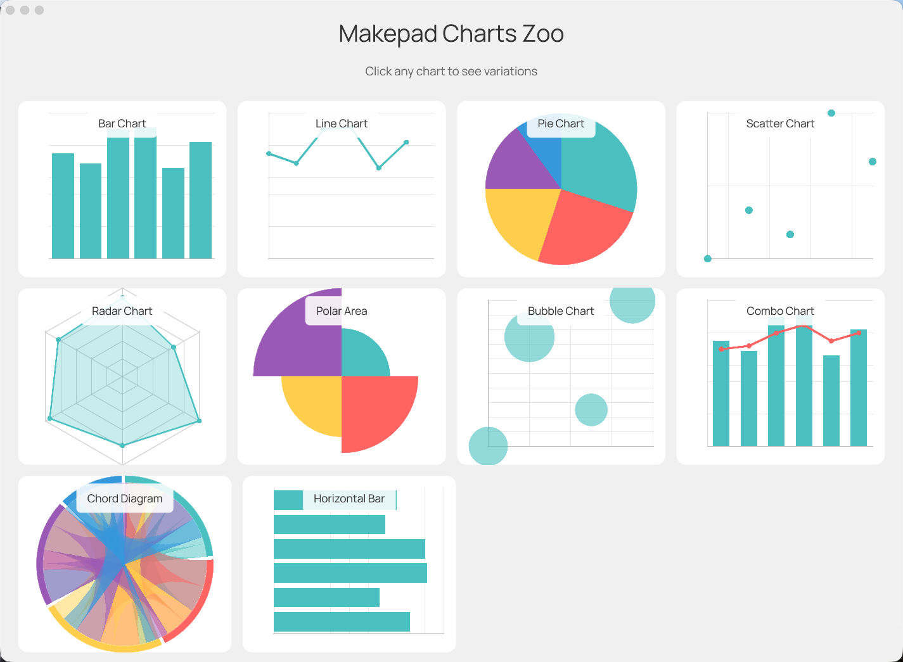

# Makepad Chart

> https://github.com/mofa-org/makepad-chart

面向 [Makepad](https://github.com/makepad/makepad) 的 GPU 加速图表库，与 Chart.js 约 75% 功能对齐。


## 特性

- **11 种图表类型**：Bar、Line、Pie、Doughnut、Scatter、Bubble、Radar、Polar Area、Combo、Horizontal Bar、Chord
- **GPU 加速**：所有渲染均通过 Makepad 的 GPU 着色器系统完成
- **动画**：28 种缓动函数 + 延迟动画 + 渐进动画
- **渐变**：所有图表类型支持垂直、径向与角向渐变
- **渐进动画**：1000+ 点的密集时间序列按左到右绘制
- **图表叠加**：使用绝对定位叠加多种图表类型
- **多数据集配色**：支持按数据集配色与自定义颜色
- **交互**：悬停效果与点击检测
- **跨平台**：支持桌面端、Web（WASM）、iOS、Android

## 运行示例

```bash
cargo run --example chart_zoo
```
## 渲染效果



## 安装

在 `Cargo.toml` 中添加：

```toml
[dependencies]
makepad-widgets = { git = "https://github.com/makepad/makepad", branch = "main" }
makepad-charts = { git = "https://github.com/mofa-org/makepad-chart", branch = "main" }
```

## 快速开始

### 1. 注册库

```rust
impl LiveRegister for App {
    fn live_register(cx: &mut Cx) {
        makepad_widgets::live_design(cx);
        makepad_charts::live_design(cx);  // Add this
    }
}
```

### 2. 在 UI 中添加图表

```rust
live_design! {
    use link::theme::*;
    use link::widgets::*;
    use makepad_charts::chart::bar_chart::BarChart;

    App = {{App}} {
        ui: <Window> {
            body = <View> {
                my_chart = <BarChart> {
                    width: Fill,
                    height: 300,
                }
            }
        }
    }
}
```

### 3. 设置图表数据

```rust
use makepad_charts::*;
use makepad_charts::chart::bar_chart::BarChart;

impl App {
    fn setup_chart(&mut self, cx: &mut Cx) {
        let data = ChartData::new()
            .with_labels(vec!["Jan", "Feb", "Mar", "Apr", "May", "Jun"])
            .add_dataset(
                Dataset::new("Sales")
                    .with_data(vec![65.0, 59.0, 80.0, 81.0, 56.0, 72.0])
            );

        if let Some(mut chart) = self.ui.widget(id!(my_chart)).borrow_mut::<BarChart>() {
            chart.set_data(data);
            chart.set_options(ChartOptions::new().with_begin_at_zero(true));
        }

        self.ui.redraw(cx);
    }
}
```

## 图表类型

### Bar Chart（柱状图）
```rust
use makepad_charts::chart::bar_chart::BarChart;

// 垂直柱状，支持堆叠与分组模式
chart.set_stacked(true);  // 启用堆叠
chart.set_delay_animation(true);  // 交错动画
chart.set_gradient(true);  // 柱状渐变
```

### Line Chart（折线图）
```rust
use makepad_charts::chart::line_chart::{LineChart, SteppedMode};

chart.set_fill(true);  // 面积图
chart.set_stepped(SteppedMode::After);  // 阶梯线
chart.set_show_points(true);  // 显示数据点
chart.set_progressive_animation(true);  // 从左到右绘制
chart.set_gradient(true);  // 启用区域渐变
```

### Pie / Doughnut Chart（饼图/环形图）
```rust
use makepad_charts::chart::pie_chart::PieChart;

chart.set_doughnut(true);  // 环形模式
chart.set_radial_gradient(true);  // 启用渐变
```

### Scatter Chart（散点图）
```rust
use makepad_charts::chart::scatter_chart::ScatterChart;

let data = ChartData::new()
    .add_dataset(
        Dataset::new("Points")
            .with_xy_data(vec![(1.0, 2.0), (3.0, 4.0), (5.0, 6.0)])
    );

chart.set_gradient(true);  // 点使用径向渐变
```

### Bubble Chart（气泡图）
```rust
use makepad_charts::chart::bubble_chart::BubbleChart;

let data = ChartData::new()
    .add_dataset(
        Dataset::new("Bubbles")
            .with_bubble_data(vec![
                (x, y, radius),  // 每个点包含 x、y 与半径
            ])
    );

chart.set_gradient(true);  // 气泡使用径向渐变
```

### Radar Chart（雷达图）
```rust
use makepad_charts::chart::radar_chart::RadarChart;

chart.set_fill(true);
chart.set_gradient(true);  // 径向渐变填充
```

### Polar Area Chart（极坐标面积图）
```rust
use makepad_charts::chart::polar_area_chart::PolarAreaChart;
// 等角度扇区，半径取决于数值
```

### Combo Chart（柱线组合图）
```rust
use makepad_charts::chart::combo_chart::{ComboChart, DatasetType};

chart.set_dataset_types(vec![DatasetType::Bar, DatasetType::Line]);
```

### Horizontal Bar Chart（横向柱状图）
```rust
use makepad_charts::chart::horizontal_bar_chart::HorizontalBarChart;
// 横向柱状，Y 轴为分类
```

### Chord Diagram（弦图）
```rust
use makepad_charts::chart::chord_chart::{ChordChart, ChordData};

// 基于矩阵的关系数据
let data = ChordData::new()
    .with_labels(vec!["A", "B", "C", "D"])
    .with_matrix(vec![
        vec![0.0, 50.0, 30.0, 10.0],  // A 到 B、C、D 的流量
        vec![20.0, 0.0, 40.0, 15.0],  // B 到 A、C、D 的流量
        vec![10.0, 25.0, 0.0, 35.0],  // C 到 A、B、D 的流量
        vec![5.0, 10.0, 20.0, 0.0],   // D 到 A、B、C 的流量
    ]);

chart.set_data(data);
```
