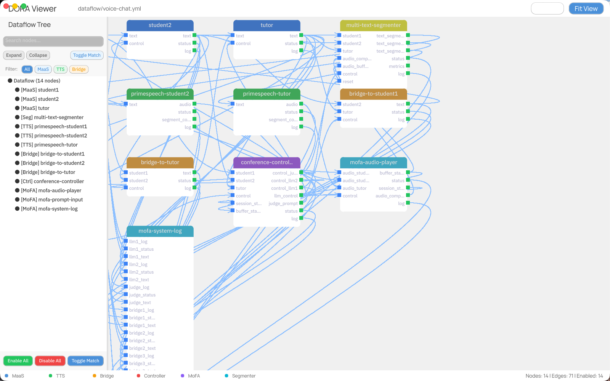

# Makepad Flow

> https://github.com/mofa-org/makepad-flow

基于 [Makepad](https://github.com/makepad/makepad) 的可视化数据流图形库与查看器。用于创建、可视化并交互式操作基于节点的数据流图。

## 特性

- **FlowCanvas 组件**：用于渲染节点图的 GPU 加速画布
- **交互式编辑**：拖拽节点、创建连接、缩放与平移
- **可定制节点**：多种形状（圆角、菱形、圆形），按分类着色
- **连线样式**：实线、虚线、点线并带流动粒子动画
- **YAML 导入**：从 YAML 文件加载数据流定义
- **过滤**：搜索、分类过滤、启用/禁用节点与端口

## 快速开始

```bash
# Clone the repository
git clone https://github.com/mofa-org/makepad-flow.git
cd makepad-flow

# Run the DORA Viewer demo
cargo run --bin dora-viewer
```

## 渲染效果




## 项目结构

```
makepad-flow/
├── crates/
│   └── makepad-flow/        # 核心流画布库
│       └── src/
│           └── flow_canvas.rs
├── examples/
│   └── dora-viewer/         # DORA 数据流查看器应用
│       ├── src/
│       │   ├── app.rs       # 主应用
│       │   ├── dataflow_tree.rs  # 用于过滤的树形组件
│       │   └── log_panel.rs
│       ├── dataflow/        # 示例 YAML 数据流
│       └── resources/       # 字体与资源
└── docs/                    # 文档
```

## DORA Viewer

DORA Viewer 是一个用于可视化 DORA 数据流定义的完整应用。

### 运行

```bash
cargo run --bin dora-viewer
```

### 功能

| 功能 | 说明 |
|---------|-------------|
| **加载 YAML** | 自动加载 `dataflow/voice-chat.yml` |
| **平移与缩放** | 鼠标滚轮缩放，拖拽空白区域平移 |
| **选择节点** | 点击选中，拖拽多选 |
| **移动节点** | 拖拽已选节点进行移动 |
| **按分类过滤** | 点击 MaaS、TTS、Bridge 按钮 |
| **搜索端口** | 在搜索框输入关键字过滤 |
| **切换匹配** | 批量启用/禁用与搜索匹配的端口 |
| **Ctrl+Click** | 切换单个节点/端口的启用状态 |

### 画布导航

| 操作 | 方法 |
|--------|--------|
| **平移画布** | 在画布任意位置按 **Shift + 鼠标拖拽** |
| **缩放** | 鼠标滚轮上下滚动 |
| **适配视图** | 点击工具栏中的 "Fit View" 按钮 |
| **选择节点** | 点击节点 |
| **多选** | 拖拽框选 |
| **移动节点** | 拖拽已选节点 |

### 启用/禁用系统

查看器支持启用或禁用节点与端口，以过滤数据流展示。

#### Ctrl+Click 切换

在左侧树形面板中，使用 **Ctrl+Click** 切换任何条目的启用状态：

- **Ctrl+Click 节点**：切换该节点以及其所有端口
- **Ctrl+Click 端口**：仅切换该端口

#### 启用状态

| 状态 | 图标 | 说明 |
|-------|------|-------------|
| **完全启用** | ● | 节点与所有端口都启用，画布正常显示 |
| **部分启用** | ◐ | 节点部分端口启用，节点可见，仅显示启用连接 |
| **完全禁用** | ○ | 节点与所有端口禁用，若无连接则从画布隐藏 |

#### 可视化提示

- **启用项**：树形面板中正常文本颜色
- **禁用项**：树形面板中灰化显示
- **隐藏连接**：连接到禁用端口的边在画布中不显示
- **隐藏节点**：节点所有连接禁用后自动从画布消失

#### 批量操作

| 按钮 | 位置 | 效果 |
|--------|--------|--------|
| **Enable All** | 底部 | 启用所有节点与端口 |
| **Disable All** | 底部 | 禁用所有节点与端口 |
| **Toggle Match** | 顶部与底部 | 切换与搜索匹配的所有端口 |

#### 示例流程

1. 在搜索框输入 "control"
2. 点击 **Toggle Match** → 所有包含 "control" 的端口被禁用
3. 仅含 "control" 连接的节点从画布消失
4. 再次点击 **Toggle Match** → 端口重新启用，节点重新出现

### 控制汇总

| 操作 | 控制 |
|--------|--------|
| **平移画布** | **Shift + 鼠标拖拽** |
| 缩放 | 鼠标滚轮 |
| 选择节点 | 点击节点 |
| 多选 | 拖拽框选 |
| 移动节点 | 拖拽已选节点 |
| **启用/禁用** | **Ctrl+Click**（树形面板） |
| 节点菜单 | 右键节点 |
| 边菜单 | 右键边 |

## FlowCanvas 库

核心 `makepad-flow` crate 提供 `FlowCanvas` 组件，用于构建自定义数据流应用。

### 基础用法

```rust
use makepad_flow::flow_canvas::*;

live_design! {
    use link::theme::*;
    use link::widgets::*;
    use makepad_flow::flow_canvas::FlowCanvas;

    App = {{App}} {
        ui: <Window> {
            body = <FlowCanvas> {}
        }
    }
}
```

### 添加节点

```rust
// 以编程方式添加节点
let canvas = self.ui.flow_canvas(id!(body));
canvas.add_node(cx, NodeType::Processor);
```

### 节点分类

节点可以设置分类用于颜色编码：

| 分类 | 颜色 | 用途 |
|----------|-------|----------|
| MaaS | 蓝色 | Model as a Service |
| TTS | 绿色 | Text-to-Speech |
| Bridge | 橙色 | Connectors |
| Controller | 红色 | Control nodes |
| MoFA | 紫色 | MoFA agents |
| Segmenter | 青色 | Segmentation |

## YAML 数据流格式

```yaml
nodes:
  - id: node-name
    path: executable/path
    inputs:
      input-port: source-node/output-port
    outputs:
      - output-port-name
```

### 示例

```yaml
nodes:
  - id: camera
    path: camera-capture
    outputs:
      - image
      - metadata

  - id: detector
    path: object-detector
    inputs:
      frame: camera/image
    outputs:
      - detections
      - confidence

  - id: tracker
    path: object-tracker
    inputs:
      detections: detector/detections
      frame: camera/image
    outputs:
      - tracks
```

## 文档

- [DORA Viewer Usage](https://github.com/mofa-org/makepad-flow/blob/main/examples/dora-viewer/doc/USAGE.md) - 详细使用指南
- [API Gaps](https://github.com/mofa-org/makepad-flow/blob/main/API_GAPS.md) - 已知限制
- [Roadmap](https://github.com/mofa-org/makepad-flow/blob/main/ROADMAP.md) - 未来开发计划

## 要求

- Rust（最新稳定版）
- Makepad 框架
