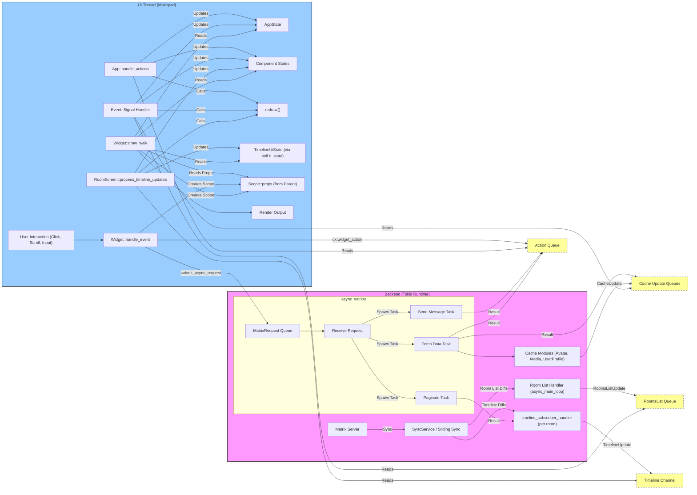

# Robrix 代码评审 Checklist

> Author: AlexZhang

**目标:** 确保 Robrix 的代码在架构层面保持清晰、高效、可维护，并遵循 Makepad 和 Rust 的最佳实践。

**本 Checklist 侧重于架构决策而非通用编码规范**，所以内容倾向于更加精简，有利于开发者把握基本原则而非受制于条条框框的约束。

**核心原则总结:**

*   **UI/后台分离:** UI 主线程 (Makepad) vs 后台异步线程 (Tokio)。
*   **通信:** Action 系统 (`Cx::post_action`, `cx.widget_action`), 线程安全队列 (`SegQueue`), 特定通道 (`mpsc`, `watch`, `crossbeam_channel`)。
*   **状态管理:** 全局 `AppState`, 每个房间的 `TimelineUiState`, 各种缓存。

---

## **一、 关注点分离 (Separation of Concerns)**

*   **[ ] 后端逻辑纯粹性:**
    *   后台模块（如 `sliding_sync.rs` 中的异步任务）是否包含或直接管理 *仅用于 UI 展示* 的状态（例如，“加载中”、“失败”、“已选中”标记、UI 元素的可见性标志）？
    *   后台任务是否直接解析或解释用户输入的原始文本（如检查是否包含 `@room` 字符串）来决定业务逻辑（如是否设置 `mentions.room`）？
    *   **目标:** 后台应专注于数据获取、处理和核心业务逻辑，将处理结果通过 Action 或更新通知发送给 UI，由 UI 组件负责管理自身的展示状态。后台应依赖于从 UI 层传递过来的、已经明确意图的数据结构。
*   **[ ] UI 职责清晰:**
    *   UI 组件（如 `RoomsList`, `RoomScreen`, `RoomPreview`）是否清晰地负责其自身的展示逻辑，例如基于接收到的数据进行过滤、排序、格式化？
    *   数据存储/缓存（如 `AppState`, `RoomsList::all_rooms`, 各 `*_cache.rs`）是否与数据的 *展示* 逻辑分离？
    *   负责处理用户输入的组件（如 `MentionableTextInput`）是否完整地封装了与该输入相关的意图解析逻辑（例如，区分用户是输入了普通文本 "@room" 还是通过建议列表选择了 `@room` 提及）？
    *   **目标:** 避免在数据层或后台进行与特定视图相关的展示逻辑处理。输入组件应负责将用户的原始输入转化为结构化的意图数据。
*   **[ ] 状态所有权与传递:**
	* 状态更新是否有合理的粒度（过大导致不必要重绘，过小导致更新不完整）？
	* 状态初始化和重置逻辑是否健壮 ？
	* 全局状态与本地状态的边界是否明确 ？
    *   对于特定上下文（如当前房间）的数据（例如房间成员列表），其所有权是否由该上下文的主要管理者（如 `RoomScreen`）持有？
    *   这些上下文数据是否通过 `Scope::props` 机制以只读引用的方式向下传递给需要访问它的子组件（如 `MentionableTextInput`, `EditingPane`）？
    *   **目标:** 避免子组件持有不必要的、可能导致内存泄漏或状态不一致的持久化上下文数据副本。状态应由合适的父级管理并通过 props 共享。
*   **[ ] 操作原子性与分离:**
    *   一个函数或 `MatrixRequest` 变体是否承担了过多不同的职责？（例如，一个函数既查询登录类型又执行登录操作）。
    *   **目标:** 保持函数和请求的单一职责，便于理解、测试和重用。预操作（如查询）应与核心操作（如执行）分离。
*   **[ ] 渲染与逻辑分离 (`draw_walk`):**
    *   `draw_walk` 方法中是否包含了非绘制逻辑，如权限检查、复杂计算、状态更新或触发 Action？
    *   **目标:** `draw_walk` 应尽可能轻量，仅基于 *当前已确定* 的状态进行绘制。状态更新应在 `handle_event` 或 `handle_actions` 中完成。

---

## **二、 性能意识**

*   **[ ] UI 线程效率:**
    *   `draw_walk`, `handle_event`, `handle_actions` 是否避免了可能阻塞主线程的操作？（例如，直接的文件 I/O、网络请求、长时间运行的循环、频繁或长时间的锁等待）。
    *   事件处理中是否避免了对大型全局集合（如所有房间、所有用户）的不必要或低效迭代？是否只处理与当前事件/Action 相关的最小工作集？
    *   **目标:** 保证 UI 线程的流畅响应。
*   **[ ] 后台任务委托:**
    *   所有潜在的阻塞或耗时操作（网络、文件、图像解码、复杂数据转换等）是否都通过 `submit_async_request` 委托给了后台 Tokio 线程处理？
    *   **目标:** 将耗时工作移出 UI 线程。
*   **[ ] 数据结构与算法效率:**
    *   对于 `HashMap`/`BTreeMap` 的操作是否高效？（例如，是否在需要插入或更新时使用了 `entry` API 来避免重复查找？）
    *   集合操作（过滤、查找、移除等）是否优先使用 Rust 的迭代器方法而非手动循环？
    *   **目标:** 使用合适的数据结构和算法以获得最佳性能。
*   **[ ] 内存使用与克隆:**
    *   是否存在不必要的 `.clone()` 调用，尤其是在循环或频繁调用的代码路径中？是否可以传递引用 (`&` 或 `&mut`) 代替？
    *   是否避免了将数据收集到临时 `Vec` 中然后立即对其进行迭代的情况？
    *   **目标:** 减少不必要的内存分配和拷贝开销。
*   **[ ] 缓存利用:**
    *   是否有效利用了现有的缓存机制（头像、媒体、用户配置、房间成员）来避免重复的网络请求或计算？
    *   缓存的更新和失效逻辑是否合理？
    *   **目标:** 通过缓存提高性能和减少资源消耗。
*   **[ ] 列表性能:**
    *   当用户输入并触发建议或搜索列表时，过滤和渲染大量成员或消息列表的操作是否足够高效？
    *   是否避免了在每次按键时都重新从全局缓存或父组件获取完整的结果列表？
    *   **目标:** 确保结果列表的弹出和过滤过程流畅。

---

## **三、 清晰的 API 设计与封装**

*   **[ ] 组件接口清晰性:**
    *   Widget 的公共 API（通过 `WidgetRef` 扩展方法暴露）是否意图明确、易于理解和使用？
    *   API 是否良好地封装了内部实现细节，防止调用者需要了解过多内部状态或进行不安全的操作？（例如 `AvatarRow` 的 API 改进）。
*   **[ ] 输入组件 API:**
    *   负责输入的组件（如 `MentionableTextInput`）是否提供清晰的 API 来获取最终解析出的结果信息（例如，一个返回 `Mentions` 结构体的方法）？
    *   **目标:** 输入组件应提供一个简洁的接口，返回结构化的结果，而不是让调用者（如 `RoomScreen`）去重新解析文本或查询内部状态。
*   **[ ] 接口一致性:**
    *   `WidgetRef` 扩展函数与其内部调用的 `Widget` 方法的可见性（`pub` vs private）是否匹配且合理？
*   **[ ] 内部逻辑封装:**
    *   复杂的内部逻辑是否通过私有辅助函数进行了良好的组织？
*   **[ ] 返回值/数据结构明确性:**
    *   当函数需要返回多个相关值时，是否使用了结构体或元组来封装？
    *   是否使用了专门的数据结构（如 `matrix_sdk::ruma::events::room::message::Mentions`）来精确表示提及的意图（包括用户 ID 和是否提及 `@room`），而不是依赖于布尔标志或字符串检查？
    *   **目标:** 使用类型系统来明确表达数据含义，减少歧义和潜在错误。

---

## **四、 遵循 Makepad 范式 (Actions, Draw Loop)**

*   **[ ] 状态通信方式:**
    *   跨线程或跨组件层级的状态变更是否主要通过 **Action** 机制驱动？
        *   后台 -> UI: `Cx::post_action` + `SignalToUI`。
        *   UI 内部: `cx.widget_action`。
    *   是否避免了过度依赖共享可变状态（如 `Arc<Mutex<T>>` 或 `RwLock`）在不同组件间直接修改数据来驱动 UI 更新？
    *   **目标:** 使用框架推荐的、基于消息传递的模式进行状态同步和通信。
*   **[ ] 状态驱动渲染:**
    *   是否遵循“状态驱动渲染”的核心原则？即：
        1.  `handle_event` / `handle_actions` 负责响应事件/动作，**更新状态**。
        2.  状态更新后，调用 `redraw()` 请求重绘。
        3.  `draw_walk` **仅根据当前状态**进行绘制，不应包含状态修改或复杂逻辑。
    *   **目标:** 保持渲染逻辑的纯粹性和可预测性。
*   **[ ] 动态样式应用:**
    *   当需要在 Rust 代码中根据状态动态改变 Widget 的样式或布局时，是否使用了 `live!{}` 宏和 `apply_over` 方法？
    *   **目标:** 使用 Makepad 提供的机制进行动态 UI 调整。
*   **[ ] Action 枚举规范:**
    *   自定义的 Action 枚举是否派生了 `#[derive(Clone, DefaultNone, Debug)]` 并包含一个 `None` 变体？
    *   **目标:** 符合 Makepad Action 的基本要求。


## 五、其他功能、安全和用户体验等检查

- **[ ] 跨平台兼容性检查:** Robrix支持桌面和移动端的不同布局，需要对跨平台适配的特定检查项：
	- UI组件是否正确响应不同屏幕尺寸和方向
	- 平台特定功能是否有恰当的抽象和替代方案
	- 资源文件（如图标和字体）是否为各平台正确优化

- **[ ]加强错误处理与用户体验检查:**
	- 网络错误是否有适当的用户反馈和重试机制
	- 用户操作失败时是否提供清晰的错误信息
	- 长时间操作是否有加载指示器

- **[ ] 安全性检查**
	- 敏感数据（如登录凭证）是否安全存储
	- 在 UI 中显示的用户数据是否经过适当清理以防止注入攻击


## 六、针对 Robrix 的愿景未来需要考虑的

- **模块化与可扩展性:**
    - **[ ] 服务插件化:** 新服务（LLM, ActivityPub 等）的集成是否设计为相对独立的模块/插件，易于添加、移除或替换？是否有清晰定义的接口？
    - **目标:** 确保添加新服务时，对现有代码的侵入性最小，架构易于扩展。
        
- **数据模型与聚合:**
    - **[ ] 统一数据模型:** 对于需要聚合展示的信息（如统一活动流），是否有设计合理的数据模型来表示来自不同服务的数据？
    - **[ ] 高效聚合:** 在后台或 UI 层聚合来自多个服务的数据时，性能是否足够高效？
    - **目标:** 有效管理和展示跨服务的数据。
        
- **错误处理与弹性:**
    - **[ ] 服务隔离:** 单个后台服务（如 ActivityPub 同步）的失败或阻塞，是否会影响其他服务（如 Matrix 同步）或整个应用的稳定性？
    - **目标:** 提高系统的容错能力。

# 附录

附录部分内容可以不断更新丰富，以便更好地沉淀项目知识。

## 附录 A: 核心原则详解

本部分旨在详细阐述 Robrix 代码评审 Checklist 中涉及的核心架构原则，并结合 Robrix 的具体实践进行说明，通过理解和遵循这些结合了 Robrix 具体实践的架构原则，以便团队可以更有效地进行代码开发和评审，构建出更健壮、高效和易于维护的应用程序。


- **图示说明:**
    
    - 展示了 **UI 主线程** (蓝色) 和 **后台异步运行时线程池** (红色) 的分离。
    - 描绘了两者之间的主要通信方式：
        - UI -> 后台 (异步请求): 蓝色实线 (sync -> async channel)，对应 MatrixRequest 队列。
        - 后台 -> UI (响应/更新): 红色虚线 (async -> sync channel)，对应 Cx::post_action / SignalToUI 或其他通知机制。
    - 展示了后台线程内部可能存在的同步调用（橙色框，调用平台 API）和异步调用（粉色框，调用异步平台 API 或 Matrix SDK）。
    - 提到了后台任务可能嵌套调用（红色框内箭头）。
    - 正确地将 Makepad UI Toolkit、Matrix SDK、Robius 平台抽象层和底层 OS/平台层放在了合适的位置。
    - 特别指出了媒体缓存 (media cache) 作为 UI 和后台都可能访问的共享内存区域（尽管图中箭头指向略有歧义，但概念是对的）。
    - 图的标题和注释也点明了手动管理混合并发上下文的复杂性。

### **一、 关注点分离 (Separation of Concerns)**

*   **原则解释:** 这是软件工程的基本原则，要求将一个复杂的系统划分为不同的部分，每个部分处理一个特定的关注点或职责。在 Robrix 中，最主要的体现是将 UI 逻辑、后台业务逻辑（Matrix 交互）和数据管理（状态、缓存、持久化）分开。
*   **重要性:**
    *   **可维护性:** 修改一个部分的逻辑（如 UI 布局）不应意外地破坏其他部分（如网络请求）。
    *   **可测试性:** 可以独立地测试后台逻辑，而无需依赖 UI。
    *   **可重用性:** 通用的后台逻辑或数据管理模块可以被不同的 UI 组件复用。
    *   **并行开发:** 不同开发者可以专注于不同的层面。
*   **Robrix 体现与实践:**
    *   **UI vs 后台:** `app.rs`, `home/`, `shared/` 等主要负责 UI 展示和交互，运行在主线程。`sliding_sync.rs` 中的 `async_worker`, `async_main_loop`, `timeline_subscriber_handler` 等运行在后台 Tokio 线程，处理网络、SDK 交互等。这是最核心的分离。
    *   **UI 内部职责:**
        *   `App` 负责顶层导航和全局模态框。
        *   `HomeScreen` 负责整体布局（桌面/移动）。
        *   `RoomScreen` 负责单个房间的展示和交互逻辑。
        *   `RoomsList` 负责房间列表的展示和过滤。
        *   （TODO 可增补更多组件说明）
    *   **数据与展示分离:**
        *   `RoomsList` 持有 `all_rooms` (数据存储) 和 `displayed_rooms` (展示状态)，过滤逻辑在 `RoomsList` 中，而不是让后台返回过滤后的数据。
        *   后台任务（如 `timeline_subscriber_handler`）发送原始或接近原始的数据更新 (`TimelineUpdate`)，由 `RoomScreen` 负责解释这些更新并修改其 `TimelineUiState`，最终影响绘制。
    *   **避免在“错误的地方”处理逻辑:**
        *   **反例 (需避免):** 在 `sliding_sync.rs` 中直接管理 UI 元素的“加载中”状态。
        *   **正例:** 后台发送 `TimelineUpdate::PaginationRunning`，由 `RoomScreen` 接收并设置 `TopSpace` 的可见性。
        *   **反例 (需避免):** 在 `draw_walk` 中进行权限检查。
        *   **正例:** 在 `handle_event` 或 `handle_actions` 中检查权限，并将结果（如按钮是否启用）存储在 Widget 状态中，`draw_walk` 只读取该状态。
        *   **反例 (需避免):** `MentionableTextInput` 直接解析原始文本判断 `@room`。
        *   **正例:** `MentionableTextInput` 解析用户意图，生成 `Mentions` 对象，`RoomScreen` 使用该对象。


###  **二、 性能意识**

 **原则解释:** 编写的代码不仅要功能正确，还要在资源消耗（CPU、内存）和响应时间上表现良好，尤其是在直接影响用户体验的 UI 线程上。
 
**重要性:**

- **流畅性:** 避免 UI 卡顿、掉帧，提供顺滑的用户体验。
- **响应性:** 应用能快速响应用户操作。
- **资源效率:** 减少电池消耗和内存占用。

**Robrix 体现与实践:**

- **UI 线程保护:**
	- **禁止阻塞:** 严格禁止在 `draw_walk`, `handle_event`, `handle_actions` 中执行任何可能耗时超过几毫秒的操作（网络、文件 I/O、复杂计算、长时间锁等待）。
	- **异步委托:** 所有这些耗时操作都通过 `submit_async_request` 发送到后台 Tokio 线程。
- **高效数据处理:**
	- **避免冗余迭代:** 不在每个事件或 Action 中迭代大型集合（如 `RoomsList::all_rooms`）。更新应尽可能精确，只处理受影响的部分。
	- **善用迭代器和 API:** 使用 `retain`, `filter`, `map`, `entry` API 等高效方法处理集合和 Map。
	- **减少克隆:** 优先传递引用 (`&`, `&mut`, `&Arc`)，尤其是在循环和频繁调用的函数中。`Arc` 本身克隆是廉价的，但克隆其内部数据（如 `Vec`）是昂贵的。
-   **缓存策略:**
	-  积极使用 `avatar_cache`, `media_cache`, `user_profile_cache`, `room_member_manager` 来存储已获取的数据，避免重复请求。
	- 缓存的获取逻辑 (`get_or_fetch_*`) 应检查缓存是否存在，如果不存在且未请求，则发起后台请求并标记为 `Requested`，避免重复请求。
-   **`draw_walk` 轻量化:**
	- `draw_walk` 只做绘制相关的事情，依赖于 *已经准备好* 的状态。所有计算、格式化（如时间戳）、数据转换应在状态更新时（`handle_event`/`actions`）完成。


###  **三、 清晰的 API 设计与封装**

**原则解释:**  设计组件和模块时，要提供清晰、简洁、易于理解和使用的公共接口（API），同时隐藏内部复杂的实现细节。好的封装能降低耦合，提高代码的可维护性和可重用性。

**重要性:**
-   **易用性:** 调用者能轻松理解如何使用组件。
- **健壮性:** 减少误用的可能性。
- **可维护性:** 内部实现可以修改而不影响外部调用者（只要 API 不变）。
- **模块化:** 组件可以像积木一样组合。

**Robrix 体现与实践:**

-   **`WidgetRef` 扩展:** 通过为 `WidgetRef` 实现扩展 Trait (如 `AvatarWidgetRefExt`) 来提供类型安全的、面向对象的 API。
- **单一入口点:** 像 `AvatarRow::set_avatar_row` 这样的方法，封装了设置数据和更新内部状态的逻辑，比暴露多个需要按特定顺序调用的方法（如 `set_range` + `iter_mut`）更好。
- **隐藏内部状态:** 子组件不应直接访问父组件的内部 `#[rust]` 状态字段。应通过 `props` (只读) 或 Action (请求修改) 进行交互。
- **明确的返回值:** 使用结构体 (如 `UserProfilePaneInfo`, `CalloutTooltipOptions`) 或有意义的元组来封装多个返回值。使用专门的类型（如 `Mentions`）来传递具有特定语义的数据。
- **私有化:** 将仅供内部使用的辅助函数标记为私有 (`fn` 而非 `pub fn`)。


### **四、 遵循 Makepad 范式 (Actions, Draw Loop)**

 **原则解释:** 有效利用 Makepad 框架提供的核心机制（事件处理、Action 系统、绘制循环、Live Design）来构建应用，而不是试图绕过或重新发明轮子。

**重要性:**
-   **一致性:** 代码风格与框架和其他部分保持一致，易于团队协作。
- **效率:** 利用框架优化过的机制（如 Action 分发、绘制系统）。
- **可维护性:** 更容易利用框架未来的更新和改进。

**Robrix 体现与实践:**
- **Action 驱动状态:**
	- **跨线程通信:** 后台任务完成 -> `Cx::post_action` -> `SignalToUI` -> UI `handle_actions` -> 更新状态 -> `redraw()`。这是标准流程。
	- **UI 内部通信:** 子 Widget -> `cx.widget_action` -> 父 Widget `handle_actions` -> 更新状态 -> `redraw()`。
	- **避免共享锁:** 尽量不使用 `Arc<Mutex<T>>` 或 `RwLock` 在 UI 组件间直接共享和修改状态来驱动更新，这容易出错且可能阻塞 UI。Action 是首选。
	- **状态驱动渲染:**
		- 严格遵守：事件/Action 处理函数负责**更新状态**，然后调用 `redraw()`。`draw_walk` 函数只负责**读取当前状态**并进行绘制。
		- **反例 (需避免):** 在 `draw_walk` 中计算布局、过滤数据、发送 Action 或修改 `#[rust]` 状态。
	- **Live Design 集成:**
		- 使用 `live!{}` 和 `apply_over` 在 Rust 代码中动态修改由 Live Design 定义的属性（颜色、边距、可见性等）。
	- **Action 枚举:**
        *   遵循规范，使用 `#[derive(Clone, DefaultNone, Debug)]` 并包含 `None` 变体。

---

## 附录 B：Makepad 编程范式

Makepad 框架采用了一种独特的混合范式，旨在结合声明式 UI 定义的速度和灵活性，以及 Rust 语言的性能和类型安全。其核心思想可以概括为：**Live Design DSL 定义结构与样式，Rust 处理逻辑与状态，通过 Action 机制进行通信，并遵循状态驱动的渲染循环。**

**1. 核心理念：Live Design DSL + Rust 逻辑分离**

*   **Live Design (`live_design!`)**:
    *   **用途**: 定义 UI 的结构、布局 (`Walk`, `Layout`)、视觉样式 (`Draw*` shaders)、动画 (`animator`) 和组件的默认/可配置属性 (`#[live]`)。
    *   **语法**: 类 CSS/JSON 的声明式语法，易于阅读和修改。
    *   **优势**: 支持实时编码 (Live Coding)，修改 DSL 无需重新编译 Rust 代码即可看到 UI 更新，极大提高了 UI 迭代速度，方便设计师与开发者协作。
*   **Rust 代码**:
    *   **用途**: 实现应用程序的核心逻辑、状态管理、事件处理、网络请求、数据处理等。
    *   **连接**: 通过 `#[derive(Live, LiveHook)]` 宏将 Rust 结构体（通常是 `App` 或自定义 Widget）与 DSL 中的定义关联起来。`#[live]` 属性标记了可以在 DSL 中设置或覆盖的字段。`LiveHook` trait (如 `after_apply`, `after_new_from_doc`) 允许在 DSL 更新应用到 Rust 结构体后执行初始化或响应逻辑。
    *   **优势**: 利用 Rust 的性能、内存安全和强大的类型系统。

**2. 状态管理：集中式、Action 驱动**

*   **状态存储**:
    *   应用程序或组件的状态主要存储在 Rust 结构体的字段中。
    *   使用 `#[live]` 标记的字段可以在 DSL 中初始化或修改，适合配置项和默认值。
    *   使用 `#[rust]` 标记的字段是纯 Rust 状态，不由 DSL 直接控制，用于存储运行时数据、缓存等。
*   **状态更新**:
    *   **核心原则**: 状态的修改**必须**在事件处理函数（如 `handle_event`, `handle_actions`, `handle_signal`）中进行，**绝不**应该在 `draw_walk` 中修改状态。
    *   **触发重绘**: 状态更新后，必须显式调用 `widget_ref.redraw(cx)` 或 `area.redraw(cx)` 来通知框架该部分 UI 需要重新绘制。
*   **避免共享可变状态**:
    *   **不推荐**: 尽量避免使用 `Arc<Mutex<T>>` 或 `RwLock` 等共享可变状态在不同组件间直接传递和修改数据来驱动 UI 更新。这种方式容易引入复杂性、竞态条件和调试困难。
    *   **推荐**: 使用下面描述的 Action 机制进行状态同步和通信。

**3. 事件处理与通信：基于 Action 的消息传递**

*   **事件流**: 事件（如用户输入、网络响应、定时器）由 `AppMain::handle_event` 接收，并通过 `widget_ref.handle_event(cx, event, scope)` 在 Widget 树中传递（通常是向上或向下，取决于 `event_order`）。
*   **WidgetAction**: 这是 Makepad 中组件间通信的核心机制。
    *   **发送**: 子 Widget 或任何需要通知外部的代码通过 `cx.widget_action(widget_uid, path, YourActionEnum::Variant)` 发送一个 Action。`widget_uid` 标识了发送者，`path` 提供了层级信息，`YourActionEnum` 是自定义的包含具体信息的枚举。
    *   **处理**: 父 Widget 或 App 通常在 `MatchEvent::handle_actions` 方法中监听 Actions。通过 `widget_ref.action_name(&actions)` 或 `actions.find_widget_action(uid).cast()` 等辅助方法来检查和处理特定 Widget 发出的特定 Action。
    *   **优势**: 实现了解耦，组件不需要直接了解彼此的内部实现，只需定义清晰的 Action 接口。通信路径清晰，易于追踪。
*   **后台到 UI**:
    *   对于后台线程（如网络请求、文件 IO）完成后的结果，使用 `Cx::post_action(YourSignalEnum::Variant)` 发送一个 `SignalToUI` 类型的 Action。
    *   UI 线程在 `MatchEvent::handle_signal` 中接收并处理这些信号，然后更新状态并请求重绘。
*   **Action 枚举规范**: 自定义的 Action 枚举需要 `#[derive(Clone, DefaultNone, Debug)]` 并包含一个 `None` 变体，以满足框架的要求。

**4. 渲染范式：状态驱动、声明式绘制**

*   **核心原则**: 绘制逻辑应该是当前状态的纯函数映射。`draw_walk` 方法只读取当前状态并生成绘制指令，不应有副作用或修改状态。
*   **渲染循环**:
    1.  事件发生，`handle_event`/`handle_actions` 更新状态。
    2.  状态更新后，调用 `redraw()` 标记需要重绘的 `Area`。
    3.  `Cx` 在事件循环的适当时候收集所有重绘请求。
    4.  触发 `Event::Draw` 事件。
    5.  `draw_walk` 被调用，它读取**当前**的状态，并使用 `Cx2d` API 生成绘制指令（通常是填充 `Draw*` 结构体的 uniforms 和 instances）。
*   **绘制原语**: `DrawQuad`, `DrawText`, `DrawIcon`, `DrawColor` 等结构体封装了 Shader 和相关 uniforms。它们的 `fn pixel` 和 `fn vertex` 定义了视觉表现。
*   **性能优化**:
    *   `DrawList2d`: 内部优化机制，用于批处理绘制调用。
    *   `ViewOptimize::DrawList` / `Texture`: 允许将静态或不常变化的 UI 部分缓存到绘制列表或纹理中，避免每帧重新计算布局和绘制。`CachedView` 是一个方便使用的包装器。

**5. Widget 架构：组合与派生宏**

*   **定义**: 使用 `#[derive(Live, LiveHook, Widget)]` 定义 Widget。
*   **组合**: 通过在 `live_design!` 中嵌套 `View` 或其他 Widget 来构建复杂 UI。使用 `#[deref]` 将核心 `Widget` 功能（如 `draw_walk`, `handle_event`）委托给内部的 `View` 或其他基础 Widget。
*   **交互**: 在 Rust 代码中，使用 `WidgetRef` 和 `WidgetSet`（通常是类型别名如 `ButtonRef`, `ButtonSet`）来查找、访问和操作 Widget 实例。

**6. 异步操作**

*   **后台任务**: 使用 `Cx::spawn_thread` 启动后台线程执行耗时操作。
*   **结果传递**: 使用 `mpsc` channel 或自定义的 `ToUIReceiver`/`Sender` 模式，在后台线程完成后通过 `Cx::post_action` 发送 `SignalToUI` Action 将结果传递回 UI 线程。
*   **UI 更新**: 在 `handle_signal` 中处理后台任务的结果，更新状态并请求重绘。

**7. 动态 UI 更新 (Rust -> DSL)**

*   当需要在 Rust 代码中根据状态动态改变 Widget 的样式或布局（而不是仅仅重绘）时，使用 `widget_ref.apply_over(cx, live!{...})`。这允许将局部的 DSL 片段应用到现有的 Widget 实例上。

**8. 总结：Makepad 范式的优势**

*   **快速迭代**: Live Design DSL 允许快速修改 UI 而无需编译。
*   **性能**: 基于 Shader 的渲染和优化的绘制系统提供了高性能。Rust 本身也提供了良好的性能基础。
*   **可维护性**: DSL 与 Rust 的分离，以及基于 Action 的通信，使得代码结构更清晰，更易于维护和扩展。
*   **类型安全**: Rust 的强类型系统减少了运行时错误。
*   **跨平台**: 一套代码库可以编译到桌面、Web 和移动端。
*   **声明式与命令式的结合**: 结合了声明式 UI 定义的简洁性和命令式代码的灵活性与控制力。

遵循这些范式有助于编写出高效、可维护且符合 Makepad 设计哲学的应用程序。

---

## 附录 C： **理解 Makepad 的重绘机制**

判断和避免不必要的重绘是优化 Makepad 应用性能的关键。以下是一些方法和思考角度来判断和处理不必要的重绘：

**1. 理解 Makepad 的重绘机制**

*   **基于 Area**: Makepad 的重绘是基于 `Area` 的。当你调用 `widget_ref.redraw(cx)` 或 `area.redraw(cx)` 时，你实际上是标记了该 `Area` 为“脏”（dirty）。
*   **DrawList 收集**: 在事件循环的绘制阶段，`Cx` 会收集所有标记为脏的 `Area`。
*   **Pass 渲染**: `Cx` 会确定哪些 `Pass`（渲染通道，通常对应一个窗口或一个缓存的 View）需要重绘，因为它们包含脏的 `Area`。
*   **Draw Call 执行**: 只有那些与脏 `Area` 相交的 `DrawCall`（绘制指令）才会被重新发送到 GPU。

**2. 识别不必要重绘的迹象**

*   **高 CPU/GPU 使用率**: 即便 UI 没有明显变化或交互，CPU 或 GPU 使用率仍然很高。这可能意味着某些部分在不断地重绘。
*   **闪烁或视觉伪影**: 偶尔可能出现，尤其是在复杂的重绘逻辑下。
*   **动画卡顿**: 如果重绘范围过大或过于频繁，可能会影响动画的流畅度。
*   **调试日志/工具**:
    *   **Makepad Studio (如果可用)**: Studio 可能会提供可视化工具来显示哪些区域正在重绘。
    *   **日志**: 在 `handle_event` 或 `draw_walk` 的关键位置添加 `log!()` 语句，观察它们被调用的频率和时机。特别注意 `draw_walk` 是否在没有状态变化的情况下被频繁调用。
    *   **性能分析器**: 使用系统级的性能分析工具（如 Instruments on macOS, Perf on Linux, VTune on Windows/Linux）来识别 CPU/GPU 热点。

**3. 判断不必要重绘的常见原因和方法**

*   **在 `draw_walk` 中修改状态**:
    *   **问题**: 这是最常见的错误。`draw_walk` 应该只读取状态并绘制。如果在 `draw_walk` 中修改了状态（即使是很小的状态），并且该修改又触发了 `redraw()`，就会导致无限重绘循环。
    *   **判断**: 仔细检查所有 `draw_walk` 实现，确保没有修改任何 `#[live]` 或 `#[rust]` 状态字段，也没有调用任何可能间接触发状态改变或重绘的方法。
    *   **解决**: 将状态修改逻辑移到 `handle_event` 或 `handle_actions` 中。

*   **过于频繁地调用 `redraw()`**:
    *   **问题**: 在事件处理中，即使状态没有实际改变，也调用了 `redraw()`。或者在每个 `NextFrame` 事件中都无条件调用 `redraw()`。
    *   **判断**: 在调用 `redraw()` 之前，检查状态是否真的发生了需要重绘的变化。
    *   **解决**:
        ```rust
        fn handle_actions(&mut self, cx: &mut Cx, actions: &Actions) {
            let mut needs_redraw = false;
            if self.ui.button(id!(some_button)).clicked(actions) {
                if self.some_state != new_value { // 检查状态是否实际改变
                    self.some_state = new_value;
                    needs_redraw = true; // 标记需要重绘
                }
            }
            // ... 其他状态更新 ...
            if needs_redraw {
                self.ui.redraw(cx); // 仅在需要时重绘
            }
        }

        fn handle_event(&mut self, cx: &mut Cx, event: &Event, scope: &mut Scope) {
            if let Some(ne) = self.next_frame.is_event(event) {
                if self.animator.is_animating() { // 仅在动画进行中时重绘
                     self.update_animation_state(ne.time);
                     self.ui.redraw(cx);
                     self.next_frame = cx.new_next_frame();
                }
            }
            // ...
        }
        ```

*   **重绘范围过大**:
    *   **问题**: 调用了父级 Widget 甚至整个窗口的 `redraw()`，而实际上只有一小部分子 Widget 需要更新。
    *   **判断**: 观察 UI 更新时，哪些无关的部分也闪烁或表现出重绘迹象。使用 `cx.debug.area(area, color)` 在 `draw_walk` 中可视化 `Area`，看哪些 `Area` 被标记为脏。
    *   **解决**: 调用更精确的 `redraw()`。例如，只调用需要更新的子 Widget 的 `widget_ref.redraw(cx)`，或者直接使用子 Widget 的 `area.redraw(cx)`。

*   **不必要的动画触发**:
    *   **问题**: `Animator` 的状态转换被不必要地触发，即使视觉上没有变化，但 `apply` 块中的 `redraw: true` 仍然导致重绘。或者 `animator_handle_event` 返回 `must_redraw()` 但实际上没有视觉变化。
    *   **判断**: 检查触发动画状态转换的逻辑 (`animator_play`, `animator_toggle`) 是否过于频繁或在不必要时调用。
    *   **解决**: 精确控制动画状态的触发时机。如果动画本身没有视觉效果，考虑从 `apply` 块中移除 `redraw: true`（但这比较少见）。

*   **Live Design 更新触发的过度重绘**:
    *   **问题**: 在 Live Coding 过程中，对 DSL 的微小更改可能导致比预期更大范围的重绘。
    *   **判断**: 这通常是框架内部行为，较难直接控制，但可以通过观察 Studio 或日志来了解。
    *   **解决**: 通常不需要用户干预，但如果某个组件对 Live Update 反应特别慢，可能需要优化其 `after_apply` 逻辑或其子组件的绘制。

*   **对 `Area::Empty` 或无效 `Area` 调用 `redraw()`**:
    *   **问题**: 虽然通常不会导致错误，但对无效区域调用 `redraw` 是无意义的操作。
    *   **判断**: 检查调用 `redraw` 前 `Area` 是否有效（例如，Widget 是否已经绘制过至少一次）。
    *   **解决**: 添加判断 `if area.is_valid(cx) { area.redraw(cx); }` 或 `if !widget_ref.is_empty() { widget_ref.redraw(cx); }`。

*   **过度使用 `redraw_all()`**:
    *   **问题**: `cx.redraw_all()` 会重绘所有窗口的所有内容，应该只在全局状态改变（如主题切换）或调试时使用。
    *   **判断**: 搜索代码库中的 `cx.redraw_all()` 调用。
    *   **解决**: 替换为更精确的 `redraw()` 调用。

**调试技巧**

1.  **注释掉 `redraw()` 调用**: 临时注释掉可疑的 `redraw(cx)` 调用，观察 UI 是否仍然按预期更新（可能通过其他地方的 `redraw`）。如果 UI 停止更新，说明这个 `redraw` 是必要的；如果 UI 仍然更新或者某个不相关的部分停止更新，说明可能存在问题。
2.  **颜色调试**: 在 `draw_walk` 的开头为 Widget 的背景添加一个随机或变化的颜色，如果这个颜色在不应该变化的时候变化，说明它被不必要地重绘了。
    ```rust
    fn draw_walk(&mut self, cx: &mut Cx2d, scope: &mut Scope, walk: Walk) -> DrawStep {
        // 调试：每次绘制时改变颜色
        // self.draw_bg.color = Vec4::random(); // 需要引入 rand crate 或其他随机数生成方式
        // 或者根据时间变化
        // self.draw_bg.color = Pal::iq1(cx.time() as f32);

        self.draw_bg.begin(cx, walk, self.layout);
        // ... rest of draw_walk ...
        self.draw_bg.end(cx);
        DrawStep::done()
    }
    ```
3.  **日志记录**: 在 `handle_event`, `handle_actions`, `draw_walk` 等关键函数中添加 `log!()`，记录调用时机和相关状态，分析调用频率。

通过结合对 Makepad 重绘机制的理解和上述判断方法与调试技巧，可以有效地定位和消除不必要的重绘，从而优化应用程序的性能。

---

## 附录D：Matrix 异步交互模式详解

Robrix 的核心功能依赖于与 Matrix Homeserver 的持续通信，这是一个**典型的 I/O 密集型操作**。为了保持用户界面的流畅和响应性，Robrix 采用了清晰的同步（UI 主线程）与异步（后台 Tokio 线程）分离架构。这两个世界之间的交互通过精心设计的消息传递系统进行。

**1. 异步请求与响应模型**

Robrix 的异步交互遵循一个标准的“请求-响应/通知”模型：

*   **UI 发起请求:** 当用户执行需要后台处理的操作时（如发送消息、加载历史记录），UI 线程会构建一个请求对象（通常是 `MatrixRequest` 枚举的变体），并将其发送给后台异步任务。UI 线程不会等待操作完成，而是立即返回继续处理其他事件。
*   **后台处理请求:** 后台的 Tokio 运行时接收请求，并启动一个或多个异步任务来执行实际的操作（如网络调用、数据处理）。
*   **后台发送响应/通知:** 当后台任务完成或收到来自服务器的新数据时，它会将结果或更新信息打包成一个 `Action`（或其他形式的消息），并将其发送回 UI 主线程。
*   **UI 处理响应/通知:** UI 主线程被唤醒，接收并处理来自后台的消息，更新 UI 状态并重新绘制界面。

**2. 请求处理流程详解**

从用户在 UI 上触发一个动作，到后台完成处理，再到 UI 更新，其流程如下：

*   **a. UI 事件触发:** 用户交互（如点击按钮、滚动列表）在 UI 主线程的 `handle_event` 中被捕获。
*   **b. 构建 `MatrixRequest`:** UI 组件根据事件类型和当前状态，创建一个具体的 `MatrixRequest` 枚举实例。例如：
    *   点击发送按钮 -> `MatrixRequest::SendMessage { ... }`
    *   滚动到时间线顶部 -> `MatrixRequest::PaginateRoomTimeline { direction: Backwards, ... }`
    *   点击用户头像 -> `MatrixRequest::GetUserProfile { ... }`
*   **c. 提交请求 (`submit_async_request`):** UI 代码调用 `submit_async_request(request)`。
*   **d. 发送到 MPSC 通道 (`REQUEST_SENDER`):** `submit_async_request` 内部获取全局的 `tokio::sync::mpsc::UnboundedSender<MatrixRequest>` (`REQUEST_SENDER`)，并将 `request` 发送到通道中。这是一个**非阻塞**操作（因为通道是无界的）。
*   **e. `async_worker` 接收:** 后台 Tokio 运行时中的 `async_worker` 任务持有一个 `UnboundedReceiver<MatrixRequest>`。它在一个循环中 `recv().await` 等待新的请求。
*   **f. 任务分发 (`tokio::spawn`):** `async_worker` 收到请求后，通常会根据 `MatrixRequest` 的类型，使用 `tokio::spawn` 启动一个新的、具体的异步任务来处理该请求（例如，一个专门用于发送消息的任务，一个专门用于分页的任务等）。这使得 `async_worker` 本身可以快速返回并接收下一个请求，实现了并发处理。
*   **g. 执行异步操作:** 新生成的任务执行实际的耗时操作，例如调用 `matrix-sdk` 的异步方法与 Homeserver 交互。

**为什么选择特定的异步模式？**

*   **`tokio::sync::mpsc::unbounded_channel` (用于 `MatrixRequest`)**:
    *   **优点:**
        *   **非阻塞发送:** UI 线程发送请求时永远不会因为通道已满而阻塞，保证了 UI 的响应性。
        *   **通用性:** 适合发送各种不同类型的请求。
        *   **多生产者:** 多个 UI 组件都可以安全地向同一个后台 worker 发送请求。
    *   **缺点:** 无界可能导致内存无限增长（如果后台处理速度跟不上 UI 发送速度，但在典型客户端场景下风险较低）。
*   **`crossbeam_channel::unbounded` (用于 `TimelineUpdate`)**:
    *   **优点:**
        *   **同步接收端:** `Receiver` 可以在非 `async` 上下文（如 Makepad 的 `handle_event`）中使用 `try_recv` 进行非阻塞接收，非常适合 UI 线程。
        *   **高性能:** `crossbeam` 通常被认为在某些场景下比 `tokio::mpsc` 性能更高（尽管在此应用中差异可能不显著）。
        *   **目标明确:** 每个房间的 `Sender` 直接将更新发送给对应的 `RoomScreen` 的 `Receiver`。
    *   **缺点:** 需要为每个房间单独创建和管理通道对。
*   **`tokio::sync::watch::channel` (用于 `TimelineRequestSender`)**:
    *   **优点:**
        *   **状态广播:** 非常适合广播“最新状态”的场景。接收者只关心最新的值，旧的值会被自动覆盖。
        *   **高效通知:** `changed().await` 只会在值 *实际发生变化* 后才唤醒等待者。
    *   **缺点:** 不适合需要处理每个消息的队列场景。只保留最新值。
*   **`crossbeam_queue::SegQueue` (用于 `PENDING_*_UPDATES`)**:
    *   **优点:**
        *   **线程安全:** 可以在后台线程 `push`，在 UI 线程 `pop`。
        *   **缓冲/批处理:** 允许后台快速推入大量更新，UI 线程可以在一次 `Event::Signal` 中处理一批，避免过于频繁的 UI 更新。
    *   **缺点:** UI 线程需要主动拉取数据。

**3. 响应处理策略详解**

后台任务完成后，需要将结果或状态更新通知回 UI 线程。

*   **主要策略：`Cx::post_action` + `SignalToUI`**
    1.  后台任务完成（例如 `client.login(...)` 返回 `Ok` 或 `Err`）。
    2.  根据结果构建一个对应的 `Action` 枚举值（例如 `LoginAction::LoginSuccess` 或 `LoginAction::LoginFailure(error_string)`）。
    3.  调用 `Cx::post_action(action)` 将 Action 放入 Makepad 事件队列。
    4.  调用 `SignalToUI::set_ui_signal()` 唤醒 UI 线程。
    5.  UI 线程的 `App::handle_actions`（或其他 Widget 的 `handle_actions`）匹配到该 Action。
    6.  Action 处理代码更新 `AppState` 或相关 Widget 的 `#[rust]` 状态。
    7.  调用 `self.ui.redraw(cx)` 或特定 Widget 的 `redraw()` 来触发界面重绘。
*   **缓冲队列策略 (`SegQueue` + `SignalToUI`)**
    1.  后台任务产生更新（例如收到新的房间列表项 `RoomsListUpdate::AddRoom(...)`）。
    2.  将更新 `push` 到对应的全局 `SegQueue`（例如 `PENDING_ROOM_UPDATES`）。
    3.  调用 `SignalToUI::set_ui_signal()`。
    4.  UI 线程在 `handle_event` 中匹配 `Event::Signal`。
    5.  在信号处理逻辑中，循环 `pop` 队列，获取所有待处理的更新。
    6.  应用这些更新（例如修改 `RoomsList` 的 `all_rooms` 和 `displayed_rooms`）。
    7.  调用 `redraw()`。
*   **时间线直接通道策略 (`crossbeam_channel`)**
    1.  后台 `timeline_subscriber_handler` 收到 SDK 的 `VectorDiff`。
    2.  处理 Diff，构建 `TimelineUpdate`（例如 `TimelineUpdate::NewItems{...}`）。
    3.  通过 `timeline_update_sender` 发送 `TimelineUpdate`。
    4.  调用 `SignalToUI::set_ui_signal()`。
    5.  UI 线程 `RoomScreen` 在 `handle_event(Event::Signal)` 中调用 `process_timeline_updates`。
    6.  `process_timeline_updates` 从其 `update_receiver` 中 `try_recv` 更新。
    7.  更新 `TimelineUiState`（如 `items` 向量）并调用 `redraw()`。

**如何同步 UI 状态？**

核心在于 Action/更新消息驱动状态变更：

*   后台发送的 Action/更新消息携带了操作结果或新数据。
*   UI 线程的 Action/信号处理器负责解析这些消息。
*   处理器根据消息内容，修改对应的 UI 状态（`AppState` 中的字段，或 `RoomScreen` 的 `TimelineUiState`，或缓存中的数据）。
*   状态修改完成后，必须调用 `redraw()` 来通知 Makepad 该 Widget 或整个 UI 需要重新绘制，以反映新的状态。

**应对网络故障与延迟的建议模式：**

1.  **明确的加载状态:**
    *   在发起异步请求时，立即更新 UI 状态以显示加载指示（例如，在 `LoginScreen` 中打开 `LoginStatusModal` 并显示“正在登录...”，在 `RoomScreen` 中显示 `LoadingPane` 或 `TopSpace`）。
    *   后台任务完成后，发送相应的成功或失败 Action。
2.  **用户友好的错误处理:**
    *   后台任务在捕获到 `matrix-sdk` 或其他库返回的 `Err` 时，应将其转换为用户可理解的错误信息字符串。
    *   将错误信息包含在失败 Action 中（如 `LoginAction::LoginFailure(String)`)。
    *   UI 在处理失败 Action 时，将错误信息显示给用户（例如，更新 `LoginStatusModal` 的文本，或使用 `enqueue_popup_notification` 显示临时通知）。
3.  **超时处理:**
    *   在构建 `Client` 时通过 `RequestConfig` 设置合理的网络请求超时时间。SDK 会在超时后返回错误。
4.  **重试机制 (可选):**
    *   对于某些可恢复的网络错误，后台任务可以实现有限次数的自动重试逻辑。
    *   UI 也可以提供手动重试按钮。
5.  **离线支持 (高级):**
    *   利用 `matrix-sdk` 的本地缓存。即使网络断开，仍可显示已缓存的数据。
    *   UI 需要能反映当前的连接状态（例如，通过监听 `SyncService` 的状态）。
    *   对于发送操作，可以实现一个发送队列，在网络恢复后自动重试发送。

**4. 常见反模式与避免方法**

1.  **在 UI 线程中直接等待异步响应:**
    *   **反模式:** 在 `handle_event` 或 `draw_walk` 中调用一个返回 `Future` 的函数并使用 `.await` 或同步阻塞方法（如 `block_on`, `recv().unwrap()`）等待结果。
    *   **后果:** UI 线程被阻塞，界面冻结，用户体验极差。
    *   **避免方法:** 始终使用“请求-响应/通知”模型。UI 发送请求后立即返回，通过处理后台发送回来的 Action 来获取结果。
2.  **循环依赖的异步回调/Action:**
    *   **反模式:** 后台任务 A 完成后发送 Action X -> UI 处理 Action X 并立即发送请求 B -> 后台任务 B 完成后发送 Action Y -> UI 处理 Action Y 并立即发送请求 A...
    *   **后果:** 可能导致无限循环或难以追踪的状态更新逻辑。
    *   **避免方法:** 保持 Action 处理逻辑的单向性。UI 处理一个 Action 时，应只更新状态并请求重绘，避免在同一个处理函数中立即触发依赖于刚刚更新状态的新后台请求。如果确实需要链式操作，考虑让后台任务自己编排，或者设计更明确的状态机。
3.  **状态不一致问题:**
    *   **反模式:**
        *   后台发送的更新信息不完整，导致 UI 只更新了部分状态。
        *   UI 在处理 Action 时未能正确更新所有相关的状态。
        *   错误处理不当，导致 UI 停留在加载状态或显示了过时的错误信息。
        *   多个地方可以修改同一份状态，但没有通过统一的 Action 流程。
    *   **后果:** UI 显示的数据与实际后台或缓存数据不符，用户看到混乱或错误的信息。
    *   **避免方法:**
        *   确保后台发送的 Action/更新包含足够的信息来完全更新 UI 状态。
        *   仔细设计 Action 处理逻辑，确保所有相关的 UI 状态都被更新。
        *   为每个异步操作明确处理成功和失败两种情况。
        *   尽量集中状态管理（如将房间状态放在 `TimelineUiState` 中），并通过单一入口（Action 处理）来修改状态。
        *   使用 Makepad 的数据绑定或更高级的状态管理库（如果适用）来简化状态同步。

---

## 附录E：状态管理与数据流拓扑

在像 Robrix 这样复杂的、与外部服务（Matrix Homeserver）持续交互的应用中，清晰、高效的状态管理至关重要。Robrix 采用了分层状态管理和明确的数据流模式。

**1. 状态分层**

Robrix 的状态管理可以大致分为三层：

*   **a. 全局应用状态 (`AppState` in `app.rs`)**
    *   **职责:** 存储整个应用程序生命周期内共享的、与具体房间或组件实例无关的状态。
    *   **内容示例:**
        *   `logged_in: bool`: 用户是否已登录。
        *   `window_geom: Option<WindowGeom>`: 当前窗口的大小和位置信息。
        *   `rooms_panel: RoomsPanelState`: 桌面版 Dock 布局的状态，包括当前选中的房间 (`selected_room`)、Dock 布局本身 (`dock_state`)、所有打开的 Tab 及其顺序 (`open_rooms`, `room_order`)。
    *   **访问:** 在 UI 主线程中，通过 `Scope::data.get::<AppState>()` 或 `Scope::data.get_mut::<AppState>()()` 进行读写访问。
    *   **修改:** 通常由顶层 `App` 组件的 `handle_actions` 或其直接子组件（如 `MainDesktopUI` 通过 `RoomsPanelAction`）修改。

*   **b. 房间级状态 (`TimelineUiState` in `room_screen.rs`, 存储在全局 `TIMELINE_STATES` Mutex 中)**
    *   **职责:** 存储与**单个 Matrix 房间**相关的、需要在 UI 上展示或交互的状态，并且这些状态需要在用户切换房间或关闭/重新打开房间 Tab（桌面版）时**持久化**（在内存中，非磁盘）。
    *   **内容示例:**
        *   `room_id`: 房间标识。
        *   `user_power`: 当前用户在该房间的权限级别。
        *   `fully_paginated`: 时间线是否已加载到最开始。
        *   `items: Vector<Arc<TimelineItem>>`: 当前已加载的时间线事件列表。
        *   `content_drawn_since_last_update`, `profile_drawn_since_last_update`: 用于优化 `PortalList` 绘制的缓存标记。
        *   `media_cache`: 该房间内媒体文件的缓存。
        *   `replying_to`, `editing_event`: 当前正在回复或编辑的消息状态。
        *   `saved_state`: 保存滚动位置、输入框内容等，以便在切换回房间时恢复。
        *   `latest_own_user_receipt`: 最新的本人已读回执。
    *   **访问/修改:**
        *   **所有权:** 由全局静态 `TIMELINE_STATES: Mutex<BTreeMap<OwnedRoomId, TimelineUiState>>` 持有。
        *   **临时借用:** 当 `RoomScreen` 显示某个房间时 (`show_timeline`)，它会从 `TIMELINE_STATES` 中 `remove` 该房间的 `TimelineUiState` 并存储在 `RoomScreen` 的 `self.tl_state` 字段中（类型为 `Option<TimelineUiState>`)。
        *   **归还:** 当 `RoomScreen` 隐藏某个房间时 (`hide_timeline`，通常在 `set_displayed_room` 或 `Drop` 时调用)，它会将 `self.tl_state` 中的 `TimelineUiState`（包含更新后的 `saved_state`）`insert` 回全局 `TIMELINE_STATES` 中。
        *   **修改:** 主要由持有 `self.tl_state` 的 `RoomScreen` 实例在处理 `TimelineUpdate` 或用户交互时修改。
    *   **交互协议:**
        *   后台 `timeline_subscriber_handler` 通过 `crossbeam_channel` 发送 `TimelineUpdate` 给对应的 `RoomScreen`。
        *   `RoomScreen` 处理 `TimelineUpdate` 并修改 `self.tl_state`。

*   **c. 组件级状态 (`#[rust]` 字段 in Widgets)**
    *   **职责:** 存储特定 Widget 实例自身的、临时的、与 UI 交互或渲染直接相关的状态。这些状态通常不需要在组件隐藏或销毁时持久化（除非通过 `saved_state` 机制传递给上层）。
    *   **内容示例:**
        *   `AvatarRow::buttons`: 缓存的头像 Widget 引用和绘制状态。
        *   `EditingPane::info`: 当前正在编辑的消息信息。
        *   `LoadingPane::state`: 加载面板当前的任务状态。
        *   `MentionableTextInput::current_mention_start_index`, `is_searching`, `possible_mentions`: `@mention` 相关的临时状态。
        *   `NewMessageContextMenu::details`: 当前上下文菜单关联的消息详情。
        *   `UserProfileSlidingPane::info`: 当前显示的用户的 Profile 信息。
        *   各种 `visible: bool`, `is_animating_out: bool` 等控制可见性和动画的状态。
    *   **访问/修改:** 由 Widget 自身在其 `handle_event`, `handle_actions`, `draw_walk` 或自定义方法中直接访问和修改。
    *   **交互协议:**
        *   通过 `WidgetRef` 调用方法（如 `show()`, `hide()`, `set_text()`）。
        *   通过 `cx.widget_action` 发送 Action 给父组件或其他组件。
        *   通过 `Scope::props` 接收来自父组件的只读上下文数据。

**状态变化传播的最佳实践:**

1.  **单向数据流:** 尽可能遵循自顶向下（或从后台到 UI）的数据流。后台更新 -> Action/更新 -> `AppState`/`TimelineUiState` 更新 -> `redraw()` -> `draw_walk` 读取状态并渲染。
2.  **Action 驱动:** 使用 Action 作为跨组件或跨线程状态变更的主要触发机制。避免直接修改其他组件的状态。
3.  **最小化可变状态:** 尽量减少可变状态的作用域。使用 `Scope::props` 传递只读数据。
4.  **明确所有权:** 清晰定义哪个层级或组件拥有特定状态的所有权。避免多个地方同时拥有可变访问权（除非通过 `Mutex` 等同步原语保护，但这应尽量少在 UI 线程使用）。
5.  **状态恢复:** 对于需要在隐藏/显示或销毁/重建后保持的状态（如滚动位置、输入框内容），使用明确的保存/恢复机制（如 `TimelineUiState` 中的 `saved_state`）。

**2. 数据流向图**

这是一个简化的数据流向图，展示了从 Matrix 服务器到 UI 组件的关键路径：




![[Screenshot 2025-04-21 at 17.09.47.png]]

**关键点与瓶颈分析:**

*   **同步点:** 主要发生在后台任务完成并将 Action/更新发送回 UI 线程时。UI 线程处理这些消息是同步的。
*   **缓存位置:** `avatar_cache`, `media_cache`, `user_profile_cache`, `room_member_manager`, `TimelineUiState` (持有 `media_cache`)。
*   **变换操作:**
    *   后台：处理 `VectorDiff` 转换为 `TimelineUpdate`。
    *   UI：`RoomScreen` 处理 `TimelineUpdate` 更新 `items` 向量。`RoomsList` 处理 `RoomsListUpdate` 更新 `all_rooms` 和 `displayed_rooms`。`draw_walk` 中根据状态进行格式化和渲染。
*   **潜在瓶颈:**
    *   **大量后台更新:** 如果短时间内有大量房间或时间线更新，后台发送大量 Action/消息可能导致 UI 线程处理不过来（尽管队列和 `Event::Signal` 有助于缓解）。
    *   **大型房间成员列表:** 在 `@mention` 建议列表中过滤和渲染非常大的成员列表可能影响 UI 响应性（虽然优化方案通过 props 传递引用有所改善）。
    *   **`draw_walk` 复杂度:** 如果 `draw_walk` 中包含过多条件判断或复杂的绘制逻辑，可能导致渲染变慢。
    *   **全局状态锁竞争 (理论上):** 虽然 Robrix 似乎避免了在 UI 线程频繁使用 `Mutex`，但如果全局状态（如 `TIMELINE_STATES`）的锁竞争激烈（不太可能在当前设计中发生），可能成为瓶颈。
*   **优化机会:**
    *   **增量更新:** 确保后台只发送必要的增量更新，而不是整个状态。
    *   **UI 批处理:** 利用 `Event::Signal` 和队列机制，在一次 UI 更新中处理多个后台消息。
    *   **虚拟列表 (`PortalList`):** 已经在使用，确保其配置合理，只渲染可见项。
    *   **缓存策略:** 优化缓存命中率和失效逻辑。
    *   **`draw_walk` 简化:** 保持 `draw_walk` 尽可能简单，将计算移到状态更新阶段。

**3. 状态管理守则**

1.  **幂等性设计:**
    *   **原则:** 多次应用同一个 Action 或更新应该产生相同的结果。例如，后台可能因为重试或其他原因发送重复的“消息已发送”确认，UI 处理逻辑应该能优雅地处理这种情况，避免重复添加消息或产生副作用。
    *   **实践:** 在处理更新时，检查状态是否已经处于目标状态。使用唯一 ID（如 Event ID）来识别和去重。
2.  **避免状态"跳变"与闪烁:**
    *   **原则:** UI 状态的转换应该是平滑和可预测的，避免界面元素突然出现、消失或在不同状态间快速切换。
    *   **实践:**
        *   使用明确的加载状态，而不是在“无数据”和“有数据”之间直接切换。
        *   对于需要时间的操作（如图片加载），先显示占位符或模糊预览，加载完成后再平滑替换。
        *   使用 Makepad 的动画系统 (`Animator`) 来实现平滑的过渡效果（如 `EditingPane` 的滑入滑出）。
        *   确保后台发送的更新是最终状态，而不是中间状态，除非 UI 需要明确展示中间过程。
3.  **减少不必要的数据复制与变换:**
    *   **原则:** 尽量在数据流转过程中传递引用而非进行深拷贝。只在必要时进行数据变换。
    *   **实践:**
        *   大量使用 `Arc` 来共享不可变数据（如 `TimelineItem`, `Vec<RoomMember>`）。
        *   通过 `Scope::props` 传递引用 (`&T` 或 `&Arc<T>`) 而不是克隆数据。
        *   避免在 `draw_walk` 中进行昂贵的数据格式化或转换，尽量在状态更新时预处理好。
        *   惰性计算：只在需要显示或使用数据时才进行计算或格式化。

---

## 附录F：组件设计模式库

Robrix 的 UI 是由一系列可复用的 Makepad Widget 组件构成的。通过分析这些组件的设计，我们可以提炼出一些在 Robrix（以及其他基于 Makepad 的应用）中常用的设计模式。

**1. 基础 UI 组件模式**

这些模式关注于构建构成界面的基本元素。

*   **a. 可重用的表单组件 (`RobrixTextInput`, `RobrixIconButton`)**
    *   **模式:** 样式封装与定制。
    *   **描述:** 基于 Makepad 提供的基础组件（如 `TextInput`, `Button`），通过 `live_design!` 定义一套符合 Robrix 视觉风格的样式（颜色、边框、字体、内边距等）。这些定制化的组件 (`RobrixTextInput`, `RobrixIconButton`) 在整个应用中被广泛复用，以保证 UI 的一致性。
    *   **实现:**
        *   在 `shared/styles.rs` 或组件自己的文件中定义 `live_design!` 块。
        *   使用 `<BaseWidget>` 语法继承基础组件。
        *   覆盖 `draw_bg`, `draw_text`, `draw_icon` 等 `draw` 块中的着色器代码或实例变量，以应用自定义样式。
        *   调整 `walk`, `layout`, `padding`, `margin` 等属性。
    *   **优点:** 统一风格，易于维护（修改一处，全局生效）。
    *   **示例:** `RobrixTextInput` 统一了输入框的外观；`RobrixIconButton` 提供了带图标和特定背景/边框样式的按钮。

*   **b. 图像与媒体组件 (`Avatar`, `TextOrImage`, `HtmlOrPlaintext`)**
    *   **模式:** 状态驱动的内容切换与异步加载占位符。
    *   **描述:** 这些组件需要根据数据可用性（例如，图片是否已加载）或内容类型（HTML vs 纯文本）来动态切换显示的内容。它们通常包含多个内部视图（例如，一个用于文本，一个用于图像），并根据内部状态控制哪个视图可见。在等待异步数据（如图片）加载时，会显示占位符（如文字或默认图像）。
    *   **实现:**
        *   使用 `flow: Overlay` 让内部视图重叠。
        *   在 `#[rust]` 状态中跟踪当前应显示的内容类型或加载状态（如 `Avatar::info`, `TextOrImage::status`）。
        *   在 `draw_walk` 中，根据状态设置内部视图的 `visible` 属性。
        *   提供公共方法（如 `Avatar::show_text`, `Avatar::show_image`, `HtmlOrPlaintext::show_html`）来更新状态并触发重绘。
        *   与缓存模块（`avatar_cache`, `media_cache`）交互，在数据加载完成后通过 Action 更新组件状态。
    *   **优点:** 优雅地处理异步加载和内容变化，提供更好的用户体验。
    *   **示例:** `Avatar` 在头像加载时显示首字母，加载后显示图片。`TextOrImage` 在图片加载失败或未加载时显示文本。

*   **c. 特殊功能扩展组件 (`MentionableTextInput`)**
    *   **模式:** 组合与行为扩展。
    *   **描述:** 通过包装或继承现有的 Makepad 组件，并添加额外的状态和逻辑来扩展其功能。`MentionableTextInput` 就是一个典型例子，它基于 `CommandTextInput`，增加了 `@mention` 触发、弹出建议列表、与 `RoomMemberManager` 交互等特定行为。
    *   **实现:**
        *   在 `live_design!` 中使用 `<BaseWidget>` 继承基础组件。
        *   在 Rust 结构体中使用 `#[deref]` 将基础组件嵌入。
        *   添加额外的 `#[rust]` 状态来管理新功能（如 `current_mention_start_index`, `is_searching`）。
        *   在 `handle_event` 和 `handle_actions` 中拦截或处理特定事件/动作，实现新行为。
        *   可能需要定义自己的 Action 枚举（如 `MentionableTextInputAction`）与其他组件通信。
        *   （优化后）通过 `Scope::props` 接收上下文数据。
    *   **优点:** 复用现有组件，专注于添加特定功能。
    *   **示例:** `MentionableTextInput` 在 `CommandTextInput` 基础上增加了 `@mention` 的完整逻辑。

**2. 交互组件设计模式**

这些模式关注于处理更复杂的 UI 交互流程。

*   **a. 模态弹窗与悬浮层 (`LoginStatusModal`, `VerificationModal`, `LoadingPane`, `UserProfileSlidingPane`)**
    *   **模式:** 覆盖层与状态驱动可见性/动画。
    *   **描述:** 这些组件通常作为顶层 `App` 或 `RoomScreen` 的子元素，并使用 `flow: Overlay` 布局，使其能够覆盖在其他内容之上。它们的可见性由父组件或全局状态控制。通常伴有动画效果（淡入淡出、滑入滑出）来增强用户体验。
    *   **实现:**
        *   在父组件的 `live_design!` 中定义模态/悬浮层组件。
        *   使用 `#[animator]` 来定义显示/隐藏动画 (`show`/`hide` 状态)。
        *   父组件通过 Action（例如 `LoginAction::Status`, `VerificationAction::RequestReceived`）触发模态框的打开。
        *   模态框/悬浮层组件内部处理关闭事件（如点击关闭按钮、点击背景、按 Esc），并通过 Action（如 `LoginStatusModalAction::Close`, `VerificationModalAction::Close`, `EditingPaneAction::Hide`）通知父组件关闭。
        *   父组件在处理关闭 Action 时，调用模态框/悬浮层的 `hide()` 或 `close()` 方法（通常会触发隐藏动画）。
        *   对于需要阻止背景交互的模态框，通常会包含一个半透明的背景视图 (`bg_view`)，或者 Makepad 的 `Modal` 组件本身会处理事件捕获。
    *   **优点:** 将临时或重要的交互流程与主界面分离，引导用户焦点。
    *   **示例:** `LoginStatusModal` 在登录时显示状态；`VerificationModal` 处理设备验证流程；`EditingPane` 提供消息编辑界面。

*   **b. 上下文菜单与工具提示 (`NewMessageContextMenu`, `CalloutTooltip`)**
    *   **模式:** 动态定位与事件驱动显示。
    *   **描述:** 这些组件通常在用户执行特定操作（如右键点击、长按、悬停）时出现，并且其位置需要根据触发事件的位置或目标元素的位置动态计算。
    *   **实现:**
        *   通常作为全局覆盖层（如在 `App` 中定义）。
        *   触发组件（如 `Message`, `AvatarRow`, `ReactionList`）在 `handle_event` 中检测到触发条件（如 `Hit::FingerLongPress`, `Hit::FingerHoverIn`）。
        *   触发组件发送一个 Action（如 `MessageAction::OpenMessageContextMenu`, `TooltipAction::HoverIn`），包含触发位置 (`abs_pos`) 或目标元素的矩形 (`widget_rect`)。
        *   顶层 `App` 或父组件处理该 Action，调用上下文菜单/工具提示的 `show()` 或 `show_with_options()` 方法。
        *   `show()` 方法内部根据传入的位置/矩形信息，结合自身的预期尺寸，计算最终的显示位置（通常需要考虑避免超出窗口边界），并通过 `apply_over` 设置 `margin` 来定位。
        *   上下文菜单/工具提示自身处理关闭事件（点击外部、按 Esc、滚动等），并通过 `TooltipAction::HoverOut` 或其他机制通知隐藏。
    *   **优点:** 在需要时提供上下文相关的操作或信息，不干扰主要 UI 流程。
    *   **示例:** `NewMessageContextMenu` 提供消息操作；`CalloutTooltip` 显示已读用户或反应用户列表。

*   **c. 列表与虚拟滚动 (`Timeline` 使用 `PortalList`, `RoomsList` 使用 `PortalList`)**
    *   **模式:** 虚拟化渲染。
    *   **描述:** 对于可能包含大量项目的列表，只渲染当前视口中可见（或即将可见）的项目，而不是一次性渲染所有项目。这极大地提高了性能和内存效率。
    *   **实现:**
        *   使用 Makepad 的 `PortalList` Widget。
        *   在 `draw_walk` 中：
            *   调用 `list.set_item_range()` 告知 `PortalList` 总的项目数量。
            *   在一个 `while let Some(item_id) = list.next_visible_item(cx)` 循环中：
                *   根据 `item_id` 获取对应的数据。
                *   调用 `list.item(cx, item_id, template_live_id)` 来获取或创建（复用）一个列表项 Widget 实例。
                *   用数据填充该实例。
                *   调用 `item.draw_all(cx, &mut scope)` 绘制该项。
        *   `PortalList` 内部处理滚动事件，并计算哪些 `item_id` 需要在下一帧绘制。
    *   **优点:** 高效处理长列表，内存占用和绘制时间与可见项数量相关，而非总项数。
    *   **示例:** `RoomScreen` 的 `Timeline` 使用 `PortalList` 显示消息；`RoomsList` 使用 `PortalList` 显示房间预览。

**3. 组件通信模式**

*   **a. 父子组件通信:**
    *   **父 -> 子:**
        *   **方法调用:** 父组件获取子组件的 `WidgetRef`，直接调用其公共方法（如 `set_text`, `show`, `hide`, `apply_over`）。适用于直接命令式的交互。
        *   **`Scope::props`:** 父组件在调用子组件的 `handle_event`/`draw_walk` 时，通过 `Scope::with_props` 传递只读的上下文数据。适用于传递渲染或事件处理所需的上下文信息。
    *   **子 -> 父:**
        *   **Action (`cx.widget_action`):** 子组件在其 `handle_event`/`handle_actions` 中，使用 `cx.widget_action` 发送一个 Action。父组件在其 `handle_actions` 中匹配并处理该 Action。这是最常用和推荐的方式。

*   **b. 兄弟组件间通信:**
    *   **通过共同父级:** 兄弟组件 A 发送 Action -> 父组件处理 Action -> 父组件更新状态或调用兄弟组件 B 的方法。这是最常见的模式，保持了单向数据流。
    *   **全局状态 (`AppState`):** 如果信息确实是全局性的，一个组件修改 `AppState`，另一个组件在 `draw_walk` 或 `handle_event` 中读取 `AppState` 来响应变化（需要配合 `redraw()`）。适用于全局设置等。
    *   **直接引用 (不推荐):** 一个兄弟组件持有另一个兄弟组件的 `WidgetRef`。这通常会导致紧耦合，应尽量避免。

*   **c. 组件与全局状态通信:**
    *   **读取:** 组件在其 `handle_event` 或 `draw_walk` 中通过 `scope.data.get::<AppState>()` 读取全局状态。
    *   **修改:** 组件通过发送 Action 给顶层 `App`，由 `App::handle_actions` 负责修改 `AppState`。或者，对于某些特定全局状态（如缓存），可以通过调用全局单例（如 `RoomMemberManager::instance()`）的方法间接触发更新（后台更新后会通过 Action 通知 UI）。

---

## 附录G：性能调优指南

构建一个流畅、响应迅速的 Matrix 客户端（如 Robrix）需要持续关注性能。虽然 Makepad 框架本身提供了高效的渲染机制，但应用层的逻辑和数据处理仍然可能引入性能瓶颈。本指南旨在提供评估和优化 Robrix 性能的方法。

**1. 性能指标与评估**

为了有效地进行性能调优，我们需要定义关键指标并建立评估方法。

*   **a. 关键性能指标 (KPIs):**
    *   **首次加载时间 (First Contentful Paint / Time to Interactive):** 从应用启动到用户可以看到并可以与之交互（例如，看到房间列表并能点击）的时间。这对于用户的第一印象至关重要。
    *   **房间切换/加载时间:** 从用户点击一个房间到该房间的时间线和 UI 完全加载并可交互的时间。
    *   **消息渲染时间:** 在 `RoomScreen` 中渲染单个或一批消息所需的时间。这影响滚动的流畅性。
    *   **滚动性能 (帧率):** 在房间列表 (`RoomsList`) 和时间线 (`Timeline`) 中滚动时的平滑度，目标是接近 60 FPS。
    *   **输入响应延迟:** 从用户在输入框键入到字符出现在屏幕上的时间，以及 `@mention` 建议列表弹出和过滤的响应时间。
    *   **内存占用:** 应用在不同状态下（空闲、加载房间、显示大量媒体）的内存使用情况。
    *   **CPU 使用率:** 应用在空闲和活动状态下的 CPU 占用，特别是在后台同步或处理数据时。
    *   **电池消耗 (移动端):** 应用对设备电池寿命的影响。

*   **b. 性能基准与评估方法:**
    *   **建立基准:** 在进行优化之前，记录当前版本在不同场景下的性能指标。选择一些有代表性的测试场景（例如，登录、打开一个有大量消息和媒体的房间、快速滚动时间线、搜索房间）。
    *   **手动测试与感知:** 开发人员和测试人员的主观感受是重要的第一步。注意界面卡顿、响应延迟、滚动不流畅等现象。
    *   **日志分析:** 在关键代码路径（如 `draw_walk`、`handle_event`、Action 处理、后台任务）添加计时日志 (`std::time::Instant`)，记录耗时操作。Makepad 的 `log!` 宏会自动包含时间戳。
    *   **性能分析工具:**
        *   **Makepad 内置工具 (潜在):** 关注 Makepad 未来可能提供的性能分析工具或调试视图。
        *   **平台原生工具:**
            *   **Web (WASM):** 使用 **Chrome DevTools** 的 "Performance" 面板进行 CPU 分析、内存分析和渲染性能分析。查看 JavaScript 控制台中的 Makepad 日志。
            *   **桌面 (Native):** 使用系统级的性能分析工具（如 Linux 的 `perf`, macOS 的 Instruments, Windows 的 Performance Analyzer）或专门的 Rust 分析工具（如 `flamegraph`, `cargo-profiler`）。
            *   **移动端 (Native):** 使用 Android Studio Profiler 或 Xcode Instruments 进行 CPU、内存、网络和电池分析。
    *   **自动化测试 (理想):** 建立自动化测试框架来持续监控关键性能指标的变化，防止性能回退。

**2. 常见性能问题与解决方案**

*   **a. 过度重绘 (Over-drawing):**
    *   **问题识别:** UI 响应迟钝，CPU 使用率异常高，即使没有明显的用户交互。通过 Makepad 的潜在调试工具（或观察重绘区域）发现不必要的区域被频繁重绘。
    *   **原因:**
        *   在 `draw_walk` 中执行了不必要的计算或状态检查，即使状态未变也触发了看似需要重绘的逻辑。
        *   过于频繁地调用 `redraw()` 或 `cx.redraw_area()`。
        *   Action 处理逻辑触发了不必要的全局重绘，而不是针对性地重绘受影响的区域。
        *   动画 (`Animator`) 配置不当，导致持续重绘。
    *   **解决方案:**
        *   **简化 `draw_walk`:** 确保 `draw_walk` 只依赖当前状态进行绘制，将状态更新逻辑移到 `handle_event`/`handle_actions`。
        *   **条件化重绘:** 仅在相关状态 *实际发生变化* 后才调用 `redraw()`。
        *   **局部重绘:** 使用 `cx.redraw_area(area)` 代替全局 `self.redraw(cx)`，只重绘真正需要更新的 Widget 区域。
        *   **缓存绘制状态:** 对于复杂或不常变化的绘制结果，考虑使用 `CachedView` 或手动缓存（如 `AvatarRow` 中的 `drawn` 标志）。
        *   **检查动画:** 确保动画只在需要时运行，并在完成后停止。

*   **b. 大量消息加载与渲染优化:**
    *   **问题识别:** 打开或滚动包含大量消息（尤其是富文本或媒体）的房间时，出现卡顿或冻结。
    *   **原因:**
        *   `PortalList` 一次性尝试渲染过多项目（如果配置不当或数据量极大）。
        *   单个消息项的 `draw_walk` 过于复杂或耗时（例如，复杂的 HTML 解析/渲染、同步的图片解码）。
        *   在 `draw_walk` 中为每个可见消息项执行重复计算（如时间戳格式化、权限检查）。
    *   **解决方案:**
        *   **`PortalList` 优化:** 确保 `PortalList` 正确配置并有效工作。调整其缓存策略（如果可配置）。
        *   **消息项渲染优化:**
            *   **预计算/缓存:** 在 `TimelineUiState` 更新时（即 `process_timeline_updates` 中）预先计算好部分渲染所需的数据（如格式化的时间戳、用户名、消息预览文本），避免在 `draw_walk` 中重复计算。
            *   **异步图像加载:** 确保图像加载是异步的，并在 `draw_walk` 中只绘制当前可用的数据（占位符、模糊哈希或已加载的图像），加载完成后通过 Action 触发重绘。`TextOrImage` 组件体现了此模式。
            *   **HTML 渲染:** Makepad 的 `Html` Widget 内部有优化，但仍需注意避免传入极其复杂或格式错误的 HTML。
            *   **惰性加载:** 对于非常复杂的消息内容（如大型嵌入式内容），考虑仅在用户明确交互时才完全加载和渲染。
        *   **状态缓存标记:** 使用 `ItemDrawnStatus` (如 `RoomScreen` 中所示) 标记已绘制的内容和 Profile，避免在后续 `draw_walk` 中不必要地重新填充 Widget 数据。

*   **c. 内存使用优化:**
    *   **问题识别:** 应用内存占用持续增长（内存泄漏），或在加载特定内容（如大量高清图片）时内存峰值过高。使用系统工具或 DevTools 的 Memory 面板进行分析。
    *   **原因:**
        *   **未释放的引用:** `Arc` 或其他引用计数指针因为循环引用或长期存活的对象（如未销毁的 Widget 实例、全局缓存中的条目）而无法降到零。
        *   **缓存过大或未清理:** 缓存（头像、媒体、房间状态）没有设置大小限制或有效的清理策略。
        *   **数据结构选择不当:** 使用了内存效率低的数据结构。
        *   **不必要的克隆:** 频繁克隆大型数据结构（如 `Vec<RoomMember>`, `Vec<TimelineItem>`）。
    *   **解决方案:**
        *   **状态所有权与生命周期:** 采用将状态上移到 `RoomScreen` 的模式，确保与房间相关的状态（如成员列表 `Arc`）的生命周期与 `RoomScreen` 实例（或其在全局状态中的表示）绑定，并在房间关闭/切换时正确释放引用和取消订阅。仔细检查 `Drop` 实现。
        *   **缓存策略:**
            *   为内存缓存（如 `AVATAR_NEW_CACHE`, `MediaCache`）实现 LRU (Least Recently Used) 或其他淘汰策略，限制缓存大小。
            *   定期清理不再需要的缓存条目（例如，与已离开或已关闭的房间相关的条目）。
        *   **减少克隆:** 优先传递引用 (`&`, `&mut`, `&Arc`)。使用 `Cow` (Clone-on-Write) 来避免不必要的字符串克隆。
        *   **数据共享:** 广泛使用 `Arc` 来共享大型只读数据（如 `TimelineItem`, `Vec<RoomMember>`）。
        *   **分析工具:** 使用内存分析工具识别内存泄漏点和占用过高的对象。

**3. 移动设备性能考量**

移动设备通常资源受限（CPU、内存、电池），需要特别关注性能优化。

*   **a. 低功耗设备优化:**
    *   **简化 UI:** 考虑为移动端提供更简洁的 UI 变体，减少动画、特效和同时渲染的元素数量。`AdaptiveView` 可用于此目的。
    *   **降低绘制复杂度:** 避免复杂的 Shader 或绘制逻辑。
    *   **减少后台活动:** 限制后台同步频率或数据处理量。
    *   **测试:** 在真实的低端设备上进行测试。

*   **b. 电池使用优化:**
    *   **减少 CPU 唤醒:** 避免不必要的定时器或过于频繁的后台任务。`SignalToUI` 只在确实需要更新 UI 时调用。
    *   **降低后台同步频率:** 在应用不活跃或屏幕关闭时，降低 Matrix Sync 的频率或暂停同步（如果 SDK 支持）。
    *   **网络优化:** 批量处理网络请求，减少网络连接次数。
    *   **避免轮询:** 使用推送通知（如果平台支持）或更智能的同步策略代替固定间隔轮询。
    *   **分析工具:** 使用 Android Studio Profiler 或 Xcode Instruments 的 Energy Impact 工具分析电池消耗。

*   **c. 移动网络环境优化:**
    *   **数据压缩:** 确保与 Homeserver 的通信启用了压缩（通常由 SDK 处理）。
    *   **请求合并/批量处理:** 尽可能合并小的网络请求。
    *   **缓存优先:** 积极利用本地缓存，减少对网络的依赖。优先加载低分辨率缩略图。
    *   **错误处理与重试:** 对网络错误进行更健壮的处理，实现智能重试逻辑（例如，使用指数退避）。
    *   **离线模式:** 提供基本的离线浏览功能，允许用户查看已缓存的消息和数据。

**4. 抓包工具推荐**： charles proxy

---

## 附录H：错误处理与恢复策略

Matrix 是一个复杂的分布式系统，客户端在与 Homeserver 交互以及处理本地数据时，不可避免地会遇到各种错误。健壮的错误处理和恢复策略对于提供稳定、可靠的用户体验至关重要。

**1. 错误分类与处理策略**

Robrix 中可能遇到的错误可以大致分为以下几类，每类需要不同的处理策略：

*   **a. 网络错误 (Network Errors)**
    *   **类型:** 连接超时、DNS 解析失败、服务器不可达、TLS/SSL 握手失败、代理错误、HTTP 错误码 (4xx, 5xx)、网络中断等。
    *   **来源:** `matrix-sdk` 网络层、`reqwest`、系统网络栈。
    *   **处理策略:**
        *   **用户反馈:**
            *   **短暂错误 (如超时、临时中断):** 通常应在后台尝试**自动重试**（使用指数退避策略），并可能在 UI 底部或特定区域显示一个不显眼的“连接中”或“网络不稳定”的指示器。避免频繁弹出错误对话框干扰用户。
            *   **持续错误 (如服务器宕机、配置错误):** 在多次重试失败后，应向用户显示明确的错误信息（例如，“无法连接到 Homeserver [URL]，请检查网络连接或服务器状态”），可能通过 `PopupNotification` 或在特定视图（如登录页、房间列表顶部）显示。
            *   **认证失败 (401/403):** 通常意味着会话无效或凭据错误。应引导用户重新登录。在 `LoginScreen` 中显示明确的错误信息。如果是后台刷新 Token 失败，可能需要将会话标记为无效并强制用户重新登录。
        *   **后台逻辑:**
            *   `SyncService` 等后台循环任务应捕获网络错误，记录日志，并根据错误类型决定是重试还是进入错误状态。
            *   对于可重试的错误，实现带延迟的重试逻辑。
            *   对于不可恢复的错误（如认证失败），应停止相关任务并通知 UI 层。
        *   **代码体现:** 在调用 `matrix-sdk` 的网络相关方法（如 `login`, `sync`, `send`, `get_media_content` 等）时，使用 `match` 或 `?` 操作符处理 `Result`，并根据 `matrix_sdk::Error` 的具体类型（如 `Http`、`ClientApi`）来区分处理。

*   **b. 数据错误 (Data Errors)**
    *   **类型:** Homeserver 返回的数据格式错误、API 版本不兼容、本地数据库损坏、缓存数据解析失败、加密/解密失败、无效的用户输入（如格式错误的 Matrix ID）。
    *   **来源:** `matrix-sdk`（反序列化、加密）、本地存储 (`sled` 或 `sqlite`)、用户输入解析。
    *   **处理策略:**
        *   **用户反馈:**
            *   **无效用户输入:** 在输入验证阶段（例如，在 `TextInput` 的 `handle_actions` 中）即时反馈错误，例如输入框边框变红，显示提示信息。
            *   **数据解析/解密失败:**
                *   对于单条消息解密失败 (`TimelineItemContent::UnableToDecrypt`)，应在时间线中明确显示“无法解密消息”的占位符，而不是崩溃或隐藏该消息。
                *   对于关键数据（如会话、房间列表）加载失败，可能需要显示全局错误信息，并可能建议用户清除缓存或重新登录。
            *   **数据库损坏:** 这是严重错误，可能需要提示用户应用数据已损坏，建议清除应用数据或重新安装。
        *   **后台/UI 逻辑:**
            *   对来自网络或本地存储的数据进行必要的验证和解析，使用 `Result` 或 `Option` 处理潜在的失败。
            *   对于可忽略的数据错误（如单个事件解析失败），记录日志并跳过该项，避免影响整体功能。
            *   对于加密/解密错误，依赖 `matrix-sdk` 的处理机制，并在 UI 上展示相应状态。
        *   **代码体现:** 在处理 JSON 反序列化、数据库读写、用户输入解析时，使用 `Result::map_err`、`Option::ok_or` 等转换错误类型，并进行适当的 `match` 处理。

*   **c. UI 交互错误 (UI Interaction Errors)**
    *   **类型:** 用户尝试执行无权限的操作（如在只读房间发送消息、编辑他人消息）、尝试对不存在或状态错误的对象进行操作（如回复已删除的消息）、内部 UI 状态不一致导致的逻辑错误。
    *   **来源:** UI 组件的 `handle_event` / `handle_actions` 逻辑。
    *   **处理策略:**
        *   **用户反馈:**
            *   **权限不足:** 明确告知用户他们没有执行该操作的权限（例如，在 `RoomScreen` 中显示 "You don't have permission to post to this room."）。禁用相关按钮或输入框。
            *   **操作对象无效:** 显示提示信息（如 "Message not found" 或 "Cannot reply to a deleted message"），通常通过 `PopupNotification`。
            *   **内部逻辑错误 (Bug):** 理想情况下应通过测试发现并修复。如果在线上发生，应记录详细错误日志，并尽可能向用户显示一个通用的“发生内部错误”信息，避免崩溃。
        *   **UI 逻辑:**
            *   在执行操作前进行权限检查（基于从后台获取的 `UserPowerLevels`）。
            *   在处理 Action 时，验证关联的对象（如 `TimelineItem`）是否存在且处于正确的状态。
            *   使用断言 (`assert!`, `debug_assert!`) 来捕捉开发过程中的逻辑错误。
            *   对于关键操作，考虑使用状态机来管理 UI 状态，确保只在有效状态下执行操作。
        *   **代码体现:** 在 `handle_actions` 中匹配 Action 时，从 `AppState` 或 `TimelineUiState` 获取所需状态进行检查。使用 `if let Some(...)` 或 `guard` 语句提前返回。

**2. 优雅降级机制 (Graceful Degradation)**

当遇到错误或资源限制时，应用应尽可能保持部分功能可用，而不是完全崩溃或无法使用。

*   **a. 断网时的本地功能保障:**
    *   **策略:** 利用 `matrix-sdk` 的本地缓存（SQLite 存储）。
    *   **实现:**
        *   即使 `SyncService` 处于 `Error` 或 `Offline` 状态，仍允许用户浏览已缓存的房间列表和时间线内容。
        *   对于需要网络的操作（发送消息、加载新数据、获取用户信息等），应禁用相关 UI 元素（如发送按钮）或在尝试操作时立即显示“无网络连接”的错误提示。
        *   UI 应能反映当前的连接状态（例如，通过监听 `SyncService` 状态并在界面上显示指示器）。

*   **b. 数据不完整时的部分展示策略:**
    *   **策略:** 当部分数据（如消息解密失败、头像加载失败、用户信息不完整）无法获取或处理时，应展示占位符或部分信息，而不是完全失败。
    *   **实现:**
        *   `RoomScreen` 显示 `TimelineItemContent::UnableToDecrypt` 占位符。
        *   `Avatar` 组件在图片加载失败或不可用时，显示用户名的首字母。
        *   `RoomPreview` 或 `UserProfileSlidingPane` 在缺少用户名时显示用户 ID。
        *   对于列表数据，如果某一项加载失败，应跳过该项或显示错误占位符，而不是阻止整个列表的渲染。

*   **c. 服务不可用时的备用方案:**
    *   **策略:** 对于依赖外部服务的功能（如位置共享），如果服务不可用或用户未授权，应禁用相关功能并提供清晰的提示。
    *   **实现:**
        *   `location.rs` 在初始化或获取位置失败时，通过 `LocationAction::Error` 通知 UI。
        *   `RoomScreen` 在处理 `LocationAction::Error` 时，禁用发送位置按钮，并在 `LocationPreview` 中显示错误信息。
        *   对于可选功能，允许用户在设置中禁用它们，以避免因服务问题导致的不良体验。

**3. 错误反馈与用户体验**

向用户传达错误信息的方式直接影响用户体验。

*   **a. 错误信息设计原则:**
    *   **清晰简洁:** 使用用户能理解的语言，避免技术术语和内部错误码。
    *   **具体明确:** 告知用户 *什么* 出了问题（例如，“无法连接到服务器”而非“网络错误”）。
    *   **提供建议 (如果可能):** 告诉用户可以尝试什么来解决问题（例如，“请检查网络连接”、“请稍后重试”、“请重新登录”）。
    *   **非侵入性:** 对于不影响核心功能的次要错误或临时网络问题，使用不打断用户流程的方式反馈（如状态栏指示器、`PopupNotification`），避免滥用模态对话框。
    *   **一致性:** 在整个应用中使用统一的风格和方式来呈现错误信息。

*   **b. 错误重试与恢复流程:**
    *   **自动重试:** 对于临时的网络错误，后台应自动进行有限次数的、带指数退避的重试。
    *   **手动重试:** 对于持续性错误，可以提供“重试”按钮，让用户手动触发操作。
    *   **引导恢复:** 对于需要用户干预的错误（如认证失败、数据库损坏），应清晰地引导用户执行恢复步骤（重新登录、清除数据等）。

*   **c. 开发环境与生产环境的错误处理差异:**
    *   **开发环境:**
        *   使用更详细的日志记录 (`log!`, `error!`, `warn!`)。
        *   在关键逻辑处使用 `debug_assert!` 来捕捉开发期间的错误。
        *   可以考虑在某些情况下 `panic!` 以快速暴露问题（但在提交代码前应移除或替换为错误处理）。
    *   **生产环境:**
        *   避免 `panic!`，所有可预见的错误都应被捕获并优雅处理。
        *   日志级别应适当调高，只记录关键错误和警告。
        *   向用户显示的错误信息应更加通用和用户友好，隐藏内部实现细节。
        *   考虑集成错误报告系统（如 Sentry）来收集生产环境中的崩溃和错误信息。

---

## 附录I：测试策略与质量保障

高质量的软件离不开全面的测试。对于像 Robrix 这样涉及复杂 UI 交互、异步网络通信和状态管理的应用程序，制定清晰的测试策略尤为重要。

**1. 测试类型与范围**

为了覆盖不同的代码层面和功能交互，Robrix 应采用分层测试策略：

*   **a. 单元测试 (Unit Tests)**
    *   **范围:** 针对最小的可测试单元，通常是单个函数、方法或纯逻辑模块（不涉及 UI 渲染或复杂的异步交互）。
    *   **目标:** 验证特定算法、数据转换、状态逻辑或工具函数的正确性。隔离被测单元，模拟其依赖。
    *   **位置:** 通常与被测代码放在同一个文件或子模块中 (`#[cfg(test)] mod tests { ... }`)。
    *   **工具:** Rust 内置的 `#[test]` 宏，可能使用 `mockall` 或手写 Mock 对象来模拟依赖。
    *   **Robrix 示例:**
        *   `utils.rs` 中的辅助函数（如 `human_readable_list`, `linkify`, `ends_with_href`）。
        *   `event_preview.rs` 中的文本预览生成函数。
        *   `persistent_state.rs` 中的序列化/反序列化逻辑（可能需要模拟文件系统）。
        *   `sliding_sync.rs` 中一些纯逻辑部分（如 `username_to_full_user_id`）。
        *   `RoomDisplayFilterBuilder` 的过滤逻辑。

*   **b. 集成测试 (Integration Tests)**
    *   **范围:** 测试多个组件或模块之间的交互，验证它们协同工作的正确性。可能涉及部分 UI 组件的逻辑（非渲染）和后台服务的交互。
    *   **目标:** 验证组件间的通信协议（Action 发送与处理）、状态更新的传递、后台请求与 UI 响应的流程。
    *   **位置:** 通常放在项目根目录下的 `tests/` 目录中。
    *   **工具:** Rust 内置的 `#[test]` 宏，可能需要设置模拟的后台环境（如模拟 Matrix Client 或特定的 Action 处理器），或者在测试中启动部分后台服务（如 `RoomMemberManager` 的测试）。
    *   **Robrix 示例:**
        *   测试 `RoomScreen` 在收到 `TimelineUpdate::NewItems` 后是否正确更新其 `TimelineUiState`。
        *   测试点击 `RoomsList` 中的 `RoomPreview` 是否能正确发送 `RoomsListAction::Selected`，以及 `MainDesktopUI` 或 `App` 是否能正确处理该 Action 来切换房间。
        *   测试 `MentionableTextInput` 在接收到 `RoomMembersUpdated` Action 后是否能正确更新其建议列表。
        *   测试 `LoginScreen` 发起登录请求 (`MatrixRequest::Login`) 后，模拟后台返回 `LoginAction::LoginSuccess` 或 `LoginFailure` 时，`App` 是否正确切换视图。
        *   测试 `RoomMemberManager` 的订阅和取消订阅逻辑是否正确更新内部状态和通知订阅者（如其自带的测试）。

*   **c. 端到端测试 (End-to-End / E2E Tests)**
    *   **范围:** 模拟真实用户操作，从 UI 层面驱动整个应用程序，验证完整的用户流程和功能。涉及 UI 渲染、事件处理、后台通信和状态更新的完整链路。
    *   **目标:** 确保核心用户场景（如登录、浏览房间、发送/接收消息、查看个人资料）按预期工作。捕捉由多个组件复杂交互引起的问题。
    *   **位置:** 通常是独立的测试项目或使用专门的 E2E 测试框架。
    *   **工具:**
        *   **Makepad 特定工具 (未来):** Makepad 可能会提供用于 E2E 测试的 API 或工具。
        *   **通用 GUI 自动化工具:** 如 `thirtyfour` (WebDriver), `autogui`, `SikuliX` 等（可能需要针对特定平台进行适配）。
        *   **模拟后端:** 可能需要一个可控的模拟 Matrix Homeserver 来提供确定的响应。
    *   **Robrix 示例:**
        *   模拟用户输入用户名/密码，点击登录，验证 `HomeScreen` 是否显示。
        *   模拟用户滚动 `RoomsList`，点击房间，验证 `RoomScreen` 是否加载并显示正确内容。
        *   模拟用户在 `RoomInputBar` 输入消息，点击发送，验证消息是否出现在 `Timeline` 中（需要模拟后台响应）。
        *   模拟用户点击头像，验证 `UserProfileSlidingPane` 是否弹出并显示正确信息。

**2. Makepad 组件测试技术**

直接测试 Makepad Widget 的渲染和交互逻辑比较困难，因为它们深度依赖 `Cx` 上下文和事件循环。以下是一些可行的策略：

*   **a. 组件渲染测试 (视觉回归测试 - 较难):**
    *   **技术:** 捕获 Widget 在特定状态下的渲染输出（例如，截图或获取绘制命令），并与预期的“黄金”快照进行比较。
    *   **挑战:** Makepad 的渲染输出可能不稳定或难以精确比较。环境（字体、GPU）差异可能导致像素级差异。需要专门的框架支持。
    *   **当前可行性:** 目前在 Makepad 生态中可能缺乏成熟的开箱即用方案，需要自行探索或等待框架支持。

*   **b. 事件触发与响应测试 (逻辑层面):**
    *   **技术:**
        1.  **实例化 Widget:** 在测试代码中，尝试创建一个 Widget 实例（可能需要模拟 `Cx` 或提供一个基本的 `Cx` 环境，如 `room_member_manager.rs` 测试中的 `create_test_cx`）。
        2.  **模拟事件:** 手动构建 `Event` 枚举实例（如 `Event::Actions`, `Event::FingerDown`, `Event::KeyDown`）。
        3.  **调用 `handle_event`:** 将模拟的 `Event` 传递给 Widget 的 `handle_event` 方法。
        4.  **捕获 Actions:** 使用 `cx.capture_actions(|cx| ...)` 来捕获 Widget 在处理事件时发出的 `WidgetAction`。
        5.  **断言 Action:** 验证捕获到的 Action 是否符合预期（类型、内容）。
        6.  **检查状态变化:** 如果可能，检查 Widget 的内部 `#[rust]` 状态是否按预期改变。
    *   **挑战:** 模拟 `Cx` 和 `Scope` 可能比较复杂。`handle_event` 可能依赖于 `draw_walk` 产生的 `Area` 信息，这在测试环境中难以精确模拟。
    *   **适用场景:** 主要用于测试 Widget 对特定 Action 的响应逻辑，或者对简单输入事件的处理逻辑。

*   **c. 异步操作测试 (结合集成测试):**
    *   **技术:**
        1.  **触发异步请求:** 如上所述，模拟 UI 事件触发 `submit_async_request`。
        2.  **模拟后台响应:** 在测试环境中，不启动完整的后台 `async_worker`，而是直接捕获或模拟 `MatrixRequest`。然后，手动构建预期的响应 `Action`（如 `LoginAction::LoginSuccess`）。
        3.  **模拟 Action 分发:** 使用 `cx.push_action(response_action)` 将模拟的响应 Action 推入事件队列。
        4.  **调用 `handle_actions`:** 手动调用被测 Widget（通常是 `App` 或 `RoomScreen`）的 `handle_actions` 方法。
        5.  **断言状态/重绘:** 检查 Widget 的状态是否按预期更新，以及是否调用了 `redraw()`。
    *   **挑战:** 需要理解 Action 的流转路径和处理逻辑。
    *   **适用场景:** 测试 UI 组件如何响应来自后台的异步结果。

**3. 测试环境与数据**

*   **a. 模拟 Matrix 服务器响应:**
    *   **目的:** 在集成测试和 E2E 测试中，提供可预测、可控的服务器行为，避免依赖真实网络和服务器状态。
    *   **技术:**
        *   **`matrix-sdk-test` crate:** Matrix Rust SDK 提供的用于测试的工具库，包含模拟服务器 (`MockServer`) 和响应构建器，可以模拟各种 API 端点的成功和失败响应。
        *   **自定义 Mock Server:** 使用 `wiremock` 或其他 HTTP 模拟库创建一个独立的 Mock 服务器，拦截并响应特定的 Matrix API 请求。
        *   **修改 SDK 行为 (高级):** 在测试配置中，可能可以注入自定义的 HTTP 客户端或修改 SDK 内部逻辑来返回模拟数据（不推荐，易破坏）。
    *   **策略:** 针对关键的 API 调用（登录、同步、发送消息、获取成员等）定义模拟响应。

*   **b. 测试数据生成策略:**
    *   **目的:** 为测试提供各种场景的数据，包括正常情况、边界情况和错误情况。
    *   **策略:**
        *   **固定数据 (Fixtures):** 为常见的场景（如一个简单的文本消息、一个带图片的房间、一个有特定成员的房间）创建固定的 JSON 文件或 Rust 结构体作为测试数据。
        *   **程序化生成:** 编写函数或使用 `proptest` 等库来生成大量不同类型的测试数据（例如，不同长度的消息、不同数量的成员、包含特殊字符的用户名）。
        *   **真实数据脱敏:** 从生产环境获取数据样本，并进行脱敏处理后用于测试（注意隐私合规）。
        *   **模拟数据:** 使用 `faker-rs` 等库生成逼真的模拟数据（用户名、消息内容等）。

*   **c. 性能基准测试环境:**
    *   **目的:** 在可重复的环境下运行性能测试，以便比较不同代码版本之间的性能差异。
    *   **环境要求:**
        *   **硬件一致性:** 尽可能在相同的物理或虚拟硬件上运行基准测试。
        *   **软件环境稳定:** 操作系统、依赖库版本保持一致。
        *   **网络模拟 (可选):** 使用工具模拟不同的网络条件（延迟、丢包、带宽限制）。
        *   **隔离干扰:** 测试时关闭其他不相关的应用程序或后台进程。
    *   **工具:**
        *   **`criterion` crate:** Rust 标准的基准测试库，用于测量小段代码的执行时间。
        *   **结合性能分析工具:** 在基准测试运行时，使用前面提到的平台原生或 Rust 特定的性能分析工具来获取详细数据。
        *   **自定义脚本:** 编写脚本来自动化 E2E 性能场景的执行和指标收集。

---

